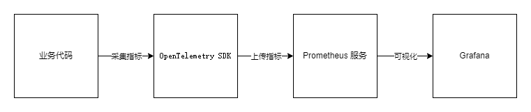
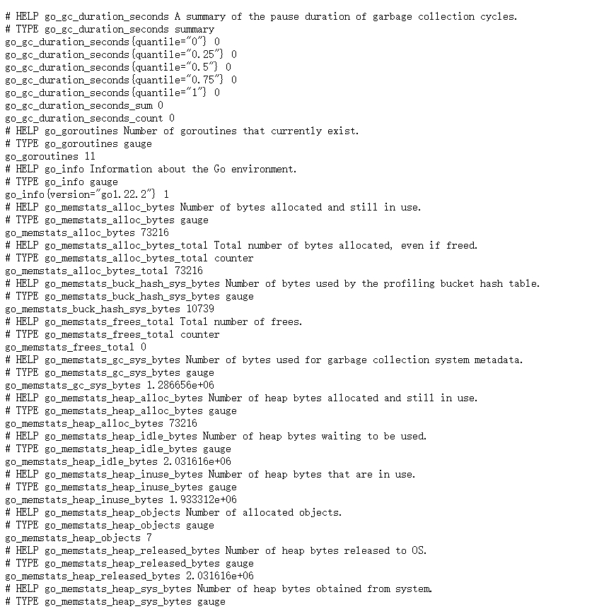
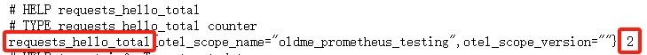
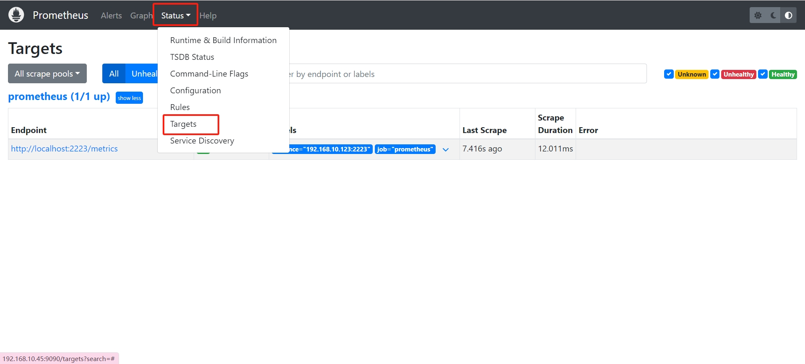
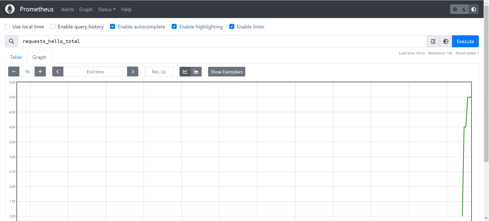
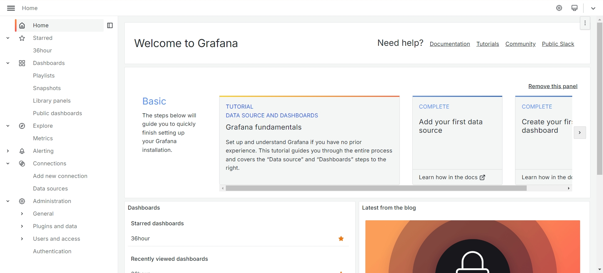
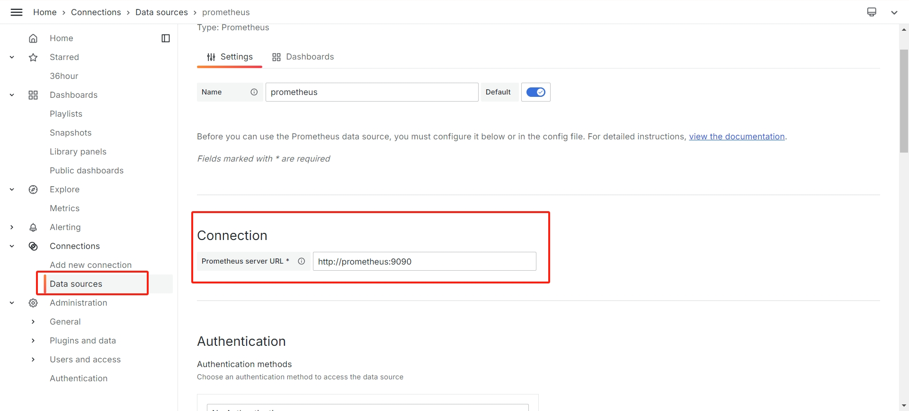
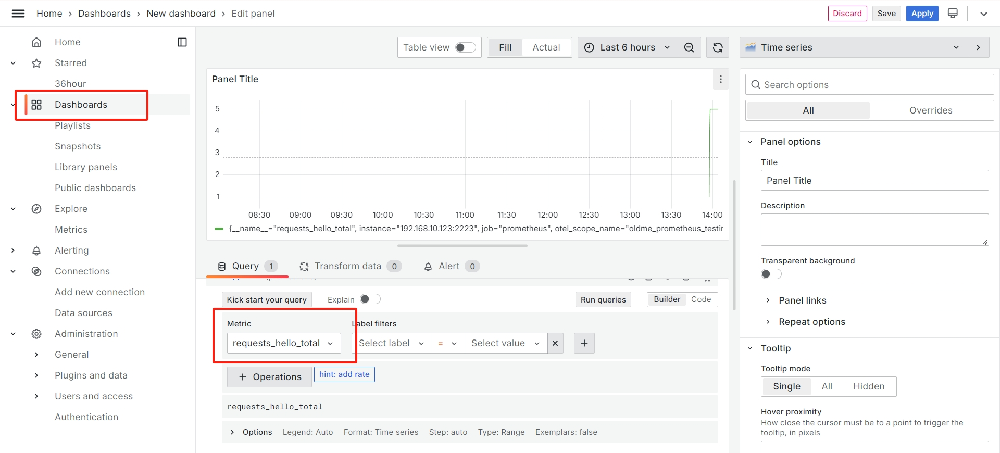

探索 Go 语言中 Opentelemetry 与 Prometheus 集成，导出 HTTP 服务指标监控，并最终将 Prometheus 指标可视化到 Grafana 中。

## 前言

### Opentelemetry

分布式链路跟踪（ `Distributed Tracing` ）的概念最早是由 Google 提出来的，发展至今技术已经比较成熟，也是有一些协议标准可以参考。目前在 `Tracing` 技术这块比较有影响力的是两大开源技术框架：Netflix 公司开源的 `OpenTracing` 和 Google 开源的 `OpenCensus`。两大框架都拥有比较高的开发者群体。为形成统一的技术标准，两大框架最终磨合成立了 `OpenTelemetry` 项目，简称 **`otel`**。

### Prometheus

`Prometheus` 源自 SoundCloud，拥有一整套开源系统监控和警报工具包，是支持 `OpenTelemetry` 的系统之一，是 [CNCF](https://www.cncf.io/) 的第二个项目

### Grafana

Grafana 是一个开源的分析和可视化平台，它允许你查询、可视化和警报来自各种数据源的数据。它提供了一个用户友好的界面，用于创建和共享仪表板、图表和警报。Grafana 支持广泛的数据源，其中就包括 `Prometheus`



## 基础概念

这里为了简单入门，尽量简单的介绍一些抽象概念，结合着代码理解，如果不能理解也没关系，代码写着写着自然就明白了：

**Meter Provider**
用于接口化管理全局的 `Meter` 创建，相当于全局的监控指标管理工厂。

**Meter**
用于接口化创建并管理全局的 `Instrument`，不同的 `Meter` 可以看做是不同的程序组件。

**Instrument**
用于管理不同组件下的各个不同类型的指标，例如 `http.server.request.total`

**Measurements**
对应指标上报的具体的 `DataPoint` 指标数据，是一系列的数值项。

**Metric Reader**
用于实现对指标的数据流读取，内部定义了具体操作指标的数据结构。`OpenTelemetry` 官方社区提供了多种灵活的 `Reader` 实现，例如 `PeridRader、ManualReader` 等。

**Metric Exporter**
`Exporter` 用于暴露本地指标到对应的第三方厂商，例如：`Promtheus、Zipkin` 等。

## 指标类型

`OpenTelemetry metrics` 有许多不同指标类型，可以把它想象成类似于 `int, float` 这种的变量类型：

**Counter：**只增不减的指标，比如 `http` 请求总数，字节大小；

**Asynchronous Counter：**异步 Counter；

**UpDownCounter：**可增可减的指标，比如 `http` 活动连接数；

**Asynchronous UpDownCounter：**异步 Counter；

**Gauge：**可增可减的指标，瞬时计量的值，比如 `CPU` 使用，它是异步的；

**Histogram**：分组聚合指标，这个较为难以理解一些，可以移步[此处](https://wl05.github.io/tech/monitor/data-visualization/histogram/)查看，当然，后文也会有一个详细的例子来使用它。

## 实战：采集指标

废话了一堆，终于可以实战了。我们先以 `http` 请求总数为例来走一遍整个采集指标流程。安装扩展：

```go
go get github.com/prometheus/client_golang
go get go.opentelemetry.io/otel/exporters/prometheus
go get go.opentelemetry.io/otel/metric
go get go.opentelemetry.io/otel/sdk/metric
```

打开 `main.go`，编写以下代码：

```go
package main

import (
	"context"
	"fmt"
	"log"
	"net/http"
	"os"
	"os/signal"

	"github.com/prometheus/client_golang/prometheus/promhttp"
	"go.opentelemetry.io/otel/exporters/prometheus"
	api "go.opentelemetry.io/otel/metric"
	"go.opentelemetry.io/otel/sdk/metric"
)

const meterName = "oldme_prometheus_testing"

var (
	requestHelloCounter api.Int64Counter
)

func main() {
	ctx := context.Background()

	// 创建 prometheus 导出器
	exporter, err := prometheus.New()
	if err != nil {
		log.Fatal(err)
	}

	// 创建 meter
	provider := metric.NewMeterProvider(metric.WithReader(exporter))
	meter := provider.Meter(meterName)

	// 创建 counter 指标类型
	requestHelloCounter, err = meter.Int64Counter("requests_hello_total")
	if err != nil {
		log.Fatal(err)
	}

	go serveMetrics()

	ctx, _ = signal.NotifyContext(ctx, os.Interrupt)
	<-ctx.Done()
}

func serveMetrics() {
	log.Printf("serving metrics at localhost:2223/metrics")
	http.Handle("/metrics", promhttp.Handler())

	http.Handle("/index", http.HandlerFunc(func(w http.ResponseWriter, r *http.Request) {
		// 记录 counter 指标
		requestHelloCounter.Add(r.Context(), 1)

		_, _ = w.Write([]byte("Hello, Otel!"))
	}))

	err := http.ListenAndServe(":2223", nil) //nolint:gosec // Ignoring G114: Use of net/http serve function that has no support for setting timeouts.
	if err != nil {
		fmt.Printf("error serving http: %v", err)
		return
	}
}
```

在我们的代码中，我们定义一个名字为 `requests_hello_total` 的 `Int64Counter` 指标类型，`Int64Counter` 代表这是一个只增不减的 `int64` 数值，用作记录请求总数正好合适。运行我们的程序，如果不出错的话，访问 [http://localhost:2223/index](http://localhost:2233/index) 可以看到 `Hello, Otel!`。并且我们访问 http://localhost:2223/metrics 可以看到指标数据：



这里数据还没有进行可视化，我们先把流程走通，多访问几次 http://localhost:2223/index 可以看到 `requests_hello_total` 会增加：



### Histogram

接下来我们采集一下 `Histogram` 指标，统计在 `0.1, 0.2, 0.5, 1, 2, 5` 秒以内的 `http` 请求数，在 `main.go` 中加上相关代码，可以直接复制过去：

```go
package main

import (
	"context"
	"fmt"
	"log"
	"math/rand"
	"net/http"
	"os"
	"os/signal"
	"time"

	"github.com/prometheus/client_golang/prometheus/promhttp"
	"go.opentelemetry.io/otel/exporters/prometheus"
	api "go.opentelemetry.io/otel/metric"
	"go.opentelemetry.io/otel/sdk/metric"
)

const meterName = "oldme_prometheus_testing"

var (
	requestHelloCounter      api.Int64Counter
	requestDurationHistogram api.Float64Histogram
)

func main() {
	ctx := context.Background()

	// 创建 prometheus 导出器
	exporter, err := prometheus.New()
	if err != nil {
		log.Fatal(err)
	}

	// 创建 meter
	provider := metric.NewMeterProvider(metric.WithReader(exporter))
	meter := provider.Meter(meterName)

	// 创建 counter 指标类型
	requestHelloCounter, err = meter.Int64Counter("requests_hello_total")
	if err != nil {
		log.Fatal(err)
	}

	// 创建 Histogram 指标类型
	requestDurationHistogram, err = meter.Float64Histogram(
		"request_hello_duration_seconds",
		api.WithDescription("记录 Hello 请求的耗时统计"),
		api.WithExplicitBucketBoundaries(0.1, 0.2, 0.5, 1, 2, 5),
	)
	if err != nil {
		log.Fatal(err)
	}

	go serveMetrics()
	go goroutineMock()

	ctx, _ = signal.NotifyContext(ctx, os.Interrupt)
	<-ctx.Done()
}

func serveMetrics() {
	log.Printf("serving metrics at localhost:2223/metrics")
	http.Handle("/metrics", promhttp.Handler())

	http.Handle("/index", http.HandlerFunc(func(w http.ResponseWriter, r *http.Request) {
		// 记录 counter 指标
		requestHelloCounter.Add(r.Context(), 1)

		// 计算请求处理时间
		startTime := time.Now()
		// 模拟请求处理时间
		time.Sleep(time.Duration(rand.Intn(3)) * time.Second)
		defer func() {
			duration := time.Since(startTime).Seconds()
			requestDurationHistogram.Record(r.Context(), duration)
		}()

		_, _ = w.Write([]byte("Hello, Otel!"))
	}))

	err := http.ListenAndServe(":2223", nil) //nolint:gosec // Ignoring G114: Use of net/http serve function that has no support for setting timeouts.
	if err != nil {
		fmt.Printf("error serving http: %v", err)
		return
	}
}

// 随机模拟若干个协程
func goroutineMock() {
	for {
		go func() {
			// 等待若干秒
			var s = time.Duration(rand.Intn(10))
			time.Sleep(s * time.Second)
		}()
		time.Sleep(1 * time.Millisecond)
	}
}
```

走到这里，代码层面结束了，已经成功一半了，代码开源在 [Github](https://github.com/oldme-git/teach-study/tree/master/golang/promethues)。之后我们就可以安装 `Prometheus` 服务端和 `Grafana` 来进行数据可视化。

## 安装 Prometheus

`Prometheus` 有多种安装方式，我这里依旧采用 `Docker` 安装，当然，你也可以使用其他方式安装，具体安装方式可以参考其他文章，后续 `Grafana` 同理，不在赘述，在 `Prometheus.yml` 中填写 `targets` 我们的地址：

```go
scrape_configs:
  - job_name: "prometheus"

    static_configs:
      - targets: ["localhost:2223"]
```

`Prometheus` 会自动去 `{{target}}/metrics` 中拉取我们的指标。之后在浏览器打开 `Promethues` 的地址，例如我的是：http://localhost:9090，如果全部正常的话可以在 `status:targets` 中看见我们的指标：



在 `Promethues` 的首页查询 `requests_hello_total` 指标可以看到可视化的图表：



## 安装 Grafana

我的 `Grafana` 安装好了，登录进去后是这样的（我更改过默认颜色）：



在 `Data source` 中添加 `Prometheus` 服务器，然后在 `Dashboard` 中添加我们想要监控的指标，即可看到更美观的图表：




