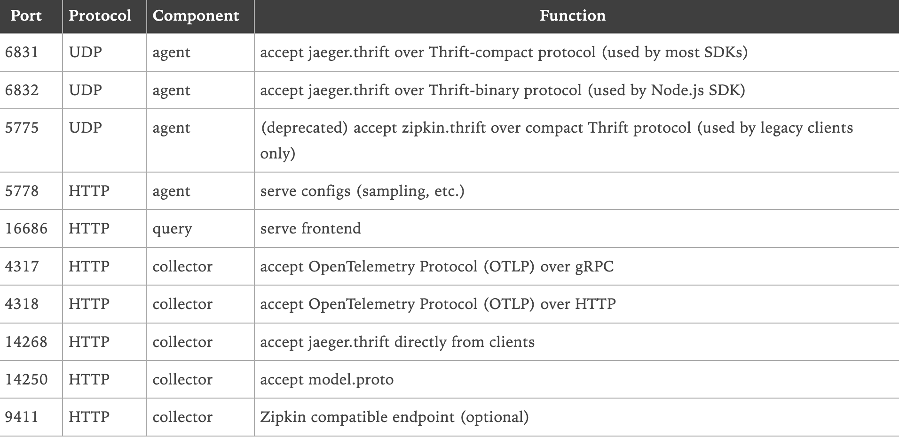

## 基础代码框架

### 安装mysql和redis

本地使用docker-compose安装mysql和redis

```docker
version:"3"
services:
	mysql:
		restart: always
		image: mysql:latest
		container_name: mysql
		environment:
			- "MYSQL_ROOT_PASSWORD"
		ports:
			- "3306:3306"

	redis:
		restart: always
		image: redis
		container_name: redis
		ports:
			- "6379:6379"
```

### 创建数据库

**ordersvc** :订单表

```mysql
create table t_order
(
	id bigint auto_increment primary key,
	order_id varchar(255) not null,
	ctime timestamp default CURRENT_TIMESTAMP not null,
	utime timestamp default CURRENT_TIMESTAMP not null,
	sku_id bigint not null,
	num int not null,
	price int not null,
	uid bigint not null,
	constraint order_pk2
		unique (order_id)
);
```

**skusvc**： 商品表

```mysql
create table t_sku
(
	id bigint auto_increment primary key,
	name varchar(10) not null,
	price int null,
	ctime timestamp default CURRENT_TIMESTAMP not null,
	utime timestamp default CURRENT_TIMESTAMP not null,
	num int null
);

```

**usersvc**: 用户表

```mysql
create table t_user
(
	id bigint auto_increment primary key,
	name varchar(20) not null,
	ctime timestamp default CURRENT_TIMESTAMP not null,
	utime timestamp default CURRENT_TIMESTAMP not null
);
```

### mysql、redis初始化

```go
package dogapm

import (
	"context"
	"database/sql"
	_ "github.com/go-sql-driver/mysql"
	"github.com/redis/go-redis/v9"
)

// 程序的框架初始化
type frame struct {
	DB      *sql.DB
	RedisDB *redis.Client
}

var Frame = &frame{}

type option func(f *frame)

func FrameMysqlDBOption(addr string) option {
	return func(f *frame) {
		var err error
		f.DB, err = sql.Open("mysql", addr)
		if err != nil {
			panic(err)
		}
		err = f.DB.Ping()
		if err != nil {
			panic(err)
		}
	}
}

func FrameRedisDBOption(addr string, pwd string) option {
	return func(f *frame) {
		client := redis.NewClient(&redis.Options{
			Addr:     addr,
			DB:       0,
			Password: pwd,
		})
		result, err := client.Ping(context.Background()).Result()
		if err != nil {
			panic(err)
		}
		if result != "PONG" {
			panic("redis client init fail")
		}
		f.RedisDB = client
	}
}

func (f *frame) Init(options ...option) {
	for _, opt := range options {
		opt(f)
	}
}

```

### 启动所有服务

```go
package dogapm

import (
	"os"
	"os/signal"
	"syscall"
)

type start interface {
	Start()
}

type close interface {
	Close()
}

var (
	globalStart = make([]start, 0)
	globalClose = make([]close, 0)
)

var EndPotin = endPoint{stop: make(chan int, 1)}

type endPoint struct {
	stop chan int
}

func (e *endPoint) Start() {
	for _, starter := range globalStart {
		starter.Start()
	}
	go func() {
		quit := make(chan os.Signal)
		signal.Notify(quit, syscall.SIGQUIT, syscall.SIGTERM, syscall.SIGINT)
		<-quit
		e.Shutdown()
	}()
	<-e.stop
}

func (e *endPoint) Shutdown() {
	for _, closer := range globalClose {
		closer.Close()
	}
	e.stop <- 1
}

```

### 初始化HTTP

```go
package dogapm

import (
	"context"
	"net/http"
)

/*
封装Http请求
mux 注册路由
Server启动服务
*/
type HttpServer struct {
	mux *http.ServeMux
	*http.Server
}

func NewHttpServer(addr string) *HttpServer {
	mux := http.NewServeMux()
	server := &http.Server{Addr: addr, Handler: mux}
	httpServer := &HttpServer{mux: mux, Server: server}
	globalStart = append(globalStart, httpServer)  // 注册启动服务
	globalClose = append(globalClose, httpServer)	// 注册关闭服务
	return httpServer
}

/*
将一个函数作为handler
*/
func (h *HttpServer) HandleFunc(pattern string, handler func(w http.ResponseWriter, r *http.Request)) {
	h.mux.HandleFunc(pattern, handler)
}

/*
将一个struct必须实现ServeHTTP(w http.Response,r *http.Request)方法
作为handler
*/
func (h *HttpServer) Handle(pattern string, handler http.Handler) {
	h.mux.Handle(pattern, handler)
}

// 启动服务
func (h *HttpServer) Start() {
	go func() {
		err := h.Server.ListenAndServe()
		if err != nil {
			panic(err)
		}
	}()
}

// 关闭服务
func (h *HttpServer) Close() {
	h.Server.Shutdown(context.TODO())
}

```

### 初始化GRPC

#### 1. Client

```go
package dogapm

import (
	"context"
	"google.golang.org/grpc"
	"google.golang.org/grpc/credentials/insecure"
)

type GrpcClient struct {
	*grpc.ClientConn
}

func NewGrpcClient(addr string) *GrpcClient {
	dial, err := grpc.Dial(addr,
		grpc.WithUnaryInterceptor(unaryInterceptor()),
		grpc.WithTransportCredentials(insecure.NewCredentials()),
	)
	if err != nil {
		panic(err)
	}
	return &GrpcClient{ClientConn: dial}
}

func unaryInterceptor() grpc.UnaryClientInterceptor {
	return func(ctx context.Context, method string, req, reply any, cc *grpc.ClientConn, invoker grpc.UnaryInvoker, opts ...grpc.CallOption) error {
		err := invoker(ctx, method, req, reply, cc, opts...)
		return err
	}
}

```

#### 2. Server

```go
package dogapm

import (
	"context"
	"google.golang.org/grpc"
	"net"
)

type grpcServer struct {
	*grpc.Server
	addr string
}

func NewGrpcServer(addr string) *grpcServer {
	svc := grpc.NewServer(grpc.UnaryInterceptor(unaryServerInterceptor()))
	server := &grpcServer{
		Server: svc,
		addr:   addr,
	}
	globalStart = append(globalStart, server)   // 注册启动服务
	globalClose = append(globalClose, server)   // 注册关闭服务
	return server
}

// 拦截器
func unaryServerInterceptor() grpc.UnaryServerInterceptor {
	return func(ctx context.Context, req any, info *grpc.UnaryServerInfo, handler grpc.UnaryHandler) (resp any, err error) {
		return nil, nil
	}
}

// 关闭服务
func (g *grpcServer) Close() {
	g.Server.GracefulStop()
}

// 开启服务
func (g *grpcServer) Start() {
	listen, err := net.Listen("tcp", g.addr)
	if err != nil {
		panic(err)
	}

	go func() {
		err := g.Serve(listen)
		if err != nil {
			panic(err)
		}
	}()
}

```

### HTTP状态码

```go
package dogapm

import (
	"encoding/json"
	"fmt"
	"net/http"
)

const jsonType string = "application/json"

type Status struct {
	Code    int    `json:"code"`
	Message string `json:"message"`
	Body    any    `json:"body"`
}

type httpStatus struct {
}

var HttpStatus = &httpStatus{}

func (h *httpStatus) Success(w http.ResponseWriter) {
	status := &Status{
		Code:    http.StatusOK,
		Message: "Success",
	}
	marshal, err := json.Marshal(status)
	if err != nil {
		fmt.Println(err)
		return
	}
	w.Header().Set("Content-Type", jsonType)
	w.WriteHeader(http.StatusOK)
	_, err = w.Write(marshal)
	if err != nil {
		fmt.Println(err)
		return
	}
}

func (h *httpStatus) SuccessBody(w http.ResponseWriter, msg string, body any) {
	status := &Status{
		Code:    http.StatusOK,
		Message: msg,
		Body:    body,
	}
	marshal, err := json.Marshal(status)
	if err != nil {
		fmt.Println(err)
		return
	}
	w.Header().Set("Content-Type", jsonType)
	w.WriteHeader(http.StatusOK)
	_, err = w.Write(marshal)
	if err != nil {
		fmt.Println(err)
		return
	}
}

func (h *httpStatus) Fail(w http.ResponseWriter, msg string, body any) {
	status := &Status{
		Code:    http.StatusBadRequest,
		Message: msg,
		Body:    body,
	}
	marshal, err := json.Marshal(status)
	if err != nil {
		fmt.Println(err)
		return
	}
	w.Header().Set("Content-Type", jsonType)
	w.WriteHeader(http.StatusBadRequest)
	_, err = w.Write(marshal)
	if err != nil {
		fmt.Println(err)
		return
	}
}

func (h *httpStatus) Error(w http.ResponseWriter, msg string, body any) {
	status := &Status{
		Code:    http.StatusInternalServerError,
		Message: msg,
		Body:    body,
	}
	marshal, err := json.Marshal(status)
	if err != nil {
		fmt.Println(err)
		return
	}
	w.Header().Set("Content-Type", jsonType)
	w.WriteHeader(http.StatusInternalServerError)
	_, err = w.Write(marshal)
	if err != nil {
		fmt.Println(err)
		return
	}
}

```

### 日志

> 使用slog，生成带色彩的日志

```go
package dogapm

import (
	"context"
	"encoding/json"
	"fmt"
	"log/slog"
	"os"
	"runtime"
	"strings"
)

// 颜色代码
const (
	colorRed    = "\033[31m"
	colorBlue   = "\033[34m"
	colorGreen  = "\033[32m"
	colorYellow = "\033[33m"
	colorReset  = "\033[0m"
)

// Logger 定义日志接口
type Logger interface {
	Debug(ctx context.Context, action string, msg string, args ...any)
	Info(ctx context.Context, action string, msg string, args ...any)
	Warn(ctx context.Context, action string, msg string, args ...any)
	Error(ctx context.Context, action string, msg string, err error, args ...any)
}

// ColorfulJSONHandler 自定义支持彩色输出的 JSON 处理器
type ColorfulJSONHandler struct {
	slog.Handler
}

// NewColorfulJSONHandler 创建一个新的 ColorfulJSONHandler 实例
func NewColorfulJSONHandler() *ColorfulJSONHandler {
	return &ColorfulJSONHandler{
		Handler: slog.NewJSONHandler(os.Stdout, nil),
	}
}

// 处理日志记录
func (h *ColorfulJSONHandler) Handle(ctx context.Context, r slog.Record) error {
	var color string
	switch r.Level {
	case slog.LevelDebug:
		color = colorBlue
	case slog.LevelInfo:
		color = colorGreen
	case slog.LevelWarn:
		color = colorYellow
	case slog.LevelError:
		color = colorRed
	default:
		color = colorReset
	}

	var buf []byte
	r.Attrs(func(a slog.Attr) bool {
		if a.Value.Kind() == slog.KindGroup {
			gv := a.Value.Group()
			for _, ga := range gv {
				buf = appendAttr(buf, ga)
			}
		} else {
			buf = appendAttr(buf, a)
		}
		return true
	})

	record := map[string]any{
		"time":    r.Time,
		"level":   r.Level.String(),
		"message": r.Message,
	}
	if err := json.Unmarshal(buf, &record); err != nil {
		return err
	}

	jsonData, err := json.Marshal(record)
	if err != nil {
		return err
	}

	fmt.Fprint(os.Stdout, color, string(jsonData), colorReset, "\n")
	return nil
}

// 追加属性到缓冲区
func appendAttr(buf []byte, a slog.Attr) []byte {
	if len(buf) > 0 {
		buf = append(buf, ',')
	}
	keyBytes := []byte(jsonEscape(a.Key))
	buf = append(buf, '"')
	buf = append(buf, keyBytes...)
	buf = append(buf, '"', ':')
	switch a.Value.Kind() {
	case slog.KindString:
		valBytes := []byte(jsonEscape(a.Value.String()))
		buf = append(buf, '"')
		buf = append(buf, valBytes...)
		buf = append(buf, '"')
	default:
		valBytes, _ := json.Marshal(a.Value.Any())
		buf = append(buf, valBytes...)
	}
	return buf
}

// 转义 JSON 字符串
func jsonEscape(s string) string {
	return strings.ReplaceAll(strings.ReplaceAll(s, `\`, `\\`), `"`, `\"`)
}

// 获取调用者信息
func getCallerInfo() (file string, line int) {
	_, file, line, _ = runtime.Caller(3)
	return
}

// SlogColorfulJSONLogger 实现 Logger 接口
type SlogColorfulJSONLogger struct {
	logger *slog.Logger
}

// NewSlogColorfulJSONLogger 创建一个新的 SlogColorfulJSONLogger 实例
func NewJSONLogger() *SlogColorfulJSONLogger {
	handler := NewColorfulJSONHandler()
	logger := slog.New(handler)
	return &SlogColorfulJSONLogger{
		logger: logger,
	}
}

// Debug 记录调试级别的日志
func (l *SlogColorfulJSONLogger) Debug(ctx context.Context, action string, msg string, args ...any) {
	file, line := getCallerInfo()
	args = append([]any{"action", action, "file", file, "line", line}, args...)
	l.logger.Debug(msg, args...)
}

// Info 记录信息级别的日志
func (l *SlogColorfulJSONLogger) Info(ctx context.Context, action string, msg string, args ...any) {
	file, line := getCallerInfo()
	args = append([]any{"action", action, "file", file, "line", line}, args...)
	l.logger.Info(msg, args...)
}

// Warn 记录警告级别的日志
func (l *SlogColorfulJSONLogger) Warn(ctx context.Context, action string, msg string, args ...any) {
	file, line := getCallerInfo()
	args = append([]any{"action", action, "file", file, "line", line}, args...)
	l.logger.Warn(msg, args...)
}

// Error 记录错误级别的日志
func (l *SlogColorfulJSONLogger) Error(ctx context.Context, action string, msg string, err error, args ...any) {
	file, line := getCallerInfo()
	args = append([]any{"action", action, "file", file, "line", line, "error", err.Error()}, args...)
	l.logger.Error(msg, args...)
}

// NewCustomError 自定义错误类型
func NewCustomError(message string) error {
	return &customError{message: message}
}

// customError 自定义错误结构体
type customError struct {
	message string
}

// Error 实现 error 接口
func (e *customError) Error() string {
	return e.message
}

```

### sql

```go
package dogapm

import "database/sql"

type dbUtil struct {
}

var DBUtil = &dbUtil{}

func (d *dbUtil) Query(rows *sql.Rows, err any) []map[string]any {
	if err != nil {
		return nil
	}
	if rows == nil {
		return []map[string]any{}
	}
	defer rows.Close()
	columns, _ := rows.Columns()
	scanArgs := make([]any, len(columns))
	values := make([]any, len(columns))
	for j := range values {
		scanArgs[j] = &values[j]
	}
	res := make([]map[string]any, 0, 5)
	for rows.Next() {
		record := make(map[string]any)
		rows.Scan(scanArgs...)
		for i, col := range values {
			if col != nil {
				switch col.(type) {
				case []byte:
					record[columns[i]] = string(col.([]byte))
				default:
					record[columns[i]] = col
				}
			}
		}
		res = append(res, record)
	}
	return res
}

func (d *dbUtil) QueryFirst(rows *sql.Rows, err any) map[string]any {
	res := d.Query(rows, err)
	if len(res) > 0 {
		return res[0]
	}
	return nil
}

```

### 测试框架

```go
package dogapm

import (
	"context"
	"fmt"
	"net/http"
	pb "proto/hello"
	"testing"
	"time"
)

// mysql db
func TestFrame(t *testing.T) {
	mysqlDB := FrameMysqlDBOption("root:1230123@tcp(127.0.0.1:3306)/ordersvc")
	redisDB := FrameRedisDBOption("127.0.0.1:6379", "1230123")
	Frame.Init(mysqlDB, redisDB)
}

// http
func TestHttp(t *testing.T) {
	server := NewHttpServer(":8080")
	server.HandleFunc("/test", func(w http.ResponseWriter, r *http.Request) {
		w.Write([]byte("ok"))
	})
	server.Start()
	time.Sleep(3600 * time.Second)
}

// grpc
func TestGrpc(t *testing.T) {
	go func() {
		server := NewGrpcServer(":8080")
		pb.RegisterHelloServiceServer(server, &Hello{})
		server.Start()
	}()

	grpcClient := NewGrpcClient("127.0.0.1:8080")
	receive, err := pb.NewHelloServiceClient(grpcClient).Receive(context.TODO(), &pb.HelloMsg{Msg: "hello world"})
	if err != nil {
		t.Fatal(err)
	}
	fmt.Println(receive.Msg)
}

type Hello struct {
	pb.UnimplementedHelloServiceServer
}

func (h *Hello) Receive(ctx context.Context, req *pb.HelloMsg) (*pb.HelloMsg, error) {
	return req, nil
}

```

## 链路追踪的基本概念

###

## OpenTelemetry

### 创建http程序

在同一目录下创建 `main.go` 文件，并添加以下代码。

```go
package main

import (
	"fmt"
	"log"
	"math/rand"
	"net/http"
)

func main() {
	handler := http.NewServeMux()
	handler.HandleFunc("/roll", func(writer http.ResponseWriter, request *http.Request) {
		number := 1 + rand.Intn(6)

		_, _ = fmt.Fprintln(writer, number)
	})

	log.Fatal(http.ListenAndServe(":8080", handler))

}

```

### 添加 OpenTelemetry 测量仪器

接下来，我们将展示如何在示例应用程序中添加 OpenTelemetry 测量仪器。

#### 1. 引入依赖

在你的Go项目中安装以下依赖包。

```go
go get "go.opentelemetry.io/otel" \
  "go.opentelemetry.io/otel/exporters/stdout/stdoutmetric" \
  "go.opentelemetry.io/otel/exporters/stdout/stdouttrace" \
  "go.opentelemetry.io/otel/propagation" \
  "go.opentelemetry.io/otel/sdk/metric" \
  "go.opentelemetry.io/otel/sdk/resource" \
  "go.opentelemetry.io/otel/sdk/trace" \
  "go.opentelemetry.io/otel/semconv/v1.24.0" \
  "go.opentelemetry.io/contrib/instrumentation/net/http/otelhttp"

```

这里安装的是 OpenTelemety SDK 组件和 `net/http` 测量仪器。如果要对不同的库进行网络请求检测，则需要安装相应的仪器库。

#### 2. 初始化OpenTelemetry SDK

首先，我们将初始化OpenTelemetry SDK。任何想导出追踪数据的应用程序都必需完成这一步初始化。

新建一个`otel.go`文件，并在其中添加以下代码。

```go
package main

import (
	"context"
	"errors"
	"time"

	"go.opentelemetry.io/otel"
	"go.opentelemetry.io/otel/exporters/stdout/stdoutmetric"
	"go.opentelemetry.io/otel/exporters/stdout/stdouttrace"
	"go.opentelemetry.io/otel/propagation"
	"go.opentelemetry.io/otel/sdk/metric"
	"go.opentelemetry.io/otel/sdk/trace"
)

// setupOTelSDK 引导 OpenTelemetry pipeline。
// 如果没有返回错误，请确保调用 shutdown 进行适当清理。
func setupOTelSDK(ctx context.Context) (shutdown func(context.Context) error, err error) {
	var shutdownFuncs []func(context.Context) error

	// shutdown 会调用通过 shutdownFuncs 注册的清理函数。
	// 调用产生的错误会被合并。
	// 每个注册的清理函数将被调用一次。
	shutdown = func(ctx context.Context) error {
		var err error
		for _, fn := range shutdownFuncs {
			err = errors.Join(err, fn(ctx))
		}
		shutdownFuncs = nil
		return err
	}

	// handleErr 调用 shutdown 进行清理，并确保返回所有错误信息。
	handleErr := func(inErr error) {
		err = errors.Join(inErr, shutdown(ctx))
	}

	// 设置传播器
	prop := newPropagator()
	otel.SetTextMapPropagator(prop)

	// 设置 trace provider.
	tracerProvider, err := newTraceProvider()
	if err != nil {
		handleErr(err)
		return
	}
	shutdownFuncs = append(shutdownFuncs, tracerProvider.Shutdown)
	otel.SetTracerProvider(tracerProvider)

	// 设置 meter provider.
	meterProvider, err := newMeterProvider()
	if err != nil {
		handleErr(err)
		return
	}
	shutdownFuncs = append(shutdownFuncs, meterProvider.Shutdown)
	otel.SetMeterProvider(meterProvider)

	return
}

func newPropagator() propagation.TextMapPropagator {
	return propagation.NewCompositeTextMapPropagator(
		propagation.TraceContext{},
		propagation.Baggage{},
	)
}

func newTraceProvider() (*trace.TracerProvider, error) {
	traceExporter, err := stdouttrace.New(
		stdouttrace.WithPrettyPrint())
	if err != nil {
		return nil, err
	}

	traceProvider := trace.NewTracerProvider(
		trace.WithBatcher(traceExporter,
			// 默认为 5s。为便于演示，设置为 1s。
			trace.WithBatchTimeout(time.Second)),
	)
	return traceProvider, nil
}

func newMeterProvider() (*metric.MeterProvider, error) {
	metricExporter, err := stdoutmetric.New()
	if err != nil {
		return nil, err
	}

	meterProvider := metric.NewMeterProvider(
		metric.WithReader(metric.NewPeriodicReader(metricExporter,
			// 默认为 1m。为便于演示，设置为 3s。
			metric.WithInterval(3*time.Second))),
	)
	return meterProvider, nil
}

```

如果不使用 `tracing` ，则可以省略相应的 `TracerProvider` 的初始化代码；

如果不使用 `metrics` ，则可以省略 `MeterProvider` 的初始化代码。

#### 3. 测量 HTTP server

现在，我们已经初始化了OpenTelemetry SDK，可以测量HTTP服务器了。

按如下代码修改 `main.go`，加入设置 OpenTelemetry SDK 的代码，并使用 otelhttp 仪器库测量 HTTP 服务器：

```go
package main

import (
	"context"
	"errors"
	"log"
	"net"
	"net/http"
	"os"
	"os/signal"
	"time"

	"go.opentelemetry.io/contrib/instrumentation/net/http/otelhttp"
)

func newHTTPHandler() http.Handler {
	mux := http.NewServeMux()

	// handleFunc 是 mux.HandleFunc 的替代品，。
	// 它使用 http.route 模式丰富了 handler 的 HTTP 测量
	handleFunc := func(pattern string, handlerFunc func(http.ResponseWriter, *http.Request)) {
		// 为 HTTP 测量配置 "http.route"。
		handler := otelhttp.WithRouteTag(pattern, http.HandlerFunc(handlerFunc))
		mux.Handle(pattern, handler)
	}

	// Register handlers.
	handleFunc("/roll", roll)

	// 为整个服务器添加 HTTP 测量。
	handler := otelhttp.NewHandler(mux, "/")
	return handler
}

func main() {
	if err := run(); err != nil {
		log.Fatalln(err)
	}
}

func run() (err error) {
	// 平滑处理 SIGINT (CTRL+C) .
	ctx, stop := signal.NotifyContext(context.Background(), os.Interrupt)
	defer stop()

	// 设置 OpenTelemetry.
	otelShutdown, err := setupOTelSDK(ctx)
	if err != nil {
		return
	}
	// 妥善处理停机，确保无泄漏
	defer func() {
		err = errors.Join(err, otelShutdown(context.Background()))
	}()

	// 启动 HTTP server.
	srv := &http.Server{
		Addr:         ":8080",
		BaseContext:  func(_ net.Listener) context.Context { return ctx },
		ReadTimeout:  time.Second,
		WriteTimeout: 10 * time.Second,
		Handler:      newHTTPHandler(),
	}
	srvErr := make(chan error, 1)
	go func() {
		srvErr <- srv.ListenAndServe()
	}()

	// 等待中断.
	select {
	case err = <-srvErr:
		// 启动 HTTP 服务器时出错.
		return
	case <-ctx.Done():
		// 等待第一个 CTRL+C.
		// 尽快停止接收信号通知.
		stop()
	}

	// 调用 Shutdown 时，ListenAndServe 会立即返回 ErrServerClosed。
	err = srv.Shutdown(context.Background())
	return
}

```

#### 4. 添加自定义测量

测量库可以捕捉系统边缘的遥测数据，例如入站和出站 HTTP 请求，但无法捕捉应用程序中的情况。因此需要编写一些自定义的手动仪器。

修改 `roll.go`，使用 OpenTelemetry API 包含定制的测量仪器：

```go
package main

import (
	"fmt"
	"math/rand"
	"net/http"

	"go.opentelemetry.io/otel"
	"go.opentelemetry.io/otel/attribute"
	"go.opentelemetry.io/otel/metric"
)

var (
	tracer  = otel.Tracer("roll")
	meter   = otel.Meter("roll")
	rollCnt metric.Int64Counter
)

func init() {
	var err error
	rollCnt, err = meter.Int64Counter("dice.rolls",
		metric.WithDescription("The number of rolls by roll value"),
		metric.WithUnit("{roll}"))
	if err != nil {
		panic(err)
	}
}

func roll(w http.ResponseWriter, r *http.Request) {
	ctx, span := tracer.Start(r.Context(), "roll") // 开始 span
	defer span.End()                               // 结束 span

	number := 1 + rand.Intn(6)

	rollValueAttr := attribute.Int("roll.value", number)

	span.SetAttributes(rollValueAttr) // span 添加属性

	// 摇骰子次数的指标 +1
	rollCnt.Add(ctx, 1, metric.WithAttributes(rollValueAttr))

	_, _ = fmt.Fprintln(w, number)
}

```

#### 5. 运行应用程序

使用以下命令构建并运行应用程序：

```go
go mod tidy
export OTEL_RESOURCE_ATTRIBUTES="service.name=dice,service.version=0.1.0"
go run .

```

使用浏览器中打开 http://127.0.0.1:8080/roll。向服务器发送请求时，你会在控制台显示的链路跟踪中看到两个 span。由仪器库生成的 span 跟踪向 /roll 路由发出请求的生命周期。名为 roll 的 span 是手动创建的，它是前面提到的 span 的子 span。

### 将链路追踪数据发送至 Jaeger

如果觉着控制台看的 span 不够直观，可以选择将链路追踪的数据发送至 Jaeger，通过 Jaeger UI 查看。

#### 1. 启动 Jaeger

Jaeger 官方提供的 **all-in-one** 是为快速本地测试而设计的可执行文件。它包括 **Jaeger UI**、**jaeger-collector**、**jaeger-query** 和 **jaeger-agent**，以及一个内存存储组件。

启动 **all-in-one** 的最简单方法是使用发布到 DockerHub 的预置镜像（只需一条命令行）。

```go
docker run --rm --name jaeger \
  -e COLLECTOR_ZIPKIN_HOST_PORT=:9411 \
  -p 6831:6831/udp \
  -p 6832:6832/udp \
  -p 5778:5778 \
  -p 16686:16686 \
  -p 4317:4317 \
  -p 4318:4318 \
  -p 14250:14250 \
  -p 14268:14268 \
  -p 14269:14269 \
  -p 9411:9411 \
  jaegertracing/all-in-one:1.55

```

然后你可以使用浏览器打开 [http://localhost:16686](http://localhost:16686/) 访问Jaeger UI。

容器公开以下端口：



我们这里使用 HTTP 协议的`4318` 端口上报链路追踪数据。

#### 2. 上报至 Jaeger

安装 `otlptracehttp` 依赖包。

```go
go get go.opentelemetry.io/otel/exporters/otlp/otlptrace/otlptracehttp
```

修改`otel.go` 代码，新增以下函数。

```go
func newJaegerTraceProvider(ctx context.Context) (*trace.TracerProvider, error) {
	// 创建一个使用 HTTP 协议连接本机Jaeger的 Exporter
	traceExporter, err := otlptracehttp.New(ctx,
		otlptracehttp.WithEndpoint("127.0.0.1:4318"),
		otlptracehttp.WithInsecure())
	if err != nil {
		return nil, err
	}
	traceProvider := trace.NewTracerProvider(
		trace.WithBatcher(traceExporter,
			// 默认为 5s。为便于演示，设置为 1s。
			trace.WithBatchTimeout(time.Second)),
	)
	return traceProvider, nil
}

```

并且按如下代码修改设置 trace provider 部分。

```go
// 设置 trace provider.
//tracerProvider, err := newTraceProvider()
tracerProvider, err := newJaegerTraceProvider(ctx)
if err != nil {
	handleErr(err)
	return
}
shutdownFuncs = append(shutdownFuncs, tracerProvider.Shutdown)
otel.SetTracerProvider(tracerProvider)

```

再次构建并启动程序。

```go
go run .
```

尝试访问一次 http://127.0.0.1:8080/roll ，确保修改后的服务能够正常运行。

#### 3. 使用 Jaeger UI

使用浏览器打开 [http://127.0.0.1:16686](http://127.0.0.1:16686/) 的Jaeger UI界面。 在屏幕左侧的 service 下拉框中选中 `dice`后查找，即可看到上报的 trace 数据。


点击右侧的 trace 数据，即可查看详情。


完整代码请查看 https://github.com/Q1mi/dice
