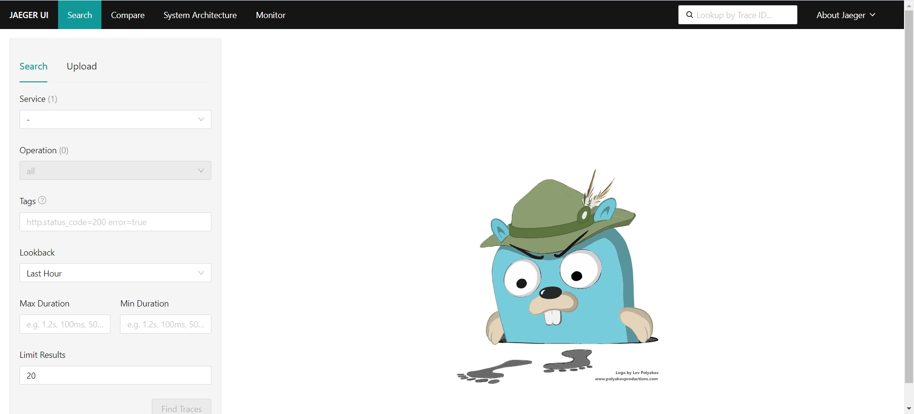
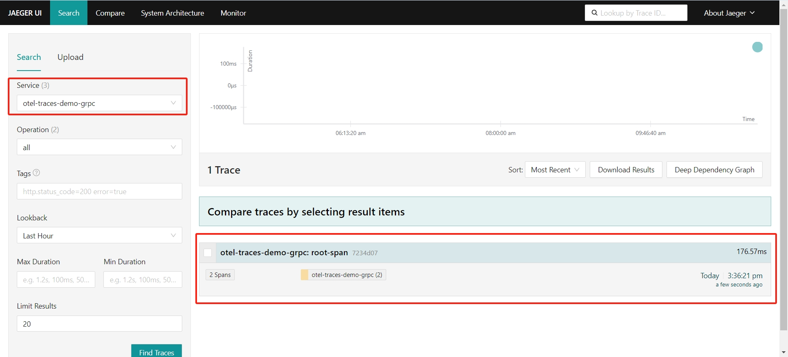
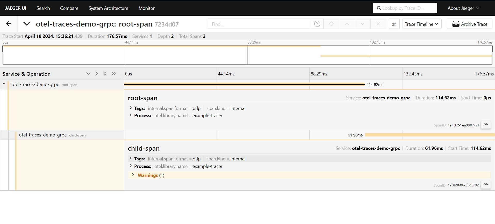

## 前言

### Opentelemetry

分布式链路跟踪（ `Distributed Tracing` ）的概念最早是由 Google 提出来的，发展至今技术已经比较成熟，也是有一些协议标准可以参考。目前在 `Tracing`技术这块比较有影响力的是两大开源技术框架：Netflix 公司开源的 `OpenTracing`和 Google 开源的 `OpenCensus`。两大框架都拥有比较高的开发者群体。为形成统一的技术标准，两大框架最终磨合成立了 `OpenTelemetry` 项目，简称 **`otel`**

### Jaeger

`Jaeger\ˈyā-gər\` 是 Uber 开源的分布式追踪系统，是支持 `OpenTelemetry` 的系统之一，也是 [CNCF](https://www.cncf.io/) 项目。

## 安装 Jaeger

Jaeger 为我们准备了 Docker 镜像，我们可以很容易的安装。

```go
docker run --rm --name jaeger \
  -p 16686:16686 \
  -p 4317:4317 \
  -p 4318:4318
```

简单的介绍以下这三个端口。16686 用做 Jaeger 服务的 Web 面板，一会我们可以在浏览器中访问它；4317 和 4318 都用做上传追踪数据，不同之处在于前者是 gRPC 协议，后者是 HTTP 协议。

Jaeger 还有很多可用的端口，本篇只介绍和 otel 相关的，具体可以查看 [Jaeger](https://www.jaegertracing.io/docs/1.56/getting-started/) 官方文档哦。

安装后，在浏览器中输入 IP:16686：



看到 gopher 侦探在追踪足迹的可爱图片就代表 Jaeger 安装成功咯。

## 编写 Go 代码

安装依赖：

```go
go get "go.opentelemetry.io/otel" \
  "go.opentelemetry.io/otel/exporters/stdout/stdoutmetric" \
  "go.opentelemetry.io/otel/exporters/stdout/stdouttrace" \
  "go.opentelemetry.io/otel/propagation" \
  "go.opentelemetry.io/otel/sdk/metric" \
  "go.opentelemetry.io/otel/sdk/resource" \
  "go.opentelemetry.io/otel/sdk/trace" \
  "go.opentelemetry.io/otel/semconv/v1.24.0" \
  "go.opentelemetry.io/contrib/instrumentation/net/http/otelhttp"
```

我这里贴出 HTTP 和 gRPC 的全部代码，直接复制过去，改成自己的地址即可：

### HTTP

```go
func TestTraceHttp(t *testing.T) {
	ctx := context.Background()

	// 创建 OTLP HTTP 导出器，连接到 Jaeger
	exporter, err := otlptracehttp.New(ctx,
		otlptracehttp.WithEndpointURL("http://srv.com:4318/v1/traces"))

	if err != nil {
		log.Fatalf("创建导出器失败: %v", err)
	}

	// 创建资源
	res, err := resource.New(ctx,
		resource.WithAttributes(
			semconv.ServiceNameKey.String("otel-traces-demo-http"),
		),
	)
	if err != nil {
		log.Fatalf("创建资源失败: %v", err)
	}

	// 创建 Tracer 提供器
	tp := sdktrace.NewTracerProvider(
		sdktrace.WithBatcher(exporter),
		sdktrace.WithResource(res),
	)

	// 设置全局 Tracer 提供器
	otel.SetTracerProvider(tp)

	// 创建一个新的 trace
	tracer := otel.Tracer("example-tracer")
	ctx, span := tracer.Start(ctx, "root-span")
	// 暂停 100ms
	time.Sleep(100 * time.Millisecond)
	// 结束 span
	span.End()

	// 创建子span
	_, childSpan := tracer.Start(ctx, "child-span")
	// 暂停 50ms
	time.Sleep(50 * time.Millisecond)
	childSpan.End()

	// 确保所有的 spans 都被发送
	if err := tp.Shutdown(ctx); err != nil {
		log.Fatalf("关闭 Tracer 提供器失败: %v", err)
	}
}
```

### gRPC

```go
func TestTraceGrpc(t *testing.T) {
	ctx := context.Background()

	// 创建 OTLP gRPC 导出器，连接到 Jaeger
	exporter, err := otlptracegrpc.New(ctx,
		otlptracegrpc.WithEndpoint("srv.com:4317"),
		otlptracegrpc.WithInsecure(),
	)

	if err != nil {
		log.Fatalf("创建导出器失败: %v", err)
	}

	// 创建资源
	res, err := resource.New(ctx,
		resource.WithAttributes(
			semconv.ServiceNameKey.String("otel-traces-demo-grpc"),
		),
	)
	if err != nil {
		log.Fatalf("创建资源失败: %v", err)
	}

	// 创建 Tracer 提供器
	tp := sdktrace.NewTracerProvider(
		sdktrace.WithBatcher(exporter),
		sdktrace.WithResource(res),
	)

	// 设置全局 Tracer 提供器
	otel.SetTracerProvider(tp)

	// 创建一个新的 trace
	tracer := otel.Tracer("example-tracer")
	ctx, span := tracer.Start(ctx, "root-span")
	// 暂停 100ms
	time.Sleep(100 * time.Millisecond)
	// 结束 span
	span.End()

	// 创建子span
	_, childSpan := tracer.Start(ctx, "child-span")
	// 暂停 50ms
	time.Sleep(50 * time.Millisecond)
	childSpan.End()

	// 确保所有的 spans 都被发送
	if err := tp.Shutdown(ctx); err != nil {
		log.Fatalf("关闭 Tracer 提供器失败: %v", err)
	}
}
```

## 效果

执行后，在面板中即可看到我们上传的数据。





可以看到我们的两个 span 已经上传到 `Jaeger` 中了，就是如此的简单！文中的代码开源在 [Github](https://github.com/oldme-git/teach-study/blob/master/golang/otel/trace/trace_test.go)。
