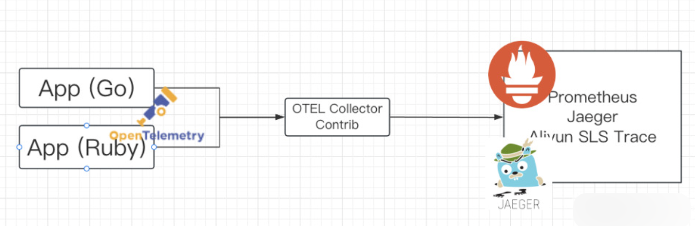
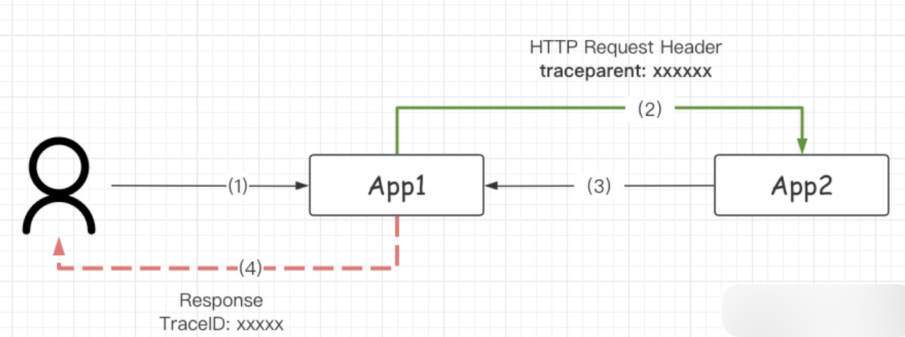
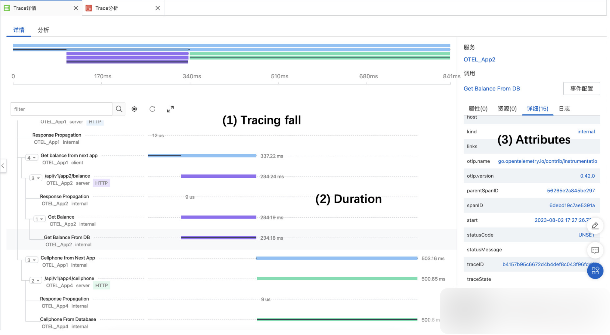
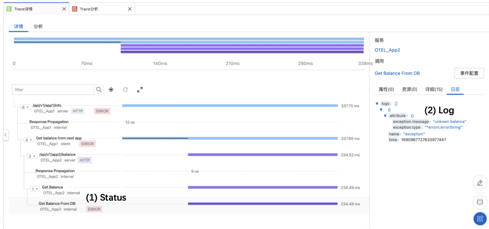

## 使用 Otel-Collect-Contrib 初始化 trace.Provider

这里使用 `app -> collector-contrib` 进行转发， 应用不直接对后端的存储。 **适配性** 更高。



`collector-contrib` 最常见的两种协议 `grpc / http(s)`。 传入 endpoint 地址进行初始化 Provider， 参考代码 [grpcExporter 和 httpExporter](https://github.com/tangx/opentelemetry-gin-demo/tree/main/pkg/middlewares/otel/provider.go#41)

```go
// Copyright The OpenTelemetry Authors
//
// Licensed under the Apache License, Version 2.0 (the "License");
// you may not use this file except in compliance with the License.
// You may obtain a copy of the License at
//
//     http://www.apache.org/licenses/LICENSE-2.0
//
// Unless required by applicable law or agreed to in writing, software
// distributed under the License is distributed on an "AS IS" BASIS,
// WITHOUT WARRANTIES OR CONDITIONS OF ANY KIND, either express or implied.
// See the License for the specific language governing permissions and
// limitations under the License.

// Example using OTLP exporters + collector + third-party backens. For
// information about using the exporter, see:
// https://pkg.go.dev/go.opentelemetry.io/otel/exporters/otlp?tab=doc#example-package-Insecure
package otel

import (
	"context"
	"fmt"
	"net/url"
	"strings"
	"time"

	"google.golang.org/grpc"
	"google.golang.org/grpc/credentials/insecure"

	"go.opentelemetry.io/otel/exporters/otlp/otlptrace"
	"go.opentelemetry.io/otel/exporters/otlp/otlptrace/otlptracegrpc"
	"go.opentelemetry.io/otel/exporters/otlp/otlptrace/otlptracehttp"
	"go.opentelemetry.io/otel/sdk/resource"
	sdktrace "go.opentelemetry.io/otel/sdk/trace"
	semconv "go.opentelemetry.io/otel/semconv/v1.12.0"
	"go.opentelemetry.io/otel/trace"
)

// Initializes an OTLP exporter, and configures the corresponding trace and
// metric providers.
func initProvider(appname string, endpoint string) (trace.TracerProvider, error) {
	ctx := context.Background()

	res, err := resource.New(ctx,
		resource.WithAttributes(
			// the service name used to display traces in backends
			semconv.ServiceNameKey.String(appname),
		),
	)
	if err != nil {
		return nil, fmt.Errorf("failed to create resource: %w", err)
	}

	// If the OpenTelemetry Collector is running on a local cluster (minikube or
	// microk8s), it should be accessible through the NodePort service at the
	// `localhost:30080` endpoint. Otherwise, replace `localhost` with the
	// endpoint of your cluster. If you run the app inside k8s, then you can
	// probably connect directly to the service through dns.
	ctx, cancel := context.WithTimeout(ctx, time.Second)
	defer cancel()

	if len(endpoint) == 0 {
		endpoint = "127.0.0.1:55680"
	}

	// var err error
	exporter, err := traceExporter(ctx, endpoint)
	if err != nil {
		return nil, fmt.Errorf("failed to create trace exporter: %w", err)
	}

	// Register the trace exporter with a TracerProvider, using a batch
	// span processor to aggregate spans before export.
	bsp := sdktrace.NewBatchSpanProcessor(exporter)
	tracerProvider := sdktrace.NewTracerProvider(
		sdktrace.WithSampler(sdktrace.AlwaysSample()),
		sdktrace.WithResource(res),
		sdktrace.WithSpanProcessor(bsp),
	)

	return tracerProvider, nil
}

func traceExporter(ctx context.Context, endpoint string) (*otlptrace.Exporter, error) {
	ur, err := url.Parse(endpoint)
	if err != nil {
		return nil, err
	}

	var exporter *otlptrace.Exporter

	switch strings.ToLower(ur.Scheme) {
	case "http", "https":
		exporter, err = httpExporter(ctx, ur.Host)
		if err != nil {
			return nil, err
		}

	case "grpc":
		fallthrough
	default:
		exporter, err = grpcExpoter(ctx, ur.Host)
		if err != nil {
			return nil, err
		}
	}

	return exporter, nil
}

// 创建 OTEL 的 GRPC 连接器
func grpcExpoter(ctx context.Context, endpoint string) (*otlptrace.Exporter, error) {
	// addr := strings.TrimLeft(endpoint, "grpc://")

	conn, err := grpc.DialContext(ctx, endpoint,
		// Note the use of insecure transport here. TLS is recommended in production.
		grpc.WithTransportCredentials(insecure.NewCredentials()),
		grpc.WithBlock(),
		// grpc.WithTimeout(5*time.Second),
	)

	if err != nil {
		return nil, fmt.Errorf("failed to create gRPC connection to collector: %w", err)
	}

	// Set up a trace exporter
	traceExporter, err := otlptracegrpc.New(
		ctx,
		otlptracegrpc.WithGRPCConn(conn),
		// otlptracegrpc.WithHeaders(
		// 	map[string]string{
		// 		"authorization": BearerAuthToken,
		// 		"Authorization": BearerAuthToken,
		// 	},
		// ),
	)
	if err != nil {
		return nil, fmt.Errorf("failed to create trace exporter: %w", err)
	}
	return traceExporter, nil
}

func httpExporter(ctx context.Context, endpoint string) (*otlptrace.Exporter, error) {

	// endpoint = strings.TrimPrefix(endpoint, "https://")
	// endpoint = strings.TrimPrefix(endpoint, "http://")

	opts := []otlptracehttp.Option{
		otlptracehttp.WithTimeout(5 * time.Second),
		otlptracehttp.WithEndpoint(endpoint),
		otlptracehttp.WithInsecure(),
		// otlptracehttp.WithHeaders(
		// 	map[string]string{
		// 		"authorization": BearerAuthToken,
		// 		"Authorization": BearerAuthToken,
		// 	},
		// ),
	}

	trace, err := otlptracehttp.New(ctx, opts...)

	return trace, err
}
```

## 使用 Otelgin 接入 TraceProvider

1. 第一步初始化好的 trace.Provider 需要通过 Option 的方式传入, 参考代码 [otel middleware option](https://github.com/tangx/opentelemetry-gin-demo/tree/main/pkg/middlewares/otel/register.go#L8)

   ```go
   package otel

   import (
   	"github.com/gin-gonic/gin"
   	"go.opentelemetry.io/contrib/instrumentation/github.com/gin-gonic/gin/otelgin"
   )

   func Register(appname string, endpoint string) gin.HandlerFunc {

   	opts := []otelgin.Option{
   		ProviderOption(appname, endpoint),
   		PropagationExtractOption(),
   	}

   	return otelgin.Middleware(appname, opts...)
   }

   func ProviderOption(appname string, endpoint string) otelgin.Option {
   	// 1. 注册 Provider
   	provider, err := initProvider(appname, endpoint)
   	if err != nil {
   		panic(err)
   	}

   	return otelgin.WithTracerProvider(provider)
   }
   ```

2. 在 gin 已经实现了一个官方的 Middleware 支持 OpenTelemetry. 参考代码 [gin-gonic/gin/otelgin](https://github.com/open-telemetry/opentelemetry-go-contrib/blob/849072ef827b4abab754253e1e63e7b410a31084/instrumentation/github.com/gin-gonic/gin/otelgin/gintrace.go#L42)

   ```go
   package otelgin // import "go.opentelemetry.io/contrib/instrumentation/github.com/gin-gonic/gin/otelgin"

   import (
   	"fmt"

   	"github.com/gin-gonic/gin"

   	"go.opentelemetry.io/otel"
   	"go.opentelemetry.io/otel/codes"

   	"go.opentelemetry.io/otel/attribute"
   	"go.opentelemetry.io/otel/propagation"
   	semconv "go.opentelemetry.io/otel/semconv/v1.17.0"
   	"go.opentelemetry.io/otel/semconv/v1.17.0/httpconv"
   	oteltrace "go.opentelemetry.io/otel/trace"
   )

   const (
   	tracerKey  = "otel-go-contrib-tracer"
   	tracerName = "go.opentelemetry.io/contrib/instrumentation/github.com/gin-gonic/gin/otelgin"
   )

   // Middleware returns middleware that will trace incoming requests.
   // The service parameter should describe the name of the (virtual)
   // server handling the request.
   func Middleware(service string, opts ...Option) gin.HandlerFunc {
   	cfg := config{}
   	for _, opt := range opts {
   		opt.apply(&cfg)
   	}
   	if cfg.TracerProvider == nil {
   		cfg.TracerProvider = otel.GetTracerProvider()
   	}
   	tracer := cfg.TracerProvider.Tracer(
   		tracerName,
   		oteltrace.WithInstrumentationVersion(Version()),
   	)
   	if cfg.Propagators == nil {
   		cfg.Propagators = otel.GetTextMapPropagator()
   	}
   	return func(c *gin.Context) {
   		for _, f := range cfg.Filters {
   			if !f(c.Request) {
   				// Serve the request to the next middleware
   				// if a filter rejects the request.
   				c.Next()
   				return
   			}
   		}
   		c.Set(tracerKey, tracer)
   		savedCtx := c.Request.Context()
   		defer func() {
   			c.Request = c.Request.WithContext(savedCtx)
   		}()
   		ctx := cfg.Propagators.Extract(savedCtx, propagation.HeaderCarrier(c.Request.Header))
   		opts := []oteltrace.SpanStartOption{
   			oteltrace.WithAttributes(httpconv.ServerRequest(service, c.Request)...),
   			oteltrace.WithSpanKind(oteltrace.SpanKindServer),
   		}
   		var spanName string
   		if cfg.SpanNameFormatter == nil {
   			spanName = c.FullPath()
   		} else {
   			spanName = cfg.SpanNameFormatter(c.Request)
   		}
   		if spanName == "" {
   			spanName = fmt.Sprintf("HTTP %s route not found", c.Request.Method)
   		} else {
   			rAttr := semconv.HTTPRoute(spanName)
   			opts = append(opts, oteltrace.WithAttributes(rAttr))
   		}
   		ctx, span := tracer.Start(ctx, spanName, opts...)
   		defer span.End()

   		// pass the span through the request context
   		c.Request = c.Request.WithContext(ctx)

   		// serve the request to the next middleware
   		c.Next()

   		status := c.Writer.Status()
   		span.SetStatus(httpconv.ServerStatus(status))
   		if status > 0 {
   			span.SetAttributes(semconv.HTTPStatusCode(status))
   		}
   		if len(c.Errors) > 0 {
   			span.SetAttributes(attribute.String("gin.errors", c.Errors.String()))
   		}
   	}
   }

   // HTML will trace the rendering of the template as a child of the
   // span in the given context. This is a replacement for
   // gin.Context.HTML function - it invokes the original function after
   // setting up the span.
   func HTML(c *gin.Context, code int, name string, obj interface{}) {
   	var tracer oteltrace.Tracer
   	tracerInterface, ok := c.Get(tracerKey)
   	if ok {
   		tracer, ok = tracerInterface.(oteltrace.Tracer)
   	}
   	if !ok {
   		tracer = otel.GetTracerProvider().Tracer(
   			tracerName,
   			oteltrace.WithInstrumentationVersion(Version()),
   		)
   	}
   	savedContext := c.Request.Context()
   	defer func() {
   		c.Request = c.Request.WithContext(savedContext)
   	}()
   	opt := oteltrace.WithAttributes(attribute.String("go.template", name))
   	_, span := tracer.Start(savedContext, "gin.renderer.html", opt)
   	defer func() {
   		if r := recover(); r != nil {
   			err := fmt.Errorf("error rendering template:%s: %s", name, r)
   			span.RecordError(err)
   			span.SetStatus(codes.Error, "template failure")
   			span.End()
   			panic(r)
   		} else {
   			span.End()
   		}
   	}()
   	c.HTML(code, name, obj)
   }
   ```

3. 在 **#L66** 中， 使用 `c.Set(k,v)` 将 provider 放入了 gin **自己实现的 Context** 中。

4. 在 **#L88-92** 中， `tracer.Start` 启动了第一个 Span， 并将生成的 **ctx** 放入 **Request** 中向下传递。 **之后我们将从 Request 中取 tracer provider**。

5. 在 **#L73,98**, 使用 `httpconv.XXXXX` 方法进行 span 状态设置。 `httpconv` 是一个 OpenTelemetry 实现的 **标准/模版** 方法， 用于处理 http 请求中的各种情况。 可以多跟一下。

6. 在 **#L71-87** 中， 初始化了一些状态。

## 完成单服务的 Trace 树状结构

在使用的时候， 需要使用 Context 在不同的 **函数/方法** 之间传递 Provider。 每个 **函数/方法** 创建自己的 **Span**， 以此实现 **调用的父子关系**。

1. 在 [utils/span.go](https://github.com/tangx/opentelemetry-gin-demo/tree/main/pkg/utils/span.go) 中， 封装了一个函数 `Span(xxxx)` 提出 context 中的 provider 并启动 `tracer.Start(xxx)`。

在 **#L21** 中， 对 `ctx` 进行了判断， 如果 ctx 是 `gin.Context` 的话， 就需要从 Request 中携带的 context， 这一点在上诉的 **2.4.** 中已经说明原因。

额外的进行了一些 **公共属性** 的设置， 例如运行的主机名。

```go
package utils

import (
	"context"
	"os"

	"github.com/gin-gonic/gin"
	"go.opentelemetry.io/otel/attribute"
	"go.opentelemetry.io/otel/trace"
	"github.com/tangx/opentelemetry-gin-demo/global"
)

func Span(ctx context.Context, spanName string, opts ...trace.SpanStartOption) (spanctx context.Context, span trace.Span) {
	value := ctx.Value(global.TracerKey)
	tracer, ok := value.(trace.Tracer)
	if !ok {
		return ctx, nil
	}

	// gin 特殊
	if c, ok := ctx.(*gin.Context); ok {
		spanctx, span = tracer.Start(c.Request.Context(), spanName, opts...)

		/*
			在这里每次注入新的 Attr
			1. host
		*/
		// 1. 从 context 中获取 "public attr"
		// attr:=ctx.Value("")
		// 2. 注入 public attr
		// span.SetAttributes(attr)

		spanctx = context.WithValue(spanctx, global.TracerKey, tracer)
		// return spanctx, span
	} else {
		spanctx, span = tracer.Start(ctx, spanName, opts...)
	}

	// 设置 Attr
	attrkv, ok := ctx.Value("attrkv").(map[string]string)
	if ok {
		SpanSetStringAttr(span, attrkv)
	}

	SpanSetStringAttr(span, map[string]string{
		"server.host": os.Getenv("HOSTNAME"),
	})

	return spanctx, span
}

func SpanSetStringAttr(span trace.Span, kvs map[string]string) {
	attrkv := []attribute.KeyValue{}

	for k, v := range kvs {
		attrkv = append(attrkv, attribute.KeyValue{
			Key:   attribute.Key(k),
			Value: attribute.StringValue(v),
		})
	}

	span.SetAttributes(attrkv...)
}

func SpanContextWithAttr(ctx context.Context, kv map[string]string) context.Context {

	value := ctx.Value("attrkv")
	attrkv, ok := value.(map[string]string)
	if !ok {
		attrkv = make(map[string]string, 0)
	}

	for k, v := range kv {
		attrkv[k] = v
	}

	return context.WithValue(ctx, "attrkv", attrkv)
}
```

2. 在 [apis/user/info.go](https://github.com/tangx/opentelemetry-gin-demo/tree/main/pkg/apis/user/info.go) 中， 通过 context 在不同 **函数/方法** 之间传递 tracer provider， 每个地方都调用了 `Span(xxx)` 跟踪当前情况。

```go
package user

import (
	"context"
	"errors"
	"fmt"
	"net/http"
	"os"

	"github.com/gin-gonic/gin"
	"go.opentelemetry.io/otel/codes"
	semconv "go.opentelemetry.io/otel/semconv/v1.12.0"
	"go.opentelemetry.io/otel/trace"
	"github.com/tangx/opentelemetry-gin-demo/pkg/httpclient"
	"github.com/tangx/opentelemetry-gin-demo/pkg/utils"
)

var (
	USER_INFO_HOST = os.Getenv("USER_INFO_HOST")
)

// Info 获取用户信息
// https://zhuanlan.zhihu.com/p/608282493
func Info(c *gin.Context) {

	username := c.GetHeader("UserName")
	if username == "" {
		username = "jane"
	}

	name := fmt.Sprintf("RequestURI: %s", c.Request.RequestURI)
	spanctx, span := utils.Span(c, name)
	defer span.End()

	data, err := info(spanctx, username)
	if err != nil {
		c.JSON(http.StatusInternalServerError, fmt.Sprintf("Error: %v", err))

		return
	}

	c.JSON(http.StatusOK, data)
}

func info(ctx context.Context, name string) (*UserInfo, error) {

	// 注入 attr 属性
	ctx = utils.SpanContextWithAttr(ctx, map[string]string{"user.name": name})

	// 设置为 consumer kind
	opt := trace.WithSpanKind(trace.SpanKindConsumer)

	spanctx, span := utils.Span(ctx, "user info integration", opt)
	if span != nil {
		defer span.End()
	}

	userinfo := &UserInfo{
		Name: name,
	}

	b, err := balance(spanctx, name)
	if err != nil {
		return nil, err
	}
	userinfo.Balance = b

	c, err := cellphone(spanctx, name)
	if err != nil {
		return nil, err
	}
	userinfo.Cellphone = c

	return userinfo, nil
}

// balance get user balance
func balance(ctx context.Context, name string) (int, error) {
	ctx = utils.SpanContextWithAttr(ctx, map[string]string{"user.kind": "func.balance"})

	_, span := utils.Span(ctx, "user balance")
	if span != nil {
		defer span.End()
	}

	switch name {
	case "guanyu":
		return 100, nil

	case "zhangfei":
		return 200, nil
	}

	return 0, errors.New("unknown user")
}

func cellphone(ctx context.Context, name string) (string, error) {
	ctx = utils.SpanContextWithAttr(ctx, map[string]string{"user.kind": "func.cellphone"})

	ctx, span := utils.Span(ctx, "user cellphone")
	if span != nil {
		defer span.End()
	}

	switch name {
	case "guanyu":
		return "131-1111-2222", nil
		// case "zhangfei":
		// 	return "132-2222-3333", nil
	}

	err := errors.New("unknown user or cellphone not found")

	// 提交错误日志
	span.RecordError(err)

	// 设置状态
	span.SetStatus(codes.Error, "unsupport user")

	attrs := semconv.HTTPAttributesFromHTTPStatusCode(500)
	span.SetAttributes(attrs...)

	// 设置属性
	// span.SetAttributes(attribute.KeyValue{
	// 	Key:   "user.kind",
	// 	Value: attribute.StringValue("user.cellphone"),
	// })

	if os.Getenv("PORT") != "9099" {
		httpclient.GET(ctx, "http://127.0.0.1:9099/api/v1/user/info")
	}

	return "", err
}

type UserInfo struct {
	Name      string
	Balance   int
	Cellphone string
}
```

## 应答客户端时， 在 Header 中默认添加 TraceID

当有需求的时候（例如出现访问错误）， 需要把 TraceID 返回给用户。 这样用户在报错的时候提供 TraceID 可以快速 debug。



在 [otel/response_traceid.go](https://github.com/tangx/opentelemetry-gin-demo/tree/main/pkg/middlewares/otel/response_traceid.go) 创建了一个 Gin Middleware， 将 TraceID 从 Context 中提取出来， 并放到 Response Header 中。

其中用到了 `propagation` 标准库， 简单快捷。

```go
xxxxxxxxxx1 1package otel

import (
	"github.com/gin-gonic/gin"
	"go.opentelemetry.io/otel/propagation"
	"github.com/tangx/opentelemetry-gin-demo/pkg/utils"
)

func ReponseTraceID() gin.HandlerFunc {
	return func(c *gin.Context) {
		spanctx, span := utils.Span(c, "Response Propagation")
		if span == nil {
			c.Next()
			return
		}
		defer span.End()

		// 4. 应答客户端时， 在 Header 中默认添加 TraceID
		traceid := span.SpanContext().TraceID().String()
		c.Header("TraceID", traceid)

		// 6. 向后传递 Header: traceparent
		pp := propagation.NewCompositeTextMapPropagator(
			propagation.TraceContext{},
		)

		carrier := propagation.MapCarrier{}
		pp.Inject(spanctx, carrier)

		for k, v := range carrier {
			c.Header(k, v)
		}
	}
}go
```

## 获取前方传递的 traceparent 信息

在上图 App2 中， 能够拿到 App 传递的 Traceparent header， 这样就保证了接收侧的 TraceID 连贯性。

1. 在 `otelgin` 中， 提供了一个 Option 注入， [otel/propagation](https://github.com/tangx/opentelemetry-gin-demo/tree/main/pkg/middlewares/otel/propagation.go) , 使用 `otelgin.WithPropagators(pptc)`

   ```go
   package otel

   import (
   	"go.opentelemetry.io/contrib/instrumentation/github.com/gin-gonic/gin/otelgin"
   	"go.opentelemetry.io/otel/propagation"
   )

   // PropagationExtractOption 从上游获取 traceparent, tracestate
   func PropagationExtractOption() otelgin.Option {
   	tc := propagation.TraceContext{}
   	return otelgin.WithPropagators(tc)
   }
   ```

2. 在 gin 中注册 provider 的时候， 使用 Option 即可, [otel/register.go#L12](https://github.com/tangx/opentelemetry-gin-demo/tree/main/pkg/middlewares/otel/register.go#L12)

   ```go
   package otel

   import (
   	"github.com/gin-gonic/gin"
   	"go.opentelemetry.io/contrib/instrumentation/github.com/gin-gonic/gin/otelgin"
   )

   func Register(appname string, endpoint string) gin.HandlerFunc {

   	opts := []otelgin.Option{
   		ProviderOption(appname, endpoint),
   		PropagationExtractOption(),
   	}

   	return otelgin.Middleware(appname, opts...)
   }

   func ProviderOption(appname string, endpoint string) otelgin.Option {
   	// 1. 注册 Provider
   	provider, err := initProvider(appname, endpoint)
   	if err != nil {
   		panic(err)
   	}

   	return otelgin.WithTracerProvider(provider)
   }
   ```

## 向后传递 Header: traceparent

为了保证 TraceID 的连贯性， 除了接收侧（App2）。 在 **发送侧 App1** 也需要做对应的操作。

从 Context 中读取 TraceParent 并注入到 HTTP Request Header 中。

1. 在 [utils/carrier.go#L9](https://github.com/tangx/opentelemetry-gin-demo/tree/main/pkg/utils/carrier.go) 中， 通过 `propagation` 标准库将 Header 字段找出来。

   ```go
   package utils

   import (
   	"context"

   	"go.opentelemetry.io/otel/propagation"
   )

   func MapCarrier(ctx context.Context) map[string]string {
   	// 6. 向后传递 Header: traceparent
   	pp := propagation.NewCompositeTextMapPropagator(
   		propagation.TraceContext{},
   	)

   	carrier := propagation.MapCarrier{}
   	pp.Inject(ctx, carrier)

   	return carrier
   }
   ```

2. 在 [httpclient/client.go#L19](https://github.com/tangx/opentelemetry-gin-demo/tree/main/pkg/httpclient/client.go#L19) 中， 将找到的 Header 字段全部放到新创建的 Request Header 中。

   ```go
   package httpclient

   import (
   	"context"
   	"io"
   	"net/http"
   	"time"

   	"github.com/tangx/opentelemetry-gin-demo/pkg/utils"
   )

   func GET(ctx context.Context, url string) (string, error) {

   	req, err := http.NewRequestWithContext(ctx, http.MethodGet, url, nil)
   	if err != nil {
   		return "", err
   	}

   	headers := utils.MapCarrier(ctx)
   	for k, v := range headers {
   		req.Header.Set(k, v)
   	}

   	// client := http.DefaultClient
   	client := http.Client{
   		Timeout: 5 * time.Second,
   	}

   	resp, err := client.Do(req)
   	if err != nil {
   		return "", err
   	}
   	defer resp.Body.Close()

   	data, err := io.ReadAll(resp.Body)
   	if err != nil {
   		return "", err
   	}

   	return string(data), nil
   }
   ```

## 在 Trace 中添加 Error Log, Status, Attr

标准 API 用法。

1. `span.RecordError` 提交错误日志
2. `span.SetStatus` 设置 trace span 状态。 氛围 error 和 ok
3. `span.SetAttributes` 设置属性，可以通过属性搜索。 (所有属性被 **索引**)。

## 修改 Trace 中的 Kind 类型。 已知 Otelngin 提供的值为 Sever， 默认的值为 internal

在 Tracer 启动的时候传入。 启动之后 Span 不能设置。 可以通过 **Kind** 类型， 表明当前步骤类型， 以后在 **检索/查询** 的时候更直观。

1. (\*) Kind 是标准字段， 是枚举类型。 其中包含 `internal, server, client, producer, consumer` 可以在代码中看到。
2. 可以通过 `trace.WithSpanKind`， 在 `trace.Start` 时作为 opt 传入。 之后不能通过 span 设置。

## 添加自定义属性字段

1. (\*) 自定义字段(Attribute)（类似 host）.

2. 每个 span 都是独立的。 因此 public attributes 需要在公共函数中注入 [utils/span.go](https://github.com/tangx/opentelemetry-gin-demo/tree/main/pkg/utils/span.go#L27)

   ```go
   package utils

   import (
   	"context"
   	"os"

   	"github.com/gin-gonic/gin"
   	"go.opentelemetry.io/otel/attribute"
   	"go.opentelemetry.io/otel/trace"
   	"github.com/tangx/opentelemetry-gin-demo/global"
   )

   func Span(ctx context.Context, spanName string, opts ...trace.SpanStartOption) (spanctx context.Context, span trace.Span) {
   	value := ctx.Value(global.TracerKey)
   	tracer, ok := value.(trace.Tracer)
   	if !ok {
   		return ctx, nil
   	}

   	// gin 特殊
   	if c, ok := ctx.(*gin.Context); ok {
   		spanctx, span = tracer.Start(c.Request.Context(), spanName, opts...)

   		/*
   			在这里每次注入新的 Attr
   			1. host
   		*/
   		// 1. 从 context 中获取 "public attr"
   		// attr:=ctx.Value("")
   		// 2. 注入 public attr
   		// span.SetAttributes(attr)

   		spanctx = context.WithValue(spanctx, global.TracerKey, tracer)
   		// return spanctx, span
   	} else {
   		spanctx, span = tracer.Start(ctx, spanName, opts...)
   	}

   	// 设置 Attr
   	attrkv, ok := ctx.Value("attrkv").(map[string]string)
   	if ok {
   		SpanSetStringAttr(span, attrkv)
   	}

   	SpanSetStringAttr(span, map[string]string{
   		"server.host": os.Getenv("HOSTNAME"),
   	})

   	return spanctx, span
   }

   func SpanSetStringAttr(span trace.Span, kvs map[string]string) {
   	attrkv := []attribute.KeyValue{}

   	for k, v := range kvs {
   		attrkv = append(attrkv, attribute.KeyValue{
   			Key:   attribute.Key(k),
   			Value: attribute.StringValue(v),
   		})
   	}

   	span.SetAttributes(attrkv...)
   }

   func SpanContextWithAttr(ctx context.Context, kv map[string]string) context.Context {

   	value := ctx.Value("attrkv")
   	attrkv, ok := value.(map[string]string)
   	if !ok {
   		attrkv = make(map[string]string, 0)
   	}

   	for k, v := range kv {
   		attrkv[k] = v
   	}

   	return context.WithValue(ctx, "attrkv", attrkv)
   }
   ```

3. 因此使用 Context 进行传递， 在不同的 方法/函数 内进行公共 attr 共享。 **（看自己情况实现）**

## Todo2: Request Tree

```
nginx/web -> app1----> app2(get balance) -----> app3 (check db)
                   \
                    \-> app4(get cellphone) ----> app5 (check redis)
```

**正常图示**



**有 Error 图示**


