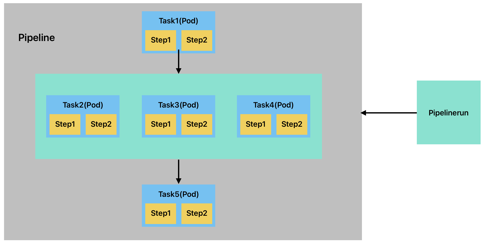

## Tekton 基本概念

### 1、核心概念：K8s 原生的 CI/CD 引擎

Tekton 是 CNCF 孵化项目，以 K8s 为运行底座，将 CI/CD 流程抽象为可扩展的 API 资源。其设计哲学是 “一切皆资源”。

|     概念      |                                                     描述                                                      |           云原生价值            |
| :-----------: | :-----------------------------------------------------------------------------------------------------------: | :-----------------------------: |
|   **Step**    |                                          每个 `Step`直接对应一个容器                                          |   容器化原子操作（独立隔离）    |
|   **Task**    |         `Task`是`Pipeline`的最小执行单元，其核心是 “完成一个具体的离散操作”, 每个`Task`对应一个`Pod`          |   可复用的原子任务（K8s CRD）   |
| **Pipeline**  |           `Pipeline`通过定义 “拉取 → 构建 → 测试 → 部署” 等阶段，让软件交付像工厂流水线一样高效可控           |   任务编排（支持并行 / 依赖）   |
| **Workspace** |                `Workspace`是连接 `Task` 和 `Pipeline`的核心组件，用于跨容器、跨任务共享数据。                 | 跨任务文件共享（PVC 或 Volume） |
|  **Trigger**  | `Triggers`是实现 事件驱动流水线 的核心组件，用于自动响应外部事件（如代码提交、API 调用）触发 `Pipeline`执行。 |  事件驱动（Webhook/Git 推送）   |

### 2、流水线架构



- 多个 Step (Container) 组成一个 Task (Pod) ，多个 Task 组成 Pipeline，Pipelinerun 来运行 Pipeline
- Task 是引用 Taskrun 来执行的，当 Pipelinerun 来运行 Pipeline 时会自动创建 Taskrun 来运行 Task
- Task 是依次执行的，Task1 完成再去执行下面的 Task2，Task3，Task4，这里 Task 是同时执行的，最后再执行 Task5，全程只要有一个容器执行失败，流水线就会从该处终止
- Step 也是依次执行，Step1 完成了才回去执行 Step2，如果 Step1 执行失败，则从 Step1 开始终止后续运行

## Tekton 部署

### 1、安装 Tekton Pipelines

```bash
# 安装Pipeline
kubectl apply --filename https://storage.googleapis.com/tekton-releases/pipeline/latest/release.yaml

# 查看
kubectl get pods --namespace tekton-pipelines --watch
```

### 2、安装 Tekton Triggers

```bash
kubectl apply --filename \
https://storage.googleapis.com/tekton-releases/triggers/latest/release.yaml
kubectl apply --filename \
https://storage.googleapis.com/tekton-releases/triggers/latest/interceptors.yaml
```

### 3、安装 Tekton Dashboard

#### 资源清单安装 Tekton Dashboard

要在 Kubernetes 集群上安装 Tekton Dashboard：

##### a)、运行以下命令安装 Tekton Dashboard：

```bash
# 只读模式
kubectl apply --filename https://storage.googleapis.com/tekton-releases/dashboard/latest/release.yaml
```

这将默认以只读模式安装仪表板。

```bash
# 读写模式
kubectl apply --filename https://storage.googleapis.com/tekton-releases/dashboard/latest/release-full.yaml
```

以前的版本可以在以下网址获取`previous/$VERSION_NUMBER/*.yaml`，例如

```bash
kubectl apply --filename https://storage.googleapis.com/tekton-releases/dashboard/previous/v0.32.0/release.yaml
```

要以读/写模式安装，请使用 release-full.yaml。

v0.31.0 及更早版本对发布清单使用了不同的命名方案：

| 模式  | 当前的         | v0.31.0 及更早版本                     |
| ----- | -------------- | -------------------------------------- |
| 只读  | 发布.yaml      | tekton-dashboard-release-readonly.yaml |
| 读/写 | 发布-full.yaml | tekton-仪表板-发布.yaml                |

##### b)、使用以下命令监视安装，直到所有组件都显示`Running`状态：

```bash
kubectl get pods --namespace tekton-pipelines --watch
```

#### 3、使用安装程序脚本安装 Tekton Dashboard

##### a)、以读/写模式安装最新版本

```bash
curl -sL https://raw.githubusercontent.com/tektoncd/dashboard/main/scripts/release-installer | \
  bash -s -- install latest --read-write
```

##### b)、安装时可以访问命名空间的子集，而不是完整的集群访问权限：

```bash
curl -sL https://raw.githubusercontent.com/tektoncd/dashboard/main/scripts/release-installer | \
  bash -s -- install latest --read-write --tenant-namespaces tenant-namespace1,tenant-namespace2
```

这会将`--namespaces`arg 添加到仪表板部署中，并在每个指定的命名空间中创建 RoleBindings，并将适当的角色授予仪表板服务帐户。

##### c)、安装并支持从外部源加载日志：

```bash
curl -sL https://raw.githubusercontent.com/tektoncd/dashboard/main/scripts/release-installer | \
  bash -s -- install latest --read-write --external-logs <logs-provider-url>
```

#### 访问 Tekton Dashboard

可以使用以下命令通过端口转发来访问 Tekton Dashboard：

```bash
# 只绑定了回环网卡，只能在127.0.0.1:9097访问
kubectl port-forward -n tekton-pipelines service/tekton-dashboard 9097:9097

# 显式指定绑定到所有接口（0.0.0.0）
kubectl port-forward -n tekton-pipelines --address 0.0.0.0 service/tekton-dashboard 9097:9097
```

然后在浏览器中打开 `http://localhost:9097` 即可访问 Tekton Dashboard。

### 4、安装 Tekton cli

下载地址：https://github.com/tektoncd/cli/releases
