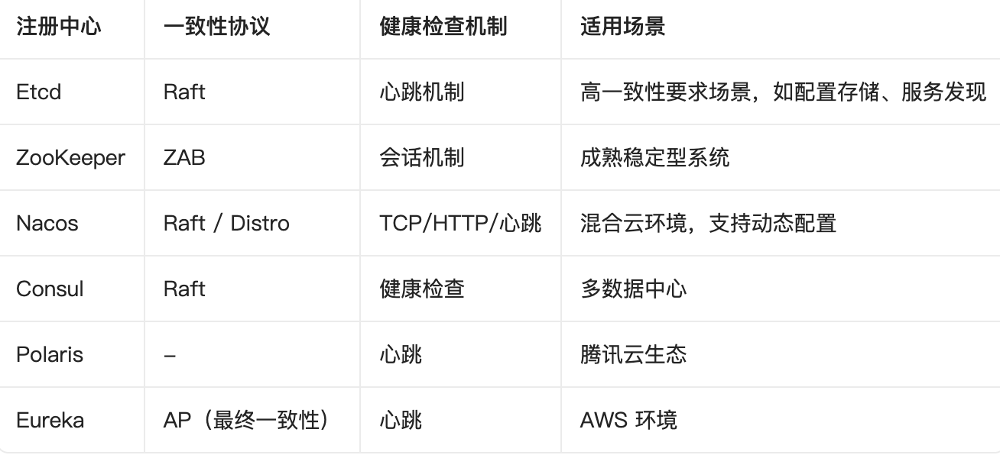

## 一、核心设计原理

Kitex 的服务注册与发现基于两个核心接口：Registry（服务注册） 和 Resolver（服务发现）。这种解耦设计使得 Kitex 不绑定任何特定的注册中心，体现了框架的中立性与可扩展性。

- Registry：由服务提供者（Server）使用，负责将服务实例信息（如 IP、端口、服务名）写入注册中心，并在服务关闭时主动注销。
- Resolver：由服务消费者（Client）使用，负责从注册中心获取可用服务节点列表，并订阅节点变化以实现动态更新。

接口定义如下：

```go
// Registry 接口
type Registry interface {
    Register(info *Info) error
    Deregister(info *Info) error
}

// Resolver 接口
type Resolver interface {
    Target(ctx context.Context, target rpcinfo.EndpointInfo) string
    Resolve(ctx context.Context, key string) (Result, error)
    Diff(key string, prev, next Result) (Change, bool)
    Name() string
}
```

其中 Diff 方法支持增量更新，客户端可以对比前后节点列表变化，避免全量拉取带来的性能损耗。

## 二、支持的注册中心对比

Kitex 通过社区贡献已经集成了多种注册中心，每种注册中心在一致性协议、健康检查机制和适用场景上各有特点



除上述注册中心外，Kitex 还支持 DNS 解析和 Static IP 直连访问模式，满足不同部署需求

## 三、服务端服务注册实践

### 3.1 基本注册流程

服务端在启动时，通过 server.WithRegistry 指定注册中心，Kitex 框架会自动完成服务信息的注册。以下是一个集成 Etcd 的示例：

```go
r, err := etcd.NewEtcdRegistry([]string{"127.0.0.1:2379"})
if err != nil {
    panic(err)
}

svr := kitex.NewServer(
    server.WithRegistry(r),
    server.WithServiceAddr(&net.TCPAddr{IP: net.ParseIP("127.0.0.1"), Port: 8888}),
)

if err := svr.Run(); err != nil {
    log.Fatal(err)
}
```

启动后，Kitex 自动将服务信息注册至 Etcd，并定期发送心跳维持会话有效性。如果服务崩溃，心跳超时后注册中心会自动剔除该实例

### 3.2 集成 Nacos

使用 Nacos 时，通常使用 NewDefaultNacosRegistry 方法创建注册中心实例，它会自动从环境变量读取 Nacos 地址配置：

```go
r, err := registry.NewDefaultNacosRegistry()
if err != nil {
    panic(err)
}

svr := hello.NewServer(
    new(HelloImpl),
    server.WithRegistry(r),
    server.WithRegistryInfo(&kitexregistry.Info{ServiceName: "Hello"}),
    server.WithServiceAddr(&net.TCPAddr{IP: net.IPv4(127, 0, 0, 1), Port: 8080}),
)

if err := svr.Run(); err != nil {
    log.Fatal(err)
}
```

### 3.3 多服务注册与服务管理

Kitex 服务端支持在同一进程中注册多个服务，每个服务通过 RegisterService 方法添加。服务名用于请求路由，Kitex 会检测不同服务之间的方法名冲突。

Fallback 服务：当请求的服务名未匹配时，可配置一个回退服务进行处理。
Unknown 服务：用于处理 IDL 中未定义的方法，自动注册二进制泛化调用方法。

以下是一个多服务示例示意：

```go
svr := server.NewServer()
svr.RegisterService(svcInfo1, handler1)
svr.RegisterService(svcInfo2, handler2, server.WithFallbackService(true))
```

通过这种方式，单个 Kitex 进程可以对外暴露多个 RPC 服务接口，减少运维复杂度

### 3.4 注册选项配置（以 Etcd 为例）

Etcd 扩展提供了丰富的配置选项，满足生产环境需求：

- TLS 配置：WithTLSOpt(certFile, keyFile, caFile)
- 认证配置：WithAuthOpt(username, password)
- 连接超时：WithDialTimeoutOpt(dialTimeout)
- 重试机制：支持最大尝试次数、观测延迟和重试延迟配置，默认最大重试5次，观测延迟30秒，重试延迟10秒

```go
r, err := etcd.NewEtcdRegistryWithRetry(
    []string{"127.0.0.1:2379"},
    retry.NewRetryConfig(retry.WithMaxAttemptTimes(10)),
    etcd.WithTLSOpt("cert.pem", "key.pem", "ca.pem"),
)
```

## 四、客户端服务发现实践

### 4.1 基本发现流程

客户端通过 client.WithResolver 注入 Resolver 实例，Kitex 在发起 RPC 调用前会自动获取服务节点列表并进行负载均衡

```go
// 使用 Etcd 进行服务发现
r, err := etcd.NewEtcdResolver([]string{"127.0.0.1:2379"})
if err != nil {
    log.Fatal(err)
}

cl, err := itemservice.NewClient("example.shop.item",
    client.WithResolver(r),
    client.WithClientBasicInfo(&rpcinfo.EndpointBasicInfo{ServiceName: "example.shop.item"}),
)
```

### 4.2 Nacos 客户端发现

Nacos 客户端的 Resolver 同样提供默认创建方式

```go
r, err := resolver.NewDefaultNacosResolver()
if err != nil {
    panic(err)
}
c, err := userservice.NewClient(constants.UserServiceName,
    client.WithResolver(r),
)
```

### 4.3 负载均衡策略

Kitex 默认使用随机负载均衡，但可以通过 client.WithLoadBalancer() 切换策略，例如轮询（Round Robin）、最小连接数（Least Connection）等。负载均衡与 Resolver 配合，客户端在每次发起调用时都会查询注册中心获取最新节点（或通过 Diff 增量更新），从而感知服务实例的变化。

### 4.4 服务变更处理

当服务实例崩溃或关闭时：

- 服务端停止发送心跳信号；
- 注册中心（如 Etcd）检测心跳超时（例如 10 秒）后自动移除该实例；
- 客户端在后续请求中获取到更新后的节点列表，不会将请求发送到已下线的实例。

如果服务重启并注册到新地址，客户端能够自动获取最新位置，整个过程对业务透明，实现了动态服务发现。

## 五、扩展性与社区生态

Kitex 不提供默认的服务注册发现实现，而是将扩展定义在 pkg/registry 和 pkg/discovery 包下，允许开发者自行集成任意注册中心。截至目前，社区已经贡献了以下扩展库：

- kitex-contrib/registry-etcd
- kitex-contrib/registry-nacos
- kitex-contrib/registry-zookeeper
- kitex-contrib/registry-polaris
- kitex-contrib/registry-eureka
- kitex-contrib/registry-consul

此外，Kitex 也支持 DNS 解析（通过 resolve.DNSResolver）和静态 IP 直连（通过 resolve.StaticIPResolver），方便在不需要注册中心的场景下使用。

## 六、进阶：结合服务治理的其他能力

服务注册与发现是微服务互通的基础，但仅有发现还不足以构建高可用的系统。Kitex 在此基础上提供了熔断、限流、重试等服务治理模块，这些模块大多通过中间件（Middleware）方式集成。

- 熔断器（Circuit Breaker）：Kitex 提供了 CBSuite，封装了服务粒度和实例粒度的熔断统计，用户通过 client.WithMiddleware 开启。服务粒度熔断按照服务名进行统计，实例粒度则按具体节点统计。

结合服务发现与熔断，可以形成完整的保护机制：当某个服务实例出现故障时，熔断器会快速失败，阻止上游继续调用该实例，同时服务发现层可以将其从可用列表中移除，加速故障恢复。

## 七、总结

Kitex 的服务注册与发现机制具备以下特点：

1. 高度抽象、灵活扩展：通过 Registry 和 Resolver 接口解耦，框架不绑定任何注册中心。
2. 生态丰富：已支持 etcd、Nacos、ZooKeeper、Consul、Polaris、Eureka 等多种主流注册中心，同时支持 DNS 和静态 IP。
3. 自动化生命周期管理：服务注册、心跳维持、异常剔除全自动完成。
4. 动态发现与负载均衡：客户端实时感知节点变化，支持多种负载均衡策略。
5. 多服务支持：单个进程可注册多个服务，支持 Fallback 和 Unknown 服务处理器。
6. 可配置性强：连接 TLS、认证、超时、重试等均可按需配置，适用于生产环境。

在实际微服务架构中，选择合适的注册中心并结合熔断、限流等治理能力，能够有效提升系统的弹性与可扩展性，而 Kitex 提供的这套注册发现机制正是实现这一切的基石。
