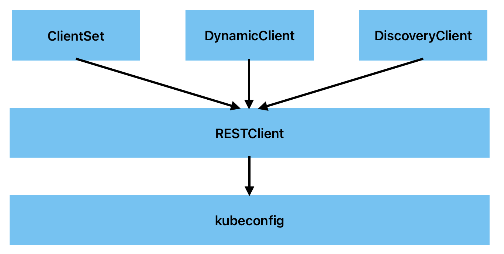

## client-go客户端分类

client-go支持4种Client客户端对象与Kubernetes API Server交互的方式，Client交互对象如图所示。



`RESTClient`是最基础的客户端。RESTClient对HTTP Request进行了封装，实现了RESTful风格的API。ClientSet、DynamicClient及DiscoveryClient客户端都是基于RESTClient实现的。

`ClientSet`在RESTClient的基础上封装了对Resource和Version的管理方法。每一个Resource可以理解为一个客户端，而ClientSet则是多个客户端的集合，每一个Resource和Version都以函数的方式暴露给开发者。ClientSet只能够处理Kubernetes内置资源，它是通过client-gen代码生成器自动生成的。

`DynamicClient`与ClientSet最大的不同之处是，ClientSet仅能访问Kubernetes自带的资源（即Client集合内的资源），不能直接访问CRD自定义资源。DynamicClient能够处理Kubernetes中的所有资源对象，包括Kubernetes内置资源与CRD自定义资源。

`DiscoveryClient`发现客户端，用于发现kube-apiserver所支持的资源组、资源版本、资源信息（即Group、Versions、Resources）。

以上4种客户端：RESTClient、ClientSet、DynamicClient、DiscoveryClient都可以通过kubeconfig配置信息连接到指定的Kubernetes API Server，后面将详解它们的实现。


## client-go使用

### 1. InCluster (集群内)

```go
// 创建一个Config实例，主要配置需要操作的集群信息，就是apiserver的address和port

config,err := rest.InClusterConfig()
if err!=nil{
  panic(err.Error())
}

// 创建一个clientSet客户端，也可以创建其它的客户端
clientSet,err :=kubernetes.NewForConfig(config)
if err!=nil{
  panic(err.Error())
}

// 使用clientSet操作集群：获取集群Pod列表
pod,err := clientSet.CoreV1().Pods("").List(context.TODO(),metav1.ListOptions{})
if err!=nil{
  panic(err.Error())
}

// len(pod.Items) 集群中pod的个数
```


### 2. OutOfCluster (集群外)

```go
 // 配置kubeconfig文件 
  var kubeconfig *string
	if home := homedir.HomeDir(); home != "" {
		kubeconfig = flag.String("kubeconfig", filepath.Join(home, ".kube", "config"), "(optional) absolute path to the kubeconfig file")
	} else {
		kubeconfig = flag.String("kubeconfig", "", "absolute path to the kubeconfig file")
	}
	flag.Parse()

	// 使用当前kubeconfig文件创建Config
	config, err := clientcmd.BuildConfigFromFlags("", *kubeconfig)
	if err != nil {
		panic(err.Error())
	}

	// 和集群内一样，开始创建clientset
	clientset, err := kubernetes.NewForConfig(config)
	if err != nil {
		panic(err.Error())
	}
	for {
		pods, err := clientset.CoreV1().Pods("").List(context.TODO(), metav1.ListOptions{})
		if err != nil {
			panic(err.Error())
		}
		fmt.Printf("There are %d pods in the cluster\n", len(pods.Items))

		// Examples for error handling:
		// - Use helper functions like e.g. errors.IsNotFound()
		// - And/or cast to StatusError and use its properties like e.g. ErrStatus.Message
		namespace := "default"
		pod := "example-xxxxx"
		_, err = clientset.CoreV1().Pods(namespace).Get(context.TODO(), pod, metav1.GetOptions{})
		if errors.IsNotFound(err) {
			fmt.Printf("Pod %s in namespace %s not found\n", pod, namespace)
		} else if statusError, isStatus := err.(*errors.StatusError); isStatus {
			fmt.Printf("Error getting pod %s in namespace %s: %v\n",
				pod, namespace, statusError.ErrStatus.Message)
		} else if err != nil {
			panic(err.Error())
		} else {
			fmt.Printf("Found pod %s in namespace %s\n", pod, namespace)
		}

		time.Sleep(10 * time.Second)
	}
```


