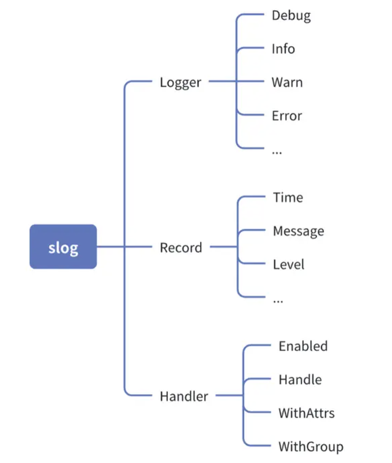
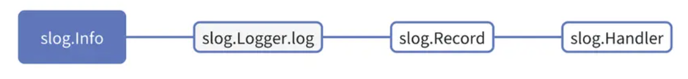

slog 日志包是 Go 语言中的一个结构化日志库，旨在提供一个简单而强大的日志系统。因为标准日志库 log 过于简陋，社区中经常有人吐槽，Go 官方也承认了这一点，于是 Go 团队成员 Jonathan Amsterdam 操刀设计了新的日志库 slog，其放在 log/slog 目录中。

slog 设计之初大量参考了社区中现有日志包方案，相比于 log，主要解决了两个问题：

- log 不支持日志级别。
- log 日志不是结构化的。

这两个问题都能在 slog 中得到解决，本文就来带大家详解 slog 用法及设计。

## slog 快速入门
### 1. 快速开始
slog 使用非常简单，导入 log/slog 后即可使用
```go
package main

import "log/slog"

func main() {
    slog.Debug("debug message")
    slog.Info("info message")
    slog.Warn("warn message")
    slog.Error("error message")
}
```
执行示例代码，输出结果如下：
```go
$ go run main.go
2024/06/23 10:20:38 INFO info message
2024/06/23 10:20:38 WARN warn message
2024/06/23 10:20:38 ERROR error message
```
slog 日志默认输出到 `os.Stdout`。

可以发现 `Debug` 日志并没有输出，说明 slog 日志默认级别为 `Info`。

slog 默认仅支持 `Debug、Info、Warn、Error` 这 4 种日志级别，后文会演示如何增加自定义日志级别。

### 2. 附加属性
slog 支持在 msg 后传入无限多个 key/value 键值对来附加额外的属性：
```go
slog.Debug("debug message", "hello", "world")
slog.Info("info message", "hello", "world")
slog.Warn("warn message", "hello", "world")
slog.Error("error message", "hello", "world")
```
执行示例代码，输出结果如下：

```go
$ go run main.go
2024/06/23 10:21:33 INFO info message hello=world
2024/06/23 10:21:33 WARN warn message hello=world
2024/06/23 10:21:33 ERROR error message hello=world
```
可以发现，传递给日志方法的键值对会以 key=value 格式输出

### 3. Context 版本日志方法
slog 的日志方法都存在 XxxContext 版本，使用示例：
```go
ctx := context.Background()
slog.DebugContext(ctx, "debug message", "hello", "world")
slog.InfoContext(ctx, "info message", "hello", "world")
slog.WarnContext(ctx, "warn message", "hello", "world")
slog.ErrorContext(ctx, "error message", "hello", "world")
```

执行示例代码，输出结果如下：
```go
$ go run main.go
2024/06/23 10:22:29 INFO info message hello=world
2024/06/23 10:22:29 WARN warn message hello=world
2024/06/23 10:22:29 ERROR error message hello=world
```
输出结果与不使用 Context 版本的日志方法相同
事实上，它们的代码主逻辑是一样的：
```go
// Info calls [Logger.Info] on the default logger.
func Info(msg string, args ...any) {
    Default().log(context.Background(), LevelInfo, msg, args...)
}

// InfoContext calls [Logger.InfoContext] on the default logger.
func InfoContext(ctx context.Context, msg string, args ...any) {
    Default().log(ctx, LevelInfo, msg, args...)
}
```
无论是 Xxx 还是 XxxContext 版本的日志方法，底层都会调用 slog.Logger.log 方法，只不过 Xxx 日志方法的 context 是在方法内部构造的，XxxContext 日志方法的 context 是通过参数传入的。

### 3. 修改日志级别
我们可以将 slog 日志级别修改为 `Debug`：

```go
slog.SetLogLoggerLevel(slog.LevelDebug)
slog.Debug("debug message", "hello", "world")
slog.Info("info message", "hello", "world")
slog.Warn("warn message", "hello", "world")
slog.Error("error message", "hello", "world")
```
执行示例代码，输出结果如下：
```go
$ go run main.go
2024/06/23 10:23:31 DEBUG debug message hello=world
2024/06/23 10:23:31 INFO info message hello=world
2024/06/23 10:23:31 WARN warn message hello=world
2024/06/23 10:23:31 ERROR error message hello=world
```
可以发现，slog 修改日志级别还是非常方便的。

### 4. 获取当前日志级别
既然可以修改日志级别，那么我们是否也可以获取当前日志级别呢？

很遗憾，slog 没有为我们提供一个方法可以便捷的获取日志级别。

不过，slog 的 `Logger` 对象有一个 `Enabled` 方法，可以用来判断给定的日志级别是否被开启。

那么我们就可以将日志级别由低到高依次传给 `Enabled` 方法来判断当前日志级别是否启用，只要当前日志级别已经启用，就说明 slog 开启的最低日志级别是当前日志级别。

示例代码如下：
```go

var currentLevel slog.Level = -10
for _, level := range []slog.Level{slog.LevelDebug, slog.LevelInfo, slog.LevelWarn, slog.LevelError} {
    r := slog.Default().Enabled(context.Background(), level)
    if r {
        currentLevel = level
        break
    }
}
fmt.Printf("current log level: %v\n", currentLevel)
```
代码中初始化 currentLevel 用来记录当前日志级别，类型为 slog.Level，初始值为 -10。这之所以能生效，是因为其实 slog.Level 本身就是 int 类型。

slog 默认支持的几种日志级别定义如下：
```go
type Level int

const (
    LevelDebug Level = -4
    LevelInfo  Level = 0
    LevelWarn  Level = 4
    LevelError Level = 8
)
```
可以发现这几个日志级别并不是连续的，这是 slog 团队经过深思熟虑后的结果。故意这样设计，是为了方便我们增加自定义日志级别。使我们可以在任意两个日志级别之间定义自己的日志级别（后文会有讲解）。

执行示例代码，输出结果如下：

```go
$ go run main.go
current log level: DEBUG
```
`currentLevel` 初始值为 `-10` 而不是最低的日志级别 `LevelDebug`，可以证明这段获取当前日志级别的示例代码的确是有效的，而不是因为默认值设为 `LevelDebug` 打印结果才是 `DEBUG`。

### 5. 结构化日志
虽然我们说 slog 是结构化的日志包，但其实前文示例中打印的日志结果，并不是结构化的。

接下来看看 slog 支持的真正结构化日志输出长什么样。
#### JSONHandler
slog 支持 JSON 结构化日志。
```go
l := slog.New(slog.NewJSONHandler(os.Stdout, &slog.HandlerOptions{
    AddSource:   true,            // 记录日志位置
    Level:       slog.LevelDebug, // 设置日志级别
    ReplaceAttr: nil,
}))
l.Debug("debug message", "hello", "world")
```
我们可以通过 `slog.New` 方法创建一个自定义的 `*slog.Logger`。

slog.New 接收一个 slog.Handler 对象（slog.Handler 是一个接口，后文会详细讲解）。

slog 内置了两个 slog.Handler 对象，其中一个就是 *slog.JSONHandler，可以使用 slog.NewJSONHandler 来创建。
slog.NewJSONHandler 接收两个参数，传入的 os.Stdout 是一个 io.Writer 接口，用来指定日志输出位置。
*slog.HandlerOptions 是一个结构体，AddSource 设为 true 可以输出记录日志的位置，Level 用来指定日志级别，ReplaceAttr 属性后文再来讲解。
执行示例代码，输出结果如下
```go
$ go run main.go
{
    "time": "2024-06-23T10:25:34.880089+08:00",
    "level": "DEBUG",
    "source": {
        "function": "main.main",
        "file": "/workspace/projects/blog-go-example/log/slog/main.go",
        "line": 71
    },
    "msg": "debug message",
    "hello": "world"
}
```
> NOTE:
slog 默认输出的 JSON 格式日志是没有换行和缩进的，例如：
`{"time":"2024-06-23T10:25:34.880089+08:00","level":"DEBUG","source":{"function":"main.main","file":"/workspace/projects/blog-go-example/log/slog/main.go","line":71},"msg":"debug message","hello":"world"}`
为了展示效果更佳清晰，这里输出的 JSON 格式日志是我经过美化处理的。后文示例也会如此。

这就是 JSON 格式的结构化日志输出。

#### TextHandler
slog 内置的另一个 slog.Handler 对象是 *slog.TextHandler，可以将日志输出为 key=value 结构：
```go
l := slog.New(slog.NewTextHandler(os.Stdout, &slog.HandlerOptions{
    AddSource:   true,            // 记录日志位置
    Level:       slog.LevelDebug, // 设置日志级别
    ReplaceAttr: nil,
}))
l.Debug("debug message", "hello", "world")
```
执行示例代码，输出结果如下：
```go
$ go run main.go
time=2024-06-23T10:25:34.880+08:00 level=DEBUG source=/workspace/projects/blog-go-example/log/slog/main.go:80 msg="debug message" hello=world
```
一般来说，TextHandler 可以作为开发/测试环境的日志输出格式，方便查看；JSONHandler 可以作为生产环境的日志输出格式，方便日志工具采集。

> NOTE:
程序中可以通过环境变量来获取当前程序所处环境是开发、测试还是生产，以此来决定使用哪个 Handler。

### 6. 使用自定义 logger 替换默认 logger
前文已经演示了如何通过 `slog.New` 方法创建一个自定义的 `*slog.Logger`。

我们可以使用自定义的 `logger` 来替换掉 slog 默认的 `logger` 对象，方便使用。

示例如下：
```go
slog.Info("info message", "hello", "world")
log.Println("normal log")

l := slog.New(slog.NewJSONHandler(os.Stdout, &slog.HandlerOptions{
    AddSource:   true,            // 记录日志位置
    Level:       slog.LevelDebug, // 设置日志级别
    ReplaceAttr: nil,
}))
slog.SetDefault(l)

slog.Info("info message", "hello", "world")
// log 也被修改了
log.Println("normal log")
```
使用 slog.SetDefault(l) 可以非常方便的用自定义的 *slog.Logger 对象 l 取代默认 logger 对象。
然后就可以像使用默认 logger 一样调用 slog.Info 使用自定义 *slog.Logger 记录日志了。
并且，slog.SetDefault(l) 对 log 库同样生效。
执行示例代码，输出结果如下：
```go
$ go run main.go
{
    "time": "2024-06-23T10:27:18.946947+08:00",
    "level": "INFO",
    "source": {
        "function": "main.main",
        "file": "/workspace/projects/blog-go-example/log/slog/main.go",
        "line": 95
    },
    "msg": "info message",
    "hello": "world"
}
{
    "time": "2024-06-23T10:27:18.946957+08:00",
    "level": "DEBUG",
    "msg": "normal log"
}
```
> NOTE:
这里 log.Println("normal log") 输出的 JSON 日志也是经过美化处理的。

### 7. 将 slog.Logger 转换为 log.Logger
既然 slog.SetDefault(l) 对 log 库有影响，则说明 *slog.Logger 对象可以被转换成 *log.Logger 对象。
转换示例代码如下：
```go
l := slog.New(slog.NewJSONHandler(os.Stdout, &slog.HandlerOptions{
    AddSource:   true,            // 记录日志位置
    Level:       slog.LevelDebug, // 设置日志级别
    ReplaceAttr: nil,
}))

logLogger := slog.NewLogLogger(l.Handler(), slog.LevelInfo)
logLogger.Println("normal log") // 输出日志级别跟随 slog.LevelInfo 设置
```
`slog.NewLogLogger` 可以创建一个 `*log.Logger` 对象，而它的参数分别是 `slog.Handler` 对象和日志级别。

执行示例代码，输出结果如下：
```go
$ go run main.go
{
    "time": "2024-06-23T10:30:07.99423+08:00",
    "level": "INFO",
    "source": {
        "function": "main.main",
        "file": "/workspace/projects/blog-go-example/log/slog/main.go",
        "line": 109
    },
    "msg": "normal log"
}
```
可以发现，通过标准库 *log.Logger 对象 logLogger 输出的日志依然是 JSON 格式。
### 8. 使用宽松类型可能出现不匹配的属性键值对
前文有介绍 slog 支持在 msg 后传入无限多个 key/value 键值对来附加额外的属性。

但是，这里存在一个坑！如果 key/value 不是成对出现，则输出日志会得到意想不到的结果：
```go
l := slog.New(slog.NewJSONHandler(os.Stdout, &slog.HandlerOptions{
    AddSource:   true,            // 记录日志位置
    Level:       slog.LevelDebug, // 设置日志级别
    ReplaceAttr: nil,
}))

l.Info("info message", "hello") // "!BADKEY":"hello"
```
执行示例代码，输出结果如下：
```go
$ go run main.go
{
    "time": "2024-06-23T10:30:53.200792+08:00",
    "level": "INFO",
    "source": {
        "function": "main.main",
        "file": "/workspace/projects/blog-go-example/log/slog/main.go",
        "line": 120
    },
    "msg": "info message",
    "!BADKEY": "hello"
}
```
示例中除了 msg 外，仅存在一个为 hello 的 key，并没有传入对应的 value。

此时 slog 不会报错，但输出日志结果 "!BADKEY": "hello"，提示我们 key/value 数量不匹配。

为了避免这种错误发生，我们可以使用 go vet 工具来进行检查：
```go
$ go vet .      
# github.com/jianghushinian/blog-go-example/log/slog
# [github.com/jianghushinian/blog-go-example/log/slog]
./main.go:120:3: call to slog.Logger.Info missing a final value
```
可以看到，go vet 能够发现代码中 slog 输出的日志属性中 key/value 数量不匹配问题。

### 9. 使用强类型缓解可能出现不匹配的属性键值对
我们可以使用 slog 提供的强类型 key/value 来缓解以上问题：
```go
l := slog.New(slog.NewJSONHandler(os.Stdout, &slog.HandlerOptions{
    AddSource:   true,            // 记录日志位置
    Level:       slog.LevelDebug, // 设置日志级别
    ReplaceAttr: nil,
}))

l.Info("info message", slog.String("hello", "world"), slog.Int("status", 200))
```
slog 提供了常见的基础类型方法，可以传入对应的 `key/value` 对。

使用 `slog.String、slog.Int` 等可以避免不匹配的 `key/value`。

执行示例代码，输出结果如下：

```go
$ go run main.go
{
    "time": "2024-06-23T10:32:23.420762+08:00",
    "level": "INFO",
    "source": {
        "function": "main.main",
        "file": "/workspace/projects/blog-go-example/log/slog/main.go",
        "line": 135
    },
    "msg": "info message",
    "hello": "world",
    "status": 200
}
```
但是，使用强类型方法，依然不能限制我们传入普通的字符串类型 key/value。

我们还是可能写出如下代码：
```go
l.Info("info message", slog.String("hello", "world"), slog.Int("status", 200), "extra") // "!BADKEY":"extra"
```
执行示例代码，输出结果如下：
```go
$ go run main.go
{
    "time": "2024-06-23T10:32:23.420787+08:00",
    "level": "INFO",
    "source": {
        "function": "main.main",
        "file": "/workspace/projects/blog-go-example/log/slog/main.go",
        "line": 136
    },
    "msg": "info message",
    "hello": "world",
    "status": 200,
    "!BADKEY": "extra"
}
```

### 10. 利用 LogAttrs 限制必须使用强类型，避免出现 !BADKEY
这个时候，我们还有一种解决方案，就是使用 LogAttrs 来输出日志：
```go
l := slog.New(slog.NewJSONHandler(os.Stdout, &slog.HandlerOptions{
    AddSource:   true,            // 记录日志位置
    Level:       slog.LevelDebug, // 设置日志级别
    ReplaceAttr: nil,
}))

l.LogAttrs(
    context.Background(),
    slog.LevelInfo,
    "info message",
    slog.String("hello", "world"),
    slog.Int("status", 405),
    slog.Any("err", errors.New("http method not allowed")), // error 类型可以使用 slog.Any 输出
    // "extra","text", // 编译不通过，类型不匹配
)
```
使用 LogAttrs 方法记录日志，用起来比 Debug、Info 等略显繁琐。不过，它限制只能传递 slog.String、slog.Int 这种强类型，如果传递普通字符串，则编译不通过。

如果要输出的 value 类型为 error，可以使用 slog.Any 输出。slog 支持的其他类型我就不一一列出来了

执行示例代码，输出结果如下：
```go
$ go run main.go
{
    "time": "2024-06-23T10:33:27.820493+08:00",
    "level": "INFO",
    "source": {
        "function": "main.main",
        "file": "/workspace/projects/blog-go-example/log/slog/main.go",
        "line": 147
    },
    "msg": "info message",
    "hello": "world",
    "status": 405,
    "err": "http method not allowed"
}
```

### 11. 属性分组
我们可以使用 slog.Group 为一组 key/value 属性进行分组。

#### JSONHandler
这是使用 JSONHandler 的属性分组示例：
```go
l := slog.New(slog.NewJSONHandler(os.Stdout, &slog.HandlerOptions{
    AddSource:   true,            // 记录日志位置
    Level:       slog.LevelDebug, // 设置日志级别
    ReplaceAttr: nil,
}))

l.Info(
    "info message",
    slog.Group("user", "name", "root", slog.Int("age", 20)),
)
```
执行示例代码，输出结果如下：

```go
$ go run main.go
{
    "time": "2024-06-23T10:35:03.301692+08:00",
    "level": "INFO",
    "source": {
        "function": "main.main",
        "file": "/workspace/projects/blog-go-example/log/slog/main.go",
        "line": 167
    },
    "msg": "info message",
    "user": {
        "name": "root",
        "age": 20
    }
}
```
可以发现，slog.Group 第一个参数为分组名称 user，接下来传递的属性键值对都属于这个分组。

#### TextHandler
使用 TextHandler 的属性分组示例：
```go
l := slog.New(slog.NewTextHandler(os.Stdout, &slog.HandlerOptions{
    AddSource:   true,            // 记录日志位置
    Level:       slog.LevelDebug, // 设置日志级别
    ReplaceAttr: nil,
}))

l.Info(
    "info message",
    slog.Group("user", "name", "root", slog.Int("age", 20)),
)
```
执行示例代码，输出结果如下：
```go
$ go run main.go
time=2024-06-23T10:35:03.301+08:00 level=INFO source=/workspace/projects/blog-go-example/log/slog/main.go:180 msg="info message" user.name=root user.age=20
```
有别于 JSONHandler，这里输出的属性结果是 user.name 形式，而非嵌套形式。

### 12. 使用子 logger
可以使用 With 方法附加自定义属性到一个新的 *slog.Logger 对象。
这个新得到的 *slog.Logger 对象使用方式不变，但其所有日志记录都会携带统一的附加属性，非常适合简化代码。
```go
l := slog.New(slog.NewJSONHandler(os.Stdout, &slog.HandlerOptions{
    AddSource:   true,            // 记录日志位置
    Level:       slog.LevelDebug, // 设置日志级别
    ReplaceAttr: nil,
}))
// 附加自定义属性
sl := l.With("requestId", "10191529-bc34-4efe-95e4-ecac7321773a")
sl.Debug("debug message")
sl.Info("info message")
```

我们为新的 *slog.Logger 对象 sl 附加了 requestId，这在 Web 开发中非常常用，可以用来追踪整个请求链。
接下来使用 sl 输出的日志都会携带这个 requestId 属性。
执行示例代码，输出结果如下：
```go
$ go run main.go
{
    "time": "2024-06-23T10:35:53.966953+08:00",
    "level": "DEBUG",
    "source": {
        "function": "main.main",
        "file": "/workspace/projects/blog-go-example/log/slog/main.go",
        "line": 195
    },
    "msg": "debug message",
    "requestId": "10191529-bc34-4efe-95e4-ecac7321773a"
}
{
    "time": "2024-06-23T10:35:53.966972+08:00",
    "level": "INFO",
    "source": {
        "function": "main.main",
        "file": "/workspace/projects/blog-go-example/log/slog/main.go",
        "line": 196
    },
    "msg": "info message",
    "requestId": "10191529-bc34-4efe-95e4-ecac7321773a"
}
```

### 13. 为子 logger 属性分组
子 logger 对象同样支持属性分组，示例代码如下：
```go
l := slog.New(slog.NewJSONHandler(os.Stdout, &slog.HandlerOptions{
    AddSource:   true,            // 记录日志位置
    Level:       slog.LevelDebug, // 设置日志级别
    ReplaceAttr: nil,
}))

sl := l.WithGroup("user").With("requestId", "10191529-bc34-4efe-95e4-ecac7321773a")
sl.Debug("debug message", "name", "admin")
sl.Info("info message", "name", "admin")
```
使用 `WithGroup` 方法可以对子 `logger` 属性进行分组，这里同时使用了 `With` 又得到一个新的子 `logger` 对象。

执行示例代码，输出结果如下：
```go
$ go run main.go
{
    "time": "2024-06-23T10:37:01.62481+08:00",
    "level": "DEBUG",
    "source": {
        "function": "main.main",
        "file": "/workspace/projects/blog-go-example/log/slog/main.go",
        "line": 208
    },
    "msg": "debug message",
    "user": {
        "requestId": "10191529-bc34-4efe-95e4-ecac7321773a"
        "name": "admin"
    }
}
{
    "time": "2024-06-23T10:37:01.625249+08:00",
    "level": "INFO",
    "source": {
        "function": "main.main",
        "file": "/workspace/projects/blog-go-example/log/slog/main.go",
        "line": 209
    },
    "msg": "info message",
    "user": {
        "requestId": "10191529-bc34-4efe-95e4-ecac7321773a",
        "name": "admin"
    }
}
```
可以发现，使用 With 附加的属性和调用 Debug、info 方法附加的属性都被分组到了 user 中。

### 14. 实现 slog.LogValuer 接口，隐藏敏感信息
有时候，我们可能要在日志中记录某个模型。

比如这里有一个 User 模型：
```go
type User struct {
    ID       int    `json:"id"`
    Name     string `json:"name"`
    Password string `json:"password"`
}
```

如果直接将 User 实例对象传给 slog 进行记录，那么 password 属性也会被记录，这通常并不是我们想要的。

在使用 `slog` 以前，我的做法一般是为 `User` 模型定义一个 `SecureString` 方法，然后返回脱敏后的字符串，这样在记录日志时，可以将 `user.SecureString()` 结果传给日志记录器。

```go
func (u *User) SecureString() string {
    u.Password = ""
    res, _ := json.Marshal(u)
    return string(res)
}
```
不过，`slog` 为我们提供了 `slog.LogValuer` 接口，一个对象只要实现这个接口，就可以直接传递给 `slog` 进行记录。
`slog.LogValuer` 接口定义如下：
```go
type LogValuer interface {
    LogValue() Value
}
```
所以，我们可以为 `User` 实现一个 `LogValue` 方法：
```go
// LogValue implements slog.LogValuer interface
// slog.Value 不可比较: https://jianghushinian.cn/2024/06/15/how-to-make-structures-incomparable-in-go/
func (u *User) LogValue() slog.Value {
    return slog.GroupValue(
        slog.Int("id", u.ID),
        slog.String("name", u.Name),
    )
}
```
`LogValue` 方法返回 `slog.Value` 类型。

> NOTE:
slog.Value 类型不可比较，

现在，我们直接将 `User` 实例传递给 slog 的日志记录方法看看效果：

```go
l := slog.New(slog.NewJSONHandler(os.Stdout, &slog.HandlerOptions{
    AddSource:   true,            // 记录日志位置
    Level:       slog.LevelDebug, // 设置日志级别
    ReplaceAttr: nil,
}))

user := &User{
    ID:       123,
    Name:     "jianghushinian",
    Password: "pass",
}
l.Info("info message", "user1", user)  // *User 未实现 slog.LogValuer 接口
l.Info("info message", "user2", *user) // User 未实现 slog.LogValuer 接口，所以无法隐藏敏感信息
```
执行示例代码，输出结果如下：
```go
$ go run main.go
{
    "time": "2024-06-23T10:38:03.64827+08:00",
    "level": "INFO",
    "source": {
        "function": "main.main",
        "file": "/workspace/projects/blog-go-example/log/slog/main.go",
        "line": 225
    },
    "msg": "info message",
    "user1": {
        "id": 123,
        "name": "jianghushinian"
    }
}
{
    "time": "2024-06-23T10:38:03.648291+08:00",
    "level": "INFO",
    "source": {
        "function": "main.main",
        "file": "/workspace/projects/blog-go-example/log/slog/main.go",
        "line": 226
    },
    "msg": "info message",
    "user2": {
        "id": 123,
        "name": "jianghushinian",
        "password": "pass"
    }
}
```
值得注意的是，这里我为指针类型 *User 实现了 slog.LogValuer 接口，但值类型 User 并没有实现 slog.LogValuer 接口。所以记录日志时 User 实例指针可以隐藏 password，但 User 实例并不能。
## slog 是如何设计的

slog 是 Go 日志生态中的后起之秀，其设计之初可以参考的流行日志库有很多，比如 logrus、zap、zerolog 等。所以我们能在 slog 中看到其他日志库的影子，尤其是 zap。

slog 核心组件有 3 个，分别是 Logger、Record 以及 Handler。

Logger 是一个结构体，面向用户侧，其提供了 Debug、Info 等方法用于记录日志，定义如下：
```go
type Logger struct {
    handler Handler // for structured logging
}

// Debug logs at [LevelDebug].
func (l *Logger) Debug(msg string, args ...any) {
    l.log(context.Background(), LevelDebug, msg, args...)
}

// DebugContext logs at [LevelDebug] with the given context.
func (l *Logger) DebugContext(ctx context.Context, msg string, args ...any) {
    l.log(ctx, LevelDebug, msg, args...)
}

// Info logs at [LevelInfo].
func (l *Logger) Info(msg string, args ...any) {
    l.log(context.Background(), LevelInfo, msg, args...)
}

// InfoContext logs at [LevelInfo] with the given context.
func (l *Logger) InfoContext(ctx context.Context, msg string, args ...any) {
    l.log(ctx, LevelInfo, msg, args...)
}

func (l *Logger) log(ctx context.Context, level Level, msg string, args ...any) {
    if !l.Enabled(ctx, level) {
        return
    }
    var pc uintptr
    if !internal.IgnorePC {
        var pcs [1]uintptr
        // skip [runtime.Callers, this function, this function's caller]
        runtime.Callers(3, pcs[:])
        pc = pcs[0]
    }
    r := NewRecord(time.Now(), level, msg, pc)
    r.Add(args...)
    if ctx == nil {
        ctx = context.Background()
    }
    _ = l.Handler().Handle(ctx, r)
}
...
```
可以发现，Logger 结构体定义非常简单，其内部唯一一个属性就是 Handler。

Record 是一条日志条目，一个 Record 实例就代表了一条日志记录，定义如下：
```go
// A Record holds information about a log event.
type Record struct {
    // The time at which the output method (Log, Info, etc.) was called.
    Time time.Time

    // The log message.
    Message string

    // The level of the event.
    Level Level

    ...
}
```
其中 Time 是当前这条日志记录的时间，Message 是日志消息，Level 是日志级别。

而 Handler 是一个接口，用于处理 Logger 产生的日志条目 Record，定义如下：

```go
// A Handler handles log records produced by a Logger.
type Handler interface {
    // Enabled reports whether the handler handles records at the given level.
    Enabled(context.Context, Level) bool

    // Handle handles the Record.
    Handle(context.Context, Record) error

    // WithAttrs returns a new Handler whose attributes consist of
    // both the receiver's attributes and the arguments.
    WithAttrs(attrs []Attr) Handler

    // WithGroup returns a new Handler with the given group appended to
    // the receiver's existing groups.
    WithGroup(name string) Handler
}
```

slog 3 大核心组件导图如下：




这就是 slog 最核心的设计了。

从 slog 架构逻辑上讲，其中 Logger 被称为前端，Handler 被称为后端，而 Record 就是连接二者的桥梁。

记录一条日志流程如下：




用户调用前端 Logger 提供的日志记录方法 Info 记录一条日志，Info 方法会调用一个私有方法 log，log 方法内部会使用 NewRecord 创建一个日志条目 Record，最终，Logger 会调用其嵌入的 Handler 对象的 Handle 方法解析 Record 并执行日志记录逻辑。

## 定制 Logger

了解了 slog 的日志设计，接下来我们就可以基于 slog.Logger 定制属于自己的 Logger 对象了。

我们要自定义的 Logger 对象需要支持 3 个功能：自定义日志级别、动态调整日志级别、以及正确输出日志位置。

### 1. 自定义日志级别
自定义的 Logger 对象首先要支持自定义日志级别：
```go
type Level = slog.Level

const (
    LevelDebug = slog.LevelDebug
    LevelTrace = slog.Level(-2) // 自定义日志级别
    LevelInfo  = slog.LevelInfo
    LevelWarn  = slog.LevelWarn
    LevelError = slog.LevelError
)
```
这里我们为 slog.Level 定义了一个别名 Level，并且在 LevelDebug 以及 LevelInfo 之间自定义了一个日志级别，其值为 -2。

因为 LevelDebug 值为 -4，LevelInfo 值为 0，所以我们最多可以在二者之间自定义 3 个日志级别 -3、-2、-1。

### 2. 动态设置日志级别
自定义 Logger 结构体对象如下：
```go
type Logger struct {
    l   *slog.Logger
    lvl *slog.LevelVar // 用来动态调整日志级别
}
```
Logger 内部包含了 *slog.Logger 对象，以及 *slog.LevelVar 对象。
其中 *slog.LevelVar 类型支持通过 *slog.LevelVar.Set(Level) 动态调整日志级别。
Logger 构造函数如下：
```go
func New(level slog.Level) *Logger {
    var lvl slog.LevelVar
    lvl.Set(level)

    h := slog.New(slog.NewJSONHandler(os.Stdout, &slog.HandlerOptions{
        AddSource: true,

        Level: &lvl, // 支持动态设置日志级别

        // 修改日志中的 Attr 键值对（即日志记录中附加的 key/value）
        ReplaceAttr: func(groups []string, a slog.Attr) slog.Attr {
            if a.Key == slog.LevelKey {
                level := a.Value.Any().(slog.Level)
                levelLabel := level.String()

                switch level {
                case LevelTrace:
                    // NOTE: 如果不设置，默认日志级别打印为 "level":"DEBUG+2"
                    levelLabel = "TRACE"
                }

                a.Value = slog.StringValue(levelLabel)
            }

            return a
        },
    }))

    return &Logger{l: h, lvl: &lvl}
}
```
自定义 `Logger` 使用 `JSONHandler` 作为默认的 `Handler`，这里终于用上了 `ReplaceAttr` 属性。

`*slog.HandlerOptions` 的 `ReplaceAttr` 属性接收一个函数，第一个参数是日志分组 `groups`，即我们通过 `slog.Group` 指定的组，第二个参数是 `slog.Attr` 类型，它其实就是日志条目中包含的所有附加属性 `key/value`。

所以，其实每记录一条日志，都会多次调用这个方法，并将日志条目对应的分组和属性传递进来，方便我们进行修改，并返回最终修改后的属性。

这也就给了我们一个机会，可以判断当前日志条目的级别，而自定义日志级别输出结果如何，完全掌握在我们自己手中。

根据前文的示例讲解，你应该也能发现，日志条目中的时间和级别等属性，都是 `slog` 自动加上去的。而属性的 `key` 其实被定义为了常量：

```go
// Keys for "built-in" attributes.
const (
    // TimeKey is the key used by the built-in handlers for the time
    // when the log method is called. The associated Value is a [time.Time].
    TimeKey = "time"
    // LevelKey is the key used by the built-in handlers for the level
    // of the log call. The associated value is a [Level].
    LevelKey = "level"
    // MessageKey is the key used by the built-in handlers for the
    // message of the log call. The associated value is a string.
    MessageKey = "msg"
    // SourceKey is the key used by the built-in handlers for the source file
    // and line of the log call. The associated value is a *[Source].
    SourceKey = "source"
)
```
slog 内置了这 4 个常量作为属性的 key，所以在 ReplaceAttr 方法中，我们可以通过 if a.Key == slog.LevelKey 判断这个属性是否为日志级别。

如果是日志级别，并且日志级别为自定义的 LevelTrace，则设置其字符串形式为 TRACE。

而动态调整日志级别其实是 slog 自带的功能，我们只需要代理一下 *slog.LevelVar.Set 方法即可：
```go
// SetLevel 动态调整日志级别
func (l *Logger) SetLevel(level Level) {
    l.lvl.Set(level)
}
```

### 3. 设置 caller skip
自定义 Logger 还要解决一个重要问题。

不知道你有没有注意，前文在介绍 slog是如何设计的 时候，给出的 s`log.Logger` 源码定义中，不管是 `Debug` 还是 `Info` 方法，其实它们内部都调用了 `slog.Logger.log` 方法。所以 `slog.Logger.log` 方法是 `slog.Logger` 的核心方法。

再次回顾下 `slog.Logger.log` 方法的定义：
```go
// log is the low-level logging method for methods that take ...any.
// It must always be called directly by an exported logging method
// or function, because it uses a fixed call depth to obtain the pc.
func (l *Logger) log(ctx context.Context, level Level, msg string, args ...any) {
    if !l.Enabled(ctx, level) {
        return
    }
    var pc uintptr
    if !internal.IgnorePC {
        var pcs [1]uintptr
        // skip [runtime.Callers, this function, this function's caller]
        runtime.Callers(3, pcs[:])
        pc = pcs[0]
    }
    r := NewRecord(time.Now(), level, msg, pc)
    r.Add(args...)
    if ctx == nil {
        ctx = context.Background()
    }
    _ = l.Handler().Handle(ctx, r)
}
```

这个方法中，先通过 `if !l.Enabled(ctx, level)` 判断当前日志级别是否启用，如果没启用则丢弃这条日志，否则继续执行。

这里有一行重点代码 `runtime.Callers(3, pcs[:])`，这行是专门用来准确记录日志位置的，在构造 `Handler` 时如果传入的 `*slog.HandlerOptions` 对象开启了 `AddSource` 选项，就会使用这里的逻辑记录日志的正确位置。

`runtime.Callers` 能够获取调用堆栈的程序计数器，3 表示跳过前 3 个调用者，包括 `runtime.Callers` 自身、当前的 `log` 函数和它的直接调用者 `Debug`、`Info` 等。

遗憾的是，这里 3 是写死的魔法数字，不是通过参数传递进来的。因为我们还会对 `slog` 的日志记录函数进行包装，所以，我们自定义的 `Logger` 对象在记录日志时无法获得准确的日志位置。

比如定义 Debug 方法如下：
```go
func (l *Logger) Debug(msg string, args ...any) {
    // 不会走 *customlog.Logger.log() 调用，会走 *slog.Logger.log() 调用
    l.l.Debug(msg, args...)
}
```
这里直接代理到 `*slog.Logger.Debug` 方法。

现在如果你使用 `New` 函数创建一个自定义 `Logger` 对象，然后调用 `*Logger.Debug` 方法记录日志，将得到错误的日志位置。

为了解决这个问题，正确的做法是，我们可以重写 `slog.Logger.log` 方法：
```go
func (l *Logger) log(ctx context.Context, level slog.Level, msg string, args ...any) {
    if !l.l.Enabled(ctx, level) {
        return
    }
    var pc uintptr
    var pcs [1]uintptr
    // skip [runtime.Callers, this function, this function's caller]
    // NOTE: 这里修改 skip 为 4，*slog.Logger.log 源码中 skip 为 3
    runtime.Callers(4, pcs[:])
    pc = pcs[0]
    r := slog.NewRecord(time.Now(), level, msg, pc)
    r.Add(args...)
    if ctx == nil {
        ctx = context.Background()
    }
    _ = l.l.Handler().Handle(ctx, r)
}
```
这里几乎是 `slog.Logger.log` 方法的拷贝，只不过将 `runtime.Callers(3, pcs[:])` 中的 3 换成了 4。

因为我们自定义的日志记录方法包装了 `slog.Logger` 对应的日志记录方法，这就多了一层调用，所以 `runtime.Callers` 的 `skip` 参数值就需要加 1。

> NOTE:
你可能纠结于 if !internal.IgnorePC { 这个判断条件被我们忽略了，没关系，这个判断实际上是为了在性能测试时关闭记录日志位置的功能，以此提升性能。所以，关闭忽略它并不影响我们的程序功能。

然后定义几个常用的日志记录方法：
```go
func (l *Logger) Info(msg string, args ...any) {
    // l.l.Info(msg, args...)
    l.Log(context.Background(), LevelInfo, msg, args...)
}

// Trace 自定义的日志级别
func (l *Logger) Trace(msg string, args ...any) {
    l.Log(context.Background(), LevelTrace, msg, args...)
}

func (l *Logger) Warn(msg string, args ...any) {
    // l.l.Warn(msg, args...)
    l.Log(context.Background(), LevelWarn, msg, args...)
}

func (l *Logger) Error(msg string, args ...any) {
    // l.l.Error(msg, args...)
    l.Log(context.Background(), LevelError, msg, args...)
}

func (l *Logger) Log(ctx context.Context, level slog.Level, msg string, args ...any) {
    l.log(ctx, level, msg, args...)
}
```
现在自定义 `Logger` 对象暴露的顶层方日志记录方法，都会调用我们自定义的 `*Logger.log` 方法，而非 `*slog.Logger.log `方法。也就解决了日志记录位置不准确的问题。

### 4. 完整 Logger 代码实现
至此，我们得到了自定义日志包的完整代码如下：
```go

package customlog

import (
    "context"
    "log/slog"
    "os"
    "runtime"
    "time"
)

type Level = slog.Level

const (
    LevelDebug = slog.LevelDebug
    LevelTrace = slog.Level(-2) // 自定义日志级别
    LevelInfo  = slog.LevelInfo
    LevelWarn  = slog.LevelWarn
    LevelError = slog.LevelError
)

type Logger struct {
    l   *slog.Logger
    lvl *slog.LevelVar // 用来动态调整日志级别
}

func New(level slog.Level) *Logger {
    var lvl slog.LevelVar
    lvl.Set(level)

    h := slog.New(slog.NewJSONHandler(os.Stdout, &slog.HandlerOptions{
        AddSource: true,

        // Level:     level, // 静态设置日志级别
        Level: &lvl, // 支持动态设置日志级别

        // 修改日志中的 Attr 键值对（即日志记录中附加的 key/value）
        ReplaceAttr: func(groups []string, a slog.Attr) slog.Attr {
            if a.Key == slog.LevelKey {
                level := a.Value.Any().(slog.Level)
                levelLabel := level.String()

                switch level {
                case LevelTrace:
                    // NOTE: 如果不设置，默认日志级别打印为 "level":"DEBUG+2"
                    levelLabel = "TRACE"
                }

                a.Value = slog.StringValue(levelLabel)
            }

            // NOTE: 可以在这里修改时间输出格式
            // if a.Key == slog.TimeKey {
            //     if t, ok := a.Value.Any().(time.Time); ok {
            //         a.Value = slog.StringValue(t.Format(time.DateTime))
            //     }
            // }

            return a
        },
    }))

    return &Logger{l: h, lvl: &lvl}
}

// SetLevel 动态调整日志级别
func (l *Logger) SetLevel(level Level) {
    l.lvl.Set(level)
}

func (l *Logger) Debug(msg string, args ...any) {
    // 不会走 *customlog.Logger.log() 调用，会走 *slog.Logger.log() 调用
    l.l.Debug(msg, args...)
}

func (l *Logger) Info(msg string, args ...any) {
    l.Log(context.Background(), LevelInfo, msg, args...)
}

// Trace 自定义的日志级别
func (l *Logger) Trace(msg string, args ...any) {
    l.Log(context.Background(), LevelTrace, msg, args...)
}

func (l *Logger) Warn(msg string, args ...any) {
    l.Log(context.Background(), LevelWarn, msg, args...)
}

func (l *Logger) Error(msg string, args ...any) {
    l.Log(context.Background(), LevelError, msg, args...)
}

func (l *Logger) Log(ctx context.Context, level slog.Level, msg string, args ...any) {
    l.log(ctx, level, msg, args...)
}

// log is the low-level logging method for methods that take ...any.
// It must always be called directly by an exported logging method
// or function, because it uses a fixed call depth to obtain the pc.
func (l *Logger) log(ctx context.Context, level slog.Level, msg string, args ...any) {
    if !l.l.Enabled(ctx, level) {
        return
    }
    var pc uintptr
    var pcs [1]uintptr
    // skip [runtime.Callers, this function, this function's caller]
    // NOTE: 这里修改 skip 为 4，*slog.Logger.log 源码中 skip 为 3
    runtime.Callers(4, pcs[:])
    pc = pcs[0]
    r := slog.NewRecord(time.Now(), level, msg, pc)
    r.Add(args...)
    if ctx == nil {
        ctx = context.Background()
    }
    _ = l.l.Handler().Handle(ctx, r)
}
```

使用示例：

```go
package main

import "github.com/jianghushinian/blog-go-example/log/slog/customlog"

...

l := customlog.New(customlog.LevelDebug)
l.Debug("custom debug message", "hello", "world")
l.Trace("custom trace message", "hello", "world")
l.Info("custom info message", "hello", "world")

l.SetLevel(customlog.LevelInfo)
l.Debug("custom debug message", "hello", "world")
l.Trace("custom trace message", "hello", "world")
l.Info("custom info message", "hello", "world")
```

执行示例代码，输出结果如下：

```go
$ go run main.go
{
    "time": "2024-06-23T10:39:28.563559+08:00",
    "level": "DEBUG",
    "source": {
        "function": "github.com/jianghushinian/blog-go-example/log/slog/customlog.(*Logger).Debug",
        "file": "/workspace/projects/blog-go-example/log/slog/customlog/customlog.go",
        "line": 72
    },
    "msg": "custom debug message",
    "hello": "world"
}
{
    "time": "2024-06-23T10:39:28.563785+08:00",
    "level": "TRACE",
    "source": {
        "function": "main.main",
        "file": "/workspace/projects/blog-go-example/log/slog/main.go",
        "line": 233
    },
    "msg": "custom trace message",
    "hello": "world"
}
{
    "time": "2024-06-23T10:39:28.563815+08:00",
    "level": "INFO",
    "source": {
        "function": "main.main",
        "file": "/workspace/projects/blog-go-example/log/slog/main.go",
        "line": 234
    },
    "msg": "custom info message",
    "hello": "world"
}
# 动态调整日志级别以后输出
{
    "time": "2024-06-23T10:39:28.56384+08:00",
    "level": "INFO",
    "source": {
        "function": "main.main",
        "file": "/workspace/projects/blog-go-example/log/slog/main.go",
        "line": 239
    },
    "msg": "custom info message",
    "hello": "world"
}

```

为了对比效果，`Debug` 方法并没有改为调用自定义 `log `方法，依旧是被代理到 `*slog.Logger.Debug` 方法。

可以发现，`Debug` 记录的日志输出位置是错误的，并不是 `l.Debug("custom debug message", "hello", "world")` 这行代码的位置，而是 `Debug `定义的位置。

`Trace` 和 `Info` 日志级别都能被正确记录。

特别强调 `Trace` 日志中输出了 `"level": "TRACE"` 属性键值对。如果我们没有在 `ReplaceAttr` 方法中修改 `levelLabel` 的字符串形式，我们将会得到 `"level":"DEBUG+2"`，即这个日志级别 `slog` 不认识，但它知道其值比 `LevelDebug` 大 2。因为 `LevelDebug` 值为 -4，`LevelTrace` 值为 -2（为了加深理解，你可以注释掉相关代码，再执行下示例程序，看看效果）。

当我们使用 `l.SetLevel(customlog.LevelInfo)`动态调整日志级别以后，仅 `Info` 级别的日志会被输出。

看来我们自定义的 Logger 实现完成了它的 3 个使命。

## 自定义 Handler
既然讲解了如何自定义 `slog` 的前端 `Logger`，我们不妨看一下如何自定义 `slog` 的后端 `Handler`。

根据前文的讲解，我们知道 `Handler` 是一个接口，回顾下其定义：

```go
// A Handler handles log records produced by a Logger.
type Handler interface {
    // Enabled reports whether the handler handles records at the given level.
    Enabled(context.Context, Level) bool

    // Handle handles the Record.
    Handle(context.Context, Record) error

    // WithAttrs returns a new Handler whose attributes consist of
    // both the receiver's attributes and the arguments.
    WithAttrs(attrs []Attr) Handler

    // WithGroup returns a new Handler with the given group appended to
    // the receiver's existing groups.
    WithGroup(name string) Handler
}

```
既然是接口，那么我们自定义的 `Handler` 其实只要实现这个接口就行了。

自定义 `Handler` 代码实现如下：

```go
package customlog

import (
    "context"
    "io"
    "log/slog"
)

// Handler 自定义日志后端 slog.Handler
type Handler struct {
    slog.Handler
}

// NewHandler 创建新的日志后端 handler
func NewHandler(w io.Writer, opts *slog.HandlerOptions) *Handler {
    return &Handler{
        Handler: slog.NewJSONHandler(w, opts),
    }
}

// Enabled 当前日志级别是否开启
func (h *Handler) Enabled(ctx context.Context, level slog.Level) bool {
    return h.Handler.Enabled(ctx, level)
}

// Handle 处理日志记录，仅在 Enabled() 返回 true 时才会被调用
func (h *Handler) Handle(ctx context.Context, record slog.Record) error {
    record.Add("customlog", "handler")
    return h.Handler.Handle(ctx, record)
}

// WithAttrs 从现有的 handler 创建一个新的 handler，并将新增属性附加到新的 handler
func (h *Handler) WithAttrs(attrs []slog.Attr) slog.Handler {
    return h.Handler.WithAttrs(attrs)
}

// WithGroup 从现有的 handler 创建一个新的 handler，并将指定分组附加到新的 handler
func (h *Handler) WithGroup(name string) slog.Handler {
    return h.Handler.WithGroup(name)
}
```

在这里，为了示例足够简单，我并没有做太多的工作，自定义的 `Handler` 仅代理了 `*slog.JSONHandler`。并在 `Handle` 方法中对日志条目 `Record` 附加了一对属性 `record.Add("customlog", "handler")`。

现在，这个自定义 `Handler` 就可以使用了：

```go
package main

import "github.com/jianghushinian/blog-go-example/log/slog/customlog"

...

l := slog.New(customlog.NewHandler(os.Stdout, nil))
l.Info("info message", "hello", "world")
```

我们直接将构造的自定义 `Handler` 传递给 `slog.New`，得到一个新的 `*slog.Logger` 对象，然后用其记录一条日志。

执行示例代码，输出结果如下：

```go
$ go run main.go
{
    "time": "2024-06-23T10:40:31.509387+08:00",
    "level": "INFO",
    "msg": "info message",
    "hello": "world",
    "customlog": "handler"
}
```
没错，就是这么简单，我们实现了自定义 `slog` 的后端 `Handler`。

## 总结
本文对 slog 的常用 API 进行了演示讲解。比如附加属性、结构化日志、属性分组等。

接下来我为你介绍了 slog 是如何设计的，slog 包含 3 大核心对象：Logger、Record、Handler。Logger 又被称为 前端，Handler 被称为 后端，而 Record 用来表示一条日志。

前端 Logger 直接面向用户侧，我们可以对其进行二次封装，来定制自己的用户 API。

后端 Handler 可以统一日志处理接口，我们也可以在自定义的 Handler 中很方便的集成如 zap、zerolog 等第三方日志库。你可以在 [Go Wiki: Resources for slog
](https://tip.golang.org/wiki/Resources-for-slog) 这个列表找到一些灵感。

