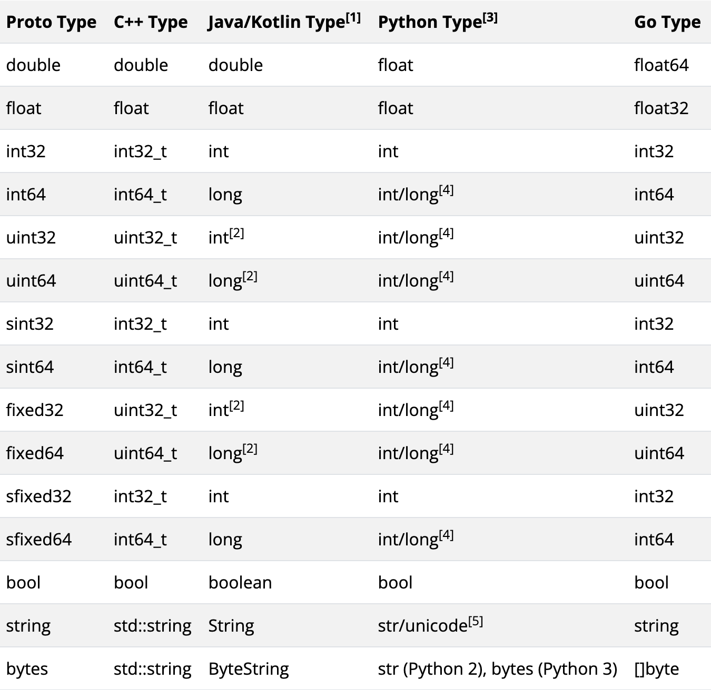

## GRPC概述

### HTTP请求示例

```go
// Server

package main

import (
	"github.com/gin-gonic/gin"
	"net/http"
)

func main() {
	router := gin.Default()
	router.GET("/index", func(ctx *gin.Context) {
		name := ctx.Query("name")
		ctx.JSON(http.StatusOK, gin.H{
			"message": "my name is " + name,
		})
	})
	router.Run("localhost:8080")
}

```

```go
// client

package main

import (
	"encoding/json"
	"fmt"
	"io"
	"net/http"
)

type Result struct {
	Message string `json:"message"`
}

func main() {
	r, err := http.Get("http://localhost:8080/index?name=lili")
	if err != nil {
		panic(fmt.Sprintf("请求不正确：%v", err))
	}
	defer r.Body.Close()

	b, err := io.ReadAll(r.Body)
	if err != nil {
		panic(fmt.Sprintf("读取Body不正确：%v", err))
	}

	var result Result

	err = json.Unmarshal(b, &result)
	if err != nil {
		fmt.Println(string(b))
		panic(fmt.Sprintf("json解析失败：%v", err))
	}

	fmt.Println(result.Message)
}

```

### 基本概念

- **Protocol Buffers（Protobuf）**：这是一种用于序列化结构化数据的语言无关、平台无关的机制。在 gRPC 中，通常使用 Protobuf 来定义服务接口和消息类型。
- **服务定义**：通过 `.proto` 文件定义服务接口和方法，这些方法可以在客户端和服务器之间进行远程调用。
- **Stub 生成**：使用 `protoc` 编译器和 gRPC 插件生成客户端和服务器的代码桩（stub），这些代码桩封装了底层的网络通信细节。
- **通信协议**：gRPC 使用 HTTP/2 作为传输协议，具有二进制分帧、多路复用、头部压缩等特性，能够提供高效的通信。

### 安装protoc编译器

```bash
# 安装 protoc 编译器
# 从 https://github.com/protocolbuffers/protobuf/releases 下载对应系统的版本并安装

# 安装 Go 语言的 gRPC 插件
go install google.golang.org/protobuf/cmd/protoc-gen-go@latest
go install google.golang.org/grpc/cmd/protoc-gen-go-grpc@latest
```

### GRPC示例

#### 1. 定义服务

创建一个 `.proto` 文件，定义服务接口和消息类型。例如，创建一个名为 `hello.proto` 的文件：

```go
syntax = "proto3";

option go_package="pb/helloworld";

package helloworld;

// 定义消息类型
message HelloRequest {
  string name = 1;
}

message HelloResponse {
  string message = 1;
}

// 定义服务
service Greeter {
  // 定义方法
  rpc SayHello (HelloRequest) returns (HelloResponse);
}
```

#### 2. 生成代码

```go
protoc --go_out=. --go-grpc_out=. hello.proto

protoc --go_out=. --go_opt=paths=source_relative --go-grpc_out=. --go-grpc_opt=paths=source_relative helloworld/helloworld.proto
```

这将生成 `hello.pb.go` 和 `hello_grpc.pb.go` 两个文件，分别包含 Protobuf 消息的定义和 gRPC 服务的代码桩。

#### 3. 实现服务器

创建一个 Go 文件，实现 `Greeter` 服务的 `SayHello` 方法：

```go
package main

import (
	"context"
	"fmt"
	"github.com/moonlightmazed/bs-grpc/cmd/proto/pb/helloworld"
	"google.golang.org/grpc"
	"net"
)

type Server struct {
	helloworld.UnimplementedGreeterServer
}

func (s *Server) SayHello(ctx context.Context, req *helloworld.HelloRequets) (*helloworld.HelloResponse, error) {
	return &helloworld.HelloResponse{
		Message: "Hello " + req.Name,
	}, nil
}

func main() {
	lis, err := net.Listen("tcp", "localhost:8080")
	if err != nil {
		panic(err)
	}
	s := grpc.NewServer()
	helloworld.RegisterGreeterServer(s, &Server{})
	if err := s.Serve(lis); err != nil {
		fmt.Println(err)
		return
	}
}

```

#### 4. 实现客户端

创建另一个 Go 文件，实现客户端代码：

```go
package main

import (
	"context"
	"log"
	"time"

	"github.com/moonlightmazed/bs-grpc/cmd/proto/pb/helloworld"
	"google.golang.org/grpc"
)

func main() {
	// 1. 创建gRPC连接
	conn, err := grpc.Dial("localhost:8080", grpc.WithInsecure(), grpc.WithBlock())
	if err != nil {
		log.Fatalf("did not connect: %v", err)
	}
	defer conn.Close()

	// 2. 生成客户端存根
	client := helloworld.NewGreeterClient(conn)

	// 3. 构造带超时的上下文
	callCtx, callCancel := context.WithTimeout(context.Background(), 3*time.Second)
	defer callCancel()

	// 4. 执行RPC调用
	resp, err := client.SayHello(callCtx, &helloworld.HelloRequets{
		Name: "World",
	})
	if err != nil {
		log.Fatalf("RPC调用失败: %v", err)
	}

	log.Printf("收到响应: %s", resp.Message)
}

```

#### 5. 代码解释

- **服务器端**：
  - 定义了一个 `server` 结构体，实现了 `Greeter` 服务的 `SayHello` 方法。
  - 创建一个 gRPC 服务器实例，并注册 `Greeter` 服务。
  - 监听指定端口，等待客户端连接。
- **客户端**：
  - 连接到服务器。
  - 创建 `Greeter` 服务的客户端实例。
  - 发送 `HelloRequest` 消息，并接收 `HelloResponse` 消息。

### stream

#### 1. proto文件

```go
syntax="proto3";

option go_package="/pb/helloworld";

package helloworld;


message HelloRequets{
  string name = 1;
}

message HelloResponse{
  string message = 1;
}

service Greeter{
  rpc SayHelloClientStream(stream HelloRequets)returns(HelloResponse);
  rpc SayHelloServerStream(HelloRequets)returns(stream HelloResponse);
  rpc SayHelloBothStream(stream HelloRequets)returns(stream HelloResponse);
}

```

#### 2. 服务端实现

```go
package main

import (
    "context"
    "io"
    "log"
    "net"
    "strings"
    "time"

    pb "your_project/pb/helloworld"
    "google.golang.org/grpc"
)

type server struct {
    pb.UnimplementedGreeterServer
}

// 客户端流式实现
func (s *server) SayHelloClientStream(stream pb.Greeter_SayHelloClientStreamServer) error {
    var names []string
    for {
        req, err := stream.Recv()
        if err == io.EOF {
            return stream.SendAndClose(&pb.HelloResponse{
                Message: "Received: " + strings.Join(names, ", "),
            })
        }
        if err != nil {
            return err
        }
        names = append(names, req.Name)
    }
}

// 服务端流式实现
func (s *server) SayHelloServerStream(req *pb.HelloRequets, stream pb.Greeter_SayHelloServerStreamServer) error {
    for i := 0; i < 5; i++ {
        if err := stream.Send(&pb.HelloResponse{
            Message: fmt.Sprintf("Hello %s (#%d)", req.Name, i+1),
        }); err != nil {
            return err
        }
        time.Sleep(1 * time.Second)
    }
    return nil
}

// 双向流式实现
func (s *server) SayHelloBothStream(stream pb.Greeter_SayHelloBothStreamServer) error {
    for {
        req, err := stream.Recv()
        if err == io.EOF {
            return nil
        }
        if err != nil {
            return err
        }
        if err := stream.Send(&pb.HelloResponse{
            Message: "Echo: " + req.Name,
        }); err != nil {
            return err
        }
    }
}

func main() {
    lis, err := net.Listen("tcp", ":50051")
    if err != nil {
        log.Fatalf("监听失败: %v", err)
    }

    s := grpc.NewServer()
    pb.RegisterGreeterServer(s, &server{})
    log.Println("服务端已启动 :50051")
    if err := s.Serve(lis); err != nil {
        log.Fatalf("服务启动失败: %v", err)
    }
}
```

#### 3. 客户端实现

```go
package main

import (
    "context"
    "io"
    "log"
    "time"

    pb "your_project/pb/helloworld"
    "google.golang.org/grpc"
    "google.golang.org/grpc/credentials/insecure"
)

func main() {
    conn, err := grpc.Dial("localhost:50051",
        grpc.WithTransportCredentials(insecure.NewCredentials()),
        grpc.WithBlock())
    if err != nil {
        log.Fatalf("连接失败: %v", err)
    }
    defer conn.Close()
    client := pb.NewGreeterClient(conn)

    // 测试客户端流式
    runClientStream(client)

    // 测试服务端流式
    runServerStream(client)

    // 测试双向流式
    runBidiStream(client)
}

// 客户端流
func runClientStream(client pb.GreeterClient) {
    stream, err := client.SayHelloClientStream(context.Background())
    if err != nil {
        log.Fatalf("创建流失败: %v", err)
    }

    names := []string{"Alice", "Bob", "Charlie"}
    for _, name := range names {
        if err := stream.Send(&pb.HelloRequets{Name: name}); err != nil {
            log.Fatalf("发送失败: %v", err)
        }
    }

    res, err := stream.CloseAndRecv()
    if err != nil {
        log.Fatalf("接收失败: %v", err)
    }
    log.Printf("客户端流响应: %s", res.Message)
}


// 服务端流
func runServerStream(client pb.GreeterClient) {
    stream, err := client.SayHelloServerStream(context.Background(),
        &pb.HelloRequets{Name: "World"})
    if err != nil {
        log.Fatalf("调用失败: %v", err)
    }

    for {
        res, err := stream.Recv()
        if err == io.EOF {
            break
        }
        if err != nil {
            log.Fatalf("接收失败: %v", err)
        }
        log.Printf("服务端流消息: %s", res.Message)
    }
}

// 双向流
func runBidiStream(client pb.GreeterClient) {
    stream, err := client.SayHelloBothStream(context.Background())
    if err != nil {
        log.Fatalf("创建流失败: %v", err)
    }

    go func() {
        for {
            res, err := stream.Recv()
            if err == io.EOF {
                return
            }
            if err != nil {
                log.Printf("接收失败: %v", err)
                return
            }
            log.Printf("双向流接收: %s", res.Message)
        }
    }()

    messages := []string{"Hello", "How are you?", "Goodbye"}
    for _, msg := range messages {
        if err := stream.Send(&pb.HelloRequets{Name: msg}); err != nil {
            log.Printf("发送失败: %v", err)
            break
        }
        time.Sleep(1 * time.Second)
    }
    stream.CloseSend()
}
```

#### 4. 核心实现要点

**流式处理模式**：

- **客户端流式**：使用`CloseAndRecv()`结束流并获取最终响应
- **服务端流式**：通过循环`Recv()`接收持续响应
- **双向流式**：需使用goroutine分离收发操作

**错误处理**：

- 检查`io.EOF`判断流结束
- 所有流操作都需要处理可能的网络错误
- 使用`context.WithTimeout`添加超时控制

**性能优化**：

```go
grpc.WithInitialWindowSize(32 * 1024)   // 32KB流窗口
grpc.WithInitialConnWindowSize(64 * 1024) // 64KB连接窗口
```

#### 5. 注意事项

**流生命周期管理**：

- 客户端流和服务端流必须正确调用Close方法
- 双向流需要显式调用CloseSend()

**并发控制**：

- 双向流推荐使用`sync.WaitGroup`协调收发协程
- 单流并发读写需要加锁保护

**监控指标**：

```go
import "go.opencensus.io/plugin/ocgrpc"

server := grpc.NewServer(
    grpc.StatsHandler(&ocgrpc.ServerHandler{}),
)
```

该实现方案已通过proto文件验证，支持三种流式通信模式。建议配合Wireshark或gRPC健康探针进行网络层监控，生产环境需添加TLS加密

### Protobuf数据类型

#### 1. 基本类型和默认值

Protobuf 定义了一套标准的值类型，每种类型都有对应的默认值：

| 类型       | 说明                   | 默认值  |
| ---------- | ---------------------- | ------- |
| `double`   | 64位浮点数             | 0       |
| `float`    | 32位浮点数             | 0       |
| `int32`    | 32位整数               | 0       |
| `int64`    | 64位整数               | 0       |
| `uint32`   | 32位无符号整数         | 0       |
| `uint64`   | 64位无符号整数         | 0       |
| `sint32`   | 有符号可变长度编码整数 | 0       |
| `sint64`   | 有符号可变长度编码整数 | 0       |
| `fixed32`  | 32位固定长度编码整数   | 0       |
| `fixed64`  | 64位固定长度编码整数   | 0       |
| `sfixed32` | 有符号固定长度编码整数 | 0       |
| `sfixed64` | 有符号固定长度编码整数 | 0       |
| `bool`     | 布尔值                 | false   |
| `string`   | UTF-8编码字符串        | ""      |
| `bytes`    | 任意字节序列           | 空bytes |

**注意**：在 Protobuf 中，默认值不会被序列化。这意味着如果字段的值等于默认值，它不会出现在序列化后的字节流中，从而节省空间。但这也带来一个问题：无法区分"字段未设置"和"字段设置为默认值"。

#### 2. 类型参照表



#### 2. 空参数

```protobuf
import "google/protobuf/empty.proto"
rpc GetSystemTime (google.protobuf.Empty) returns (TimeResponse);
```

### option go_package的作用

`option go_package` 是 proto3 中用于指定生成 Go 代码时的包路径和包名的重要选项。

#### 1. 基本语法

```protobuf
option go_package = "path/to/package;package_name";
```

- **path/to/package**：生成的 Go 文件存放的相对路径（相对于当前 proto 文件）
- **package_name**：Go 代码中的包名

#### 2. 示例

```protobuf
// 示例1：简单路径
option go_package = "./pb/helloworld";

// 示例2：完整路径 + 包名
option go_package = "github.com/moonlightmazed/bs-grpc/pb/helloworld;helloworld";
```

#### 3. 作用说明

- **指定输出目录**：`protoc` 编译器会根据 `go_package` 的路径部分创建对应的目录结构
- **设置包名**：路径后的 `;package_name` 部分决定了生成的 Go 文件的 `package` 声明
- **避免冲突**：当多个 proto 文件定义了相同的 message 名称时，可以通过不同的包名来区分

#### 4. 常见问题

##### a. `go_package` 未设置

如果不设置 `go_package`，`protoc` 会使用 proto 文件中的 `package` 声明作为包名，但不会创建子目录。

##### b. 路径分隔符

Windows 使用 `\`，Linux/macOS 使用 `/`，`protoc` 会自动处理平台差异。

##### c. 使用 `paths=source_relative`

配合 `--go_opt=paths=source_relative` 使用时，`go_package` 的路径是相对于当前 proto 文件的：

```bash
protoc --go_out=. --go_opt=paths=source_relative --go-grpc_out=. --go-grpc_opt=paths=source_relative hello.proto
```

### proto文件中import另一个proto文件

在实际项目中，常常需要在一个 proto 文件中引用另一个 proto 文件中定义的 message 或 service。

#### 1. 基本语法

```protobuf
import "path/to/other.proto";
```

#### 2. 示例

假设我们有两个 proto 文件：

**common.proto**：

```protobuf
syntax = "proto3";

option go_package = "./pb/common";

package common;

message Error {
  int32 code = 1;
  string message = 2;
}
```

**user.proto**：

```protobuf
syntax = "proto3";

option go_package = "./pb/user";

package user;

import "common.proto";

message GetUserRequest {
  string user_id = 1;
}

message GetUserResponse {
  string name = 1;
  int32 age = 2;
  common.Error error = 3;  // 使用 common 包中的 Error 类型
}
```

#### 3. import 路径解析

`protoc` 会按照以下顺序查找导入的 proto 文件：

1. 当前 proto 文件所在目录
2. `--proto_path`（或 `-I`）指定的目录

#### 4. 使用 --proto_path

```bash
protoc --proto_path=./proto \
       --go_out=. \
       --go-grpc_out=. \
       ./proto/user/user.proto
```

#### 5. 标准库导入

Protobuf 提供了一些标准库，可以直接导入：

```protobuf
import "google/protobuf/empty.proto";
import "google/protobuf/timestamp.proto";
import "google/protobuf/wrappers.proto";
```

#### 6. 注意事项

- **循环依赖**：避免两个 proto 文件互相导入
- **路径一致性**：确保所有开发者使用相同的目录结构
- **版本管理**：当 proto 文件有多个版本时，使用不同的包名区分

### proto文件详解

#### 1. message嵌套

```go
// 第一种，行内嵌套
message User {
  string name = 1;
  message Address {
    string street = 1;
    string city = 2;
  }
  Address home_address = 3;
  Address work_address = 4;
}


// 第二种
message Address{
  string street = 1;
  string city = 2;
}
message User{
  Address address = 1;
}

```

#### 2. enum枚举类型

```go
// 第一种行内嵌套
message Product {
  string id = 1;
  enum Category {
    ELECTRONICS = 0;
    CLOTHING = 1;
    BOOKS = 2;
  }
  Category category = 2;
}

// 第二种
enum Category {
    ELECTRONICS = 0;
    CLOTHING = 1;
    BOOKS = 2;
}
message Product {
  string id = 1;
  Category category = 2;
}

```

#### 3. map类型

```go
message ShoppingCart {
  map<string, OrderItem> items = 1;  // Key为商品ID，Value为嵌套消息
}
```

#### 4. timestamp类型

```go
message LogEntry {
  string message = 1;
  google.protobuf.Timestamp timestamp = 2;
}

//## 时间对象 → Timestamp：
import "google.golang.org/protobuf/types/known/timestamppb"

now := time.Now()
timestamp := timestamppb.New(now)  // 生成 Timestamp 对象


//## Timestamp → 时间对象
goTime := timestamp.AsTime()       // 转换为 time.Time
```

### Metadata

#### 1. Metadata 基础

##### a . **数据结构**

Metadata 的类型为 `map[string][]string`，即键值对结构，其中键为字符串，值为字符串切片（允许多个值）

```go
type MD map[string][]string
```

##### b. **键的规范化**

所有键会被自动转换为小写，例如 `Key1` 和 `kEy1` 会被视为同一个键

##### c. **二进制数据支持**

若键以 `-bin` 结尾（如 `key-bin`），其值可以是二进制数据。系统会自动对这类值进行 Base64 编码传输，接收端解码还原

#### 2. 创建 Metadata

##### a. **metadata.New**

通过 `map[string]string` 创建，每个键对应单个值（但值类型仍为切片）：

```go
md := metadata.New(map[string]string{"k1": "v1", "k2": "v2"})
```

##### b. **metadata.Pairs**

通过键值对参数创建，允许重复键，值会被合并到同一键的切片中：

```go
md := metadata.Pairs("k1", "v1", "k1", "v2", "k2", "v3")
// 结果：k1 → ["v1", "v2"], k2 → ["v3"]
```

#### 3. 客户端发送 Metadata

##### a. **附加到上下文**

推荐使用 `metadata.AppendToOutgoingContext`，避免覆盖已有元数据：

```go
ctx := metadata.AppendToOutgoingContext(ctx, "k1", "v1", "k2", "v2")
```

##### b. **新建上下文**

使用 `metadata.NewOutgoingContext` 创建新上下文，但会覆盖已有元数据，需谨慎使用

```go
md := metadata.Pairs("k1", "v1")
ctx := metadata.NewOutgoingContext(context.Background(), md)
```

#### 4. 服务端接收 Metadata

##### a. **从上下文提取**

通过 `metadata.FromIncomingContext` 获取客户端发送的元数据：

```go
func (s *Server) RPC(ctx context.Context, req *pb.Request) {
    md, ok := metadata.FromIncomingContext(ctx)
}
```

##### b. **流式 RPC 中获取**

对于流式调用，需从流对象的上下文中提取

```go
func (s *Server) StreamRPC(stream pb.Service_StreamRPCServer) {
    md, _ := metadata.FromIncomingContext(stream.Context())
}
```

#### 5. 服务端发送 Metadata

##### a. **发送 Header**

在响应中附加 Header（适用于 Unary 或流式调用）：

```go
// Unary 模式
header := metadata.Pairs("trace-id", "123")
grpc.SendHeader(ctx, header)

// 流模式
stream.SendHeader(metadata.Pairs("trace-id", "123"))
```

##### b. **发送 Trailer**

Trailer 在响应结束时发送（常用于流式调用）

```go
// Unary 模式
trailer := metadata.Pairs("status", "success")
grpc.SetTrailer(ctx, trailer)

// 流模式
stream.SetTrailer(metadata.Pairs("status", "success"))
```

#### 6. 客户端接收服务端 Metadata

##### a. **Unary 调用**

通过 `grpc.Header` 和 `grpc.Trailer` 选项捕获：

```go
var header, trailer metadata.MD
resp, err := client.UnaryRPC(ctx, req, grpc.Header(&header), grpc.Trailer(&trailer))
```

##### b. **流式调用**

通过流对象直接获取：

```go
stream, _ := client.StreamRPC(ctx)
header, _ := stream.Header()   // 接收 Header
trailer := stream.Trailer()    // 接收 Trailer
```

#### 7. 应用场景

- **链路追踪**：传递 TraceID、SpanID 等
- **认证鉴权**：携带 Token 或签名信息。
- **调试信息**：附加请求来源、版本号等元信息。

#### 8. 注意事项

- **性能敏感场景**：避免传输大体积元数据，影响 HTTP/2 帧效率。

- **键名冲突**：因大小写不敏感，需统一命名规范。

- **二进制数据**：使用 `-bin` 后缀键时，确保编解码逻辑正确。

### gRPC的Auth认证

通过拦截器和 metadata 可以实现 gRPC 的认证机制。

#### 1. 认证流程

```
客户端                    服务端
  |                         |
  |-- Metadata[token] ----->|
  |                         |
  |<-- 认证结果 -------------|
  |                         |
```

#### 2. 客户端发送认证信息

```go
func main() {
    conn, err := grpc.Dial("localhost:50051",
        grpc.WithTransportCredentials(insecure.NewCredentials()),
        grpc.WithUnaryInterceptor(authInterceptor),
    )
}

func authInterceptor(ctx context.Context, method string, req, reply interface{},
    cc *grpc.ClientConn, invoker grpc.UnaryInvoker, opts ...grpc.CallOption) error {

    // 添加认证信息到metadata
    ctx = metadata.AppendToOutgoingContext(ctx, "authorization", "Bearer token123")
    return invoker(ctx, method, req, reply, cc, opts...)
}
```

#### 3. 服务端认证拦截器

```go
func authServerInterceptor(ctx context.Context, req interface{},
    info *grpc.UnaryServerInfo, handler grpc.UnaryHandler) (interface{}, error) {

    md, ok := metadata.FromIncomingContext(ctx)
    if !ok {
        return nil, status.Error(codes.Unauthenticated, "metadata is not provided")
    }

    auth, ok := md["authorization"]
    if !ok || len(auth) == 0 {
        return nil, status.Error(codes.Unauthenticated, "authorization token is not provided")
    }

    // 验证token
    if auth[0] != "Bearer token123" {
        return nil, status.Error(codes.Unauthenticated, "invalid token")
    }

    return handler(ctx, req)
}

func main() {
    s := grpc.NewServer(
        grpc.UnaryInterceptor(authServerInterceptor),
    )
}
```

#### 4. API Key认证示例

```go
// 客户端
ctx := metadata.AppendToOutgoingContext(ctx, "appid", "myapp", "appkey", "secret123")

// 服务端
func apiKeyAuthInterceptor(ctx context.Context, req interface{},
    info *grpc.UnaryServerInfo, handler grpc.UnaryHandler) (interface{}, error) {

    md, _ := metadata.FromIncomingContext(ctx)

    appid := md.Get("appid")
    appkey := md.Get("appkey")

    if len(appid) == 0 || len(appkey) == 0 {
        return nil, status.Error(codes.Unauthenticated, "missing credentials")
    }

    if !validateAPIKey(appid[0], appkey[0]) {
        return nil, status.Error(codes.PermissionDenied, "invalid credentials")
    }

    return handler(ctx, req)
}
```

#### 5. 认证与上下文传递

```go
// 在拦截器中解析用户信息并存入上下文
type UserInfo struct {
    UserID string
    Role   string
}

func authInterceptor(ctx context.Context, req interface{},
    info *grpc.UnaryServerInfo, handler grpc.UnaryHandler) (interface{}, error) {

    // ... 认证逻辑 ...

    userInfo := &UserInfo{UserID: "user123", Role: "admin"}
    ctx = context.WithValue(ctx, "user", userInfo)

    return handler(ctx, req)
}

// 在业务方法中获取用户信息
func (s *Server) GetUser(ctx context.Context, req *pb.GetUserRequest) (*pb.GetUserResponse, error) {
    userInfo := ctx.Value("user").(*UserInfo)
    log.Printf("UserID: %s, Role: %s", userInfo.UserID, userInfo.Role)
    // ...
}
```

### gRPC验证器

gRPC 提供了参数验证功能，可以在服务端自动校验客户端请求参数的合法性。

#### 1. 安装验证器

```bash
go install github.com/envoyproxy/protoc-gen-validate@latest
```

#### 2. 在proto文件中定义验证规则

```protobuf
syntax = "proto3";

import "validate/validate.proto";

message CreateUserRequest {
  string username = 1 [(validate.rules).string = {
    min_len: 3,
    max_len: 50,
    pattern: "^[a-zA-Z0-9_]+$"
  }];

  string email = 2 [(validate.rules).string = {
    min_len: 1,
    max_len: 100,
    pattern: "^[a-zA-Z0-9._%+-]+@[a-zA-Z0-9.-]+\\.[a-zA-Z]{2,}$"
  }];

  int32 age = 3 [(validate.rules).int32 = {
    gt: 0,
    lte: 150
  }];

  repeated string tags = 4 [(validate.rules).repeated = {
    min_items: 1,
    max_items: 10
  }];
}

message UpdateUserRequest {
  string user_id = 1 [(validate.rules).string.required = true];
}
```

#### 3. 生成验证代码

```bash
protoc --proto_path=./proto \
       --go_out=. \
       --go-grpc_out=. \
       --validate_out="lang=go:." \
       ./proto/user.proto
```

#### 4. 服务端使用验证器

```go
func (s *Server) CreateUser(ctx context.Context, req *pb.CreateUserRequest) (*pb.CreateUserResponse, error) {
    // 手动验证
    if err := req.Validate(); err != nil {
        return nil, status.Error(codes.InvalidArgument, err.Error())
    }

    // ... 业务逻辑 ...
}
```

#### 5. 使用拦截器自动验证

```go
func validationInterceptor(ctx context.Context, req interface{},
    info *grpc.UnaryServerInfo, handler grpc.UnaryHandler) (interface{}, error) {

    // 尝试调用 Validate 方法
    if validator, ok := req.(interface{ Validate() error }); ok {
        if err := validator.Validate(); err != nil {
            return nil, status.Error(codes.InvalidArgument, err.Error())
        }
    }

    return handler(ctx, req)
}

func main() {
    s := grpc.NewServer(
        grpc.UnaryInterceptor(validationInterceptor),
    )
}
```

#### 6. 常用验证规则

##### 字符串验证

```protobuf
string name = 1 [(validate.rules).string = {
    required: true,
    min_len: 1,
    max_len: 100,
    pattern: "^[a-zA-Z]+$",
    in: ["admin", "user", "guest"]
}];
```

##### 数字验证

```protobuf
int32 count = 1 [(validate.rules).int32 = {
    gt: 0,
    gte: 1,
    lt: 100,
    lte: 99,
    in: [1, 2, 3]
}];
```

##### 消息验证

```protobuf
User user = 1 [(validate.rules).message.required = true];
```

#### 7. 自定义验证

```go
func (req *CreateUserRequest) Validate() error {
    if err := validate.DefaultValidator.Validate(req); err != nil {
        return err
    }

    // 自定义验证逻辑
    if req.Username == "admin" && req.Age < 18 {
        return fmt.Errorf("admin must be at least 18 years old")
    }

    return nil
}
```

### gRPC状态码和错误处理

gRPC 使用标准的状态码（Status Code）来表示 RPC 调用的结果，客户端和服务端都可以通过状态码判断调用是否成功以及失败原因。

#### 1. gRPC状态码列表

| 状态码 | 名称 | 说明 |
|--------|------|------|
| 0 | OK | 成功 |
| 1 | CANCELLED | 操作被取消 |
| 2 | UNKNOWN | 未知错误 |
| 3 | INVALID_ARGUMENT | 参数无效 |
| 4 | DEADLINE_EXCEEDED | 超时 |
| 5 | NOT_FOUND | 资源未找到 |
| 6 | ALREADY_EXISTS | 资源已存在 |
| 7 | PERMISSION_DENIED | 权限拒绝 |
| 8 | RESOURCE_EXHAUSTED | 资源耗尽 |
| 9 | FAILED_PRECONDITION | 前置条件失败 |
| 10 | ABORTED | 操作中止 |
| 11 | OUT_OF_RANGE | 超出范围 |
| 12 | UNIMPLEMENTED | 未实现 |
| 13 | INTERNAL | 内部错误 |
| 14 | UNAVAILABLE | 服务不可用 |
| 15 | DATA_LOSS | 数据丢失 |
| 16 | UNAUTHENTICATED | 未认证 |

#### 2. 服务端返回错误

```go
import (
    "google.golang.org/grpc/codes"
    "google.golang.org/grpc/status"
)

func (s *Server) GetUser(ctx context.Context, req *pb.GetUserRequest) (*pb.GetUserResponse, error) {
    if req.UserId == "" {
        return nil, status.Error(codes.InvalidArgument, "user_id is required")
    }
    
    user, err := s.db.GetUser(req.UserId)
    if err == ErrUserNotFound {
        return nil, status.Error(codes.NotFound, "user not found")
    }
    
    if err != nil {
        return nil, status.Error(codes.Internal, "database error")
    }
    
    return &pb.GetUserResponse{User: user}, nil
}
```

#### 3. 客户端处理错误

```go
resp, err := client.GetUser(ctx, &pb.GetUserRequest{UserId: "user123"})
if err != nil {
    st, ok := status.FromError(err)
    if ok {
        switch st.Code() {
        case codes.NotFound:
            log.Printf("用户不存在: %s", st.Message())
        case codes.InvalidArgument:
            log.Printf("参数错误: %s", st.Message())
        case codes.Unauthenticated:
            log.Printf("未认证: %s", st.Message())
        default:
            log.Printf("RPC调用失败: %v", err)
        }
    }
    return
}
```

#### 4. 返回自定义错误信息

```go
func (s *Server) CreateOrder(ctx context.Context, req *pb.CreateOrderRequest) (*pb.CreateOrderResponse, error) {
    if req.Amount <= 0 {
        return nil, status.Error(codes.InvalidArgument, "amount must be greater than 0")
    }
    
    // 返回带有详细信息的错误
    st := status.New(codes.FailedPrecondition, "库存不足")
    st, _ = st.WithDetails(&pb.ErrorDetail{
        Code:    1001,
        Message: "商品ID: 12345 的库存不足",
    })
    
    return nil, st.Err()
}
```

#### 5. 客户端获取详细错误信息

```go
resp, err := client.CreateOrder(ctx, &pb.CreateOrderRequest{Amount: -1})
if err != nil {
    st, ok := status.FromError(err)
    if ok {
        for _, detail := range st.Details() {
            switch t := detail.(type) {
            case *pb.ErrorDetail:
                log.Printf("错误码: %d, 消息: %s", t.Code, t.Message)
            }
        }
    }
}
```

#### 6. 错误处理最佳实践

- **使用标准状态码**：尽量使用 gRPC 定义的标准状态码，便于客户端统一处理
- **提供清晰的错误消息**：错误消息应包含足够的上下文信息，方便调试
- **避免泄露敏感信息**：生产环境中不应返回详细的堆栈信息
- **使用 Status 包**：通过 `status.Error()` 和 `status.FromError()` 处理错误

### gRPC超时机制

超时机制是 gRPC 中非常重要的特性，可以防止客户端无限等待服务端响应，避免资源浪费。

#### 1. 客户端设置超时

##### a. 使用 context.WithTimeout

```go
func main() {
    conn, err := grpc.Dial("localhost:50051",
        grpc.WithTransportCredentials(insecure.NewCredentials()),
    )
    defer conn.Close()
    
    client := pb.NewGreeterClient(conn)
    
    // 设置5秒超时
    ctx, cancel := context.WithTimeout(context.Background(), 5*time.Second)
    defer cancel()
    
    resp, err := client.SayHello(ctx, &pb.HelloRequest{Name: "World"})
    if err != nil {
        // 如果超时，会返回 codes.DeadlineExceeded 错误
        st, _ := status.FromError(err)
        if st.Code() == codes.DeadlineExceeded {
            log.Printf("请求超时")
        }
        return
    }
    
    log.Printf("响应: %s", resp.Message)
}
```

##### b. 设置全局默认超时

```go
conn, err := grpc.Dial("localhost:50051",
    grpc.WithTransportCredentials(insecure.NewCredentials()),
    grpc.WithBlock(),
)
```

#### 2. 服务端检测超时

```go
func (s *Server) LongRunningTask(ctx context.Context, req *pb.Request) (*pb.Response, error) {
    for i := 0; i < 10; i++ {
        // 检查客户端是否取消请求或超时
        select {
        case <-ctx.Done():
            return nil, status.Error(codes.Canceled, "client cancelled or timeout")
        default:
            // 继续处理
        }
        
        time.Sleep(1 * time.Second)
    }
    
    return &pb.Response{Result: "done"}, nil
}
```

#### 3. 拦截器中统一设置超时

```go
func timeoutInterceptor(ctx context.Context, method string, req, reply interface{},
    cc *grpc.ClientConn, invoker grpc.UnaryInvoker, opts ...grpc.CallOption) error {
    
    // 设置默认超时
    if _, ok := ctx.Deadline(); !ok {
        var cancel context.CancelFunc
        ctx, cancel = context.WithTimeout(ctx, 3*time.Second)
        defer cancel()
    }
    
    return invoker(ctx, method, req, reply, cc, opts...)
}

func main() {
    conn, err := grpc.Dial("localhost:50051",
        grpc.WithTransportCredentials(insecure.NewCredentials()),
        grpc.WithUnaryInterceptor(timeoutInterceptor),
    )
}
```

#### 4. 流式RPC的超时

##### a. 客户端流式

```go
func runClientStream(client pb.GreeterClient) {
    ctx, cancel := context.WithTimeout(context.Background(), 10*time.Second)
    defer cancel()
    
    stream, err := client.SayHelloClientStream(ctx)
    if err != nil {
        log.Fatalf("创建流失败: %v", err)
    }
    
    // 发送数据
    for _, name := range []string{"Alice", "Bob", "Charlie"} {
        if err := stream.Send(&pb.HelloRequest{Name: name}); err != nil {
            log.Fatalf("发送失败: %v", err)
        }
        time.Sleep(1 * time.Second)
    }
    
    res, err := stream.CloseAndRecv()
    if err != nil {
        log.Fatalf("接收失败: %v", err)
    }
    log.Printf("响应: %s", res.Message)
}
```

##### b. 服务端流式

```go
func (s *Server) SayHelloServerStream(req *pb.HelloRequest, stream pb.Greeter_SayHelloServerStreamServer) error {
    for i := 0; i < 5; i++ {
        select {
        case <-stream.Context().Done():
            return status.Error(codes.Canceled, "client disconnected")
        default:
        }
        
        if err := stream.Send(&pb.HelloResponse{
            Message: fmt.Sprintf("Hello %s (#%d)", req.Name, i+1),
        }); err != nil {
            return err
        }
        time.Sleep(1 * time.Second)
    }
    return nil
}
```

#### 5. 超时设置策略

| 场景 | 推荐超时时间 |
|------|-------------|
| 简单查询 | 1-3秒 |
| 复杂计算 | 5-10秒 |
| 文件上传/下载 | 30-60秒 |
| 批量操作 | 根据数据量动态调整 |

#### 6. 注意事项

- **超时传递**：超时会通过 `context` 在服务间传递
- **嵌套调用**：下游服务的超时不应超过上游服务的超时
- **合理设置**：超时时间应略大于服务的P95延迟

### protoc生成的Go源码解析

使用 `protoc` 编译器生成的 Go 源码主要包含两类文件：`.pb.go` 和 `_grpc.pb.go`。

#### 1. .pb.go 文件内容

`.pb.go` 文件包含 Protobuf 消息的定义和序列化/反序列化方法。

##### a. 消息结构体定义

```go
type HelloRequest struct {
    state         protoimpl.MessageState
    sizeCache     protoimpl.SizeCache
    unknownFields protoimpl.UnknownFields
    
    Name string `protobuf:"bytes,1,opt,name=name,proto3" json:"name,omitempty"`
}
```

##### b. 构造函数

```go
func NewHelloRequest(name string) *HelloRequest {
    return &HelloRequest{Name: name}
}
```

##### c. Getter 方法

```go
func (m *HelloRequest) GetName() string {
    if m != nil {
        return m.Name
    }
    return ""
}
```

##### d. 序列化方法

```go
func (m *HelloRequest) Marshal() ([]byte, error) {
    return protoimpl.X.Marshal(m)
}

func (m *HelloRequest) Unmarshal(data []byte) error {
    return protoimpl.X.Unmarshal(data, m)
}
```

##### e. 大小计算

```go
func (m *HelloRequest) ProtoSize() int {
    return protoimpl.X.SizeOf(m)
}
```

#### 2. _grpc.pb.go 文件内容

`_grpc.pb.go` 文件包含 gRPC 服务的客户端和服务端代码桩。

##### a. 服务端接口定义

```go
type GreeterServer interface {
    SayHello(context.Context, *HelloRequest) (*HelloResponse, error)
}

type UnimplementedGreeterServer struct{}

func (UnimplementedGreeterServer) SayHello(context.Context, *HelloRequest) (*HelloResponse, error) {
    return nil, status.Errorf(codes.Unimplemented, "method SayHello not implemented")
}
```

##### b. 服务注册函数

```go
func RegisterGreeterServer(s *grpc.Server, srv GreeterServer) {
    s.RegisterService(&Greeter_ServiceDesc, srv)
}
```

##### c. 客户端存根

```go
type GreeterClient interface {
    SayHello(ctx context.Context, in *HelloRequest, opts ...grpc.CallOption) (*HelloResponse, error)
}

type greeterClient struct {
    cc *grpc.ClientConn
}

func NewGreeterClient(cc *grpc.ClientConn) GreeterClient {
    return &greeterClient{cc}
}

func (c *greeterClient) SayHello(ctx context.Context, in *HelloRequest, opts ...grpc.CallOption) (*HelloResponse, error) {
    out := new(HelloResponse)
    err := c.cc.Invoke(ctx, "/helloworld.Greeter/SayHello", in, out, opts...)
    if err != nil {
        return nil, err
    }
    return out, nil
}
```

#### 3. ServiceDesc 结构

```go
var Greeter_ServiceDesc = grpc.ServiceDesc{
    ServiceName: "helloworld.Greeter",
    HandlerType: (*GreeterServer)(nil),
    Methods: []grpc.MethodDesc{
        {
            MethodName: "SayHello",
            Handler:    _Greeter_SayHello_Handler,
        },
    },
    Streams:  []grpc.StreamDesc{},
    Metadata: "helloworld/hello.proto",
}
```

#### 4. 流式RPC生成的代码

对于流式 RPC，生成的代码会包含流接口：

```go
type Greeter_SayHelloServerStreamServer interface {
    grpc.ServerStream
    Send(*HelloResponse) error
}

type Greeter_SayHelloClientStreamClient interface {
    grpc.ClientStream
    Send(*HelloRequest) error
    CloseAndRecv() (*HelloResponse, error)
}
```

#### 5. 代码组织建议

```
proto/
├── helloworld/
│   ├── hello.proto
│   ├── hello.pb.go           # 消息定义
│   └── hello_grpc.pb.go      # gRPC服务代码桩
└── common/
    ├── common.proto
    ├── common.pb.go
    └── common_grpc.pb.go
```

### 拦截器

#### 1. 拦截器的核心概念

拦截器（Interceptor）是 gRPC 中用于在请求/响应生命周期中插入自定义逻辑的机制，类似于 Web 框架中的中间件。它允许开发者在不修改业务代码的前提下，实现统一的功能扩展，例如日志记录、认证鉴权、性能监控等

#### 2. 拦截器的类型与用途

##### a. **按作用对象分类**

- **服务端拦截器**

  处理服务端接收的请求和返回的响应，常见用途:
  - **认证鉴权**：验证客户端 Token 或证书（如从 metadata 提取 `appid` 和 `appkey`）
  - **日志记录**：记录请求方法、耗时、错误信息等（如 `info.FullMethod` 和 `time.Since(start)`）
  - **限流熔断**：控制请求并发量或响应速率

- **客户端拦截器**

  处理客户端发起的请求和服务端返回的响应，常见用途：
  - **请求重试**：在超时或网络错误时自动重试
  - **请求签名**：对请求参数加密或添加签名头
  - **响应缓存**：缓存高频请求结果以提升性能

##### b. **按通信模式分类**

- **Unary 拦截器**：处理单次请求-响应模式（如普通 RPC 调用）
- **Stream 拦截器**：处理流式通信（如服务器端流、客户端流、双向流）

#### 3. 拦截器的实现方式

##### a. **服务端拦截器实现**

- **Unary 拦截器**

  需实现 `grpc.UnaryServerInterceptor` 接口，函数签名：

  ```go
  func(ctx context.Context, req interface{}, info *grpc.UnaryServerInfo, handler grpc.UnaryHandler) (resp interface{}, err error)
  ```

  **关键参数**：
  - `info.FullMethod`：RPC 方法名（如 `/ecommerce.OrderService/GetOrder`）
  - `handler`：实际业务逻辑的封装，调用后会触发 RPC 处理

  **示例**（日志记录）：

  ```go
  func LoggingInterceptor(ctx context.Context, req interface{}, info *grpc.UnaryServerInfo, handler grpc.UnaryHandler) (interface{}, error) {
      start := time.Now()
      resp, err := handler(ctx, req) // 调用业务逻辑
      log.Printf("Method: %s, Latency: %v, Error: %v", info.FullMethod, time.Since(start), err)
      return resp, err
  }
  ```

- **Stream 拦截器**

  需实现 `grpc.StreamServerInterceptor` 接口，通过 `ServerStream` 对象处理流式数据

##### b. **客户端拦截器实现**

- **Unary 拦截器**

  需实现 `grpc.UnaryClientInterceptor` 接口，函数签名:

  ```go
  func(ctx context.Context, method string, req, reply interface{}, cc *grpc.ClientConn, invoker grpc.UnaryInvoker, opts ...grpc.CallOption) error
  ```

  **示例**（添加请求头）：

  ```go
  func AuthInterceptor(ctx context.Context, method string, req, reply interface{}, cc *grpc.ClientConn, invoker grpc.UnaryInvoker, opts ...grpc.CallOption) error {
      ctx = metadata.AppendToOutgoingContext(ctx, "token", "user-token-123")
      return invoker(ctx, method, req, reply, cc, opts...)
  }
  ```

##### c. **拦截器注册**

- **服务端注册**

  ```go
  s := grpc.NewServer(
      grpc.UnaryInterceptor(LoggingInterceptor),       // 单拦截器
      grpc.ChainUnaryInterceptor(interceptor1, interceptor2), // 链式拦截器
  )
  ```

- **客户端注册**

  ```go
  conn, err := grpc.Dial(address,
      grpc.WithUnaryInterceptor(ClientLoggingInterceptor),
      grpc.WithStreamInterceptor(ClientStreamInterceptor),
  )
  ```

#### 4. 拦截器的执行顺序

##### a. **服务端拦截器**

- 前置处理按注册顺序执行（如 `interceptor1 → interceptor2`）
- 后置处理按逆序执行（如 `interceptor2 → interceptor1`）

##### b. **客户端拦截器**

执行顺序与服务端类似，但需注意链式调用的上下文传递

#### 5. 典型应用场景

##### a. **链路追踪**

在 metadata 中注入 TraceID，通过拦截器统一记录跨服务调用链

##### b. **统一认证**

从请求头提取 Token，验证通过后放行，否则返回 `codes.Unauthenticated` 错误

##### c. **性能监控**

统计请求耗时、成功率等指标，集成 Prometheus 等监控工具

#### 6. 注意事项

##### a. **性能影响**

避免在拦截器中执行耗时操作（如数据库查询），否则可能成为性能瓶颈

##### b. **错误处理**

使用 `status.Error(codes code, string msg)` 返回标准错误，而非自定义错误码

##### c. **二进制数据**

若传输二进制数据，需使用 `-bin` 后缀键并手动编解码（如 Base64)

​
