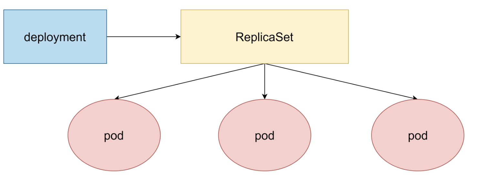
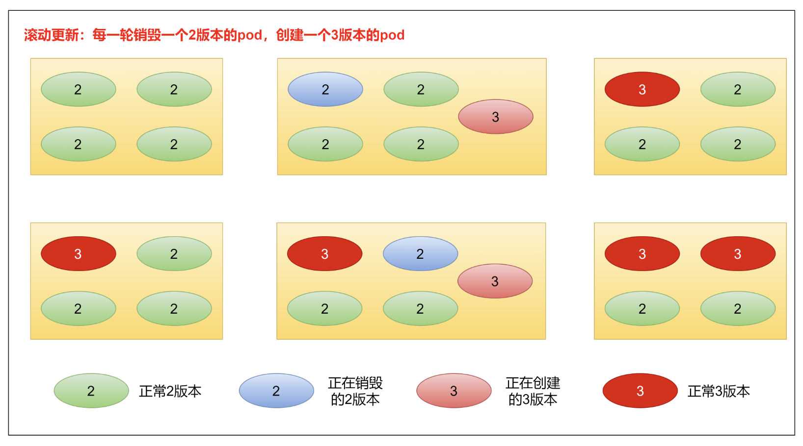
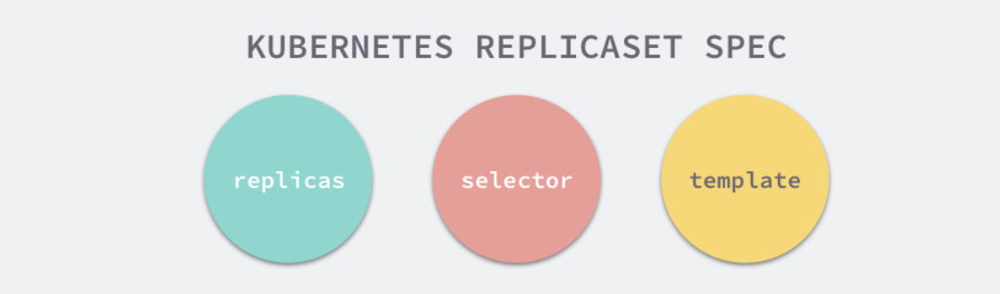

## 一、Controller 概述

在 Kubernetes 中，控制器（Controller）是一个核心概念，它是一种控制循环，通过持续监控 Kubernetes API 服务器中的对象状态，并根据期望状态与实际状态的差异采取相应的操作，以确保系统始终处于用户所期望的状态。控制器不断地比较期望状态和实际状态，然后对资源进行创建、更新或删除操作，使实际状态逐渐趋近于期望状态。

## 二、常见控制器详细解析

### 1.Deployment

#### 1.1 功能作用

Deployment 是 Kubernetes 中用于管理无状态应用的工作负载资源。它主要用于定义 Pod 的模板，控制 Pod 的副本数量，支持滚动更新、回滚、扩缩容等操作，从而确保应用的高可用性和可扩展性。通过 Deployment，你可以方便地对应用进行版本管理和更新，而无需手动管理每个 Pod。

#### 1.2 创建的资源清单示例

```yaml
apiVersion: apps/v1 #版本号
kind: Deployment #类型
metadata: #元数据
  name: #rs名称
  namespace: #所属命名空间
  labels: #标签
    controller: deploy
spec: #详情描述
  replicas: #副本数量
  revisionHistoryLimit: #保留历史版本，默认是10
  paused: #暂停部署，默认是false
  progressDeadlineSeconds: #部署超时时间(s)，默认是600
  strategy: #策略
    type: RollingUpdates #滚动更新策略
    rollingUpdate: #滚动更新
      maxSurge: #最大额外可以存在的副本数，可以为百分比，也可以为整数
      maxUnavaliable: #最大不可用状态的pod的最大值，可以为百分比，也可以为整数
  selector: #选择器，通过它指定该控制器管理哪些pod
    matchLabels: #Labels匹配规则
      app: nginx-pod
    matchExpressions: #Expression匹配规则
      - { key: app, operator: In, values: [nginx-pod] }
  template: #模板，当副本数量不足时，会根据下面的模板创建pod副本
    metadata:
      labels:
        app: nginx-pod
    spec:
      containers:
        - name: nginx
          image: nginx:1.17.1
          ports:
            - containerPort: 80
```

- `apiVersion`：指定使用的 Kubernetes API 版本。
- `kind`：指定资源类型为 Deployment。
- `metadata`：包含 Deployment 的名称和标签等元数据。
- `spec.replicas`：指定要创建的 Pod 副本数量。
- `spec.selector`：用于选择要管理的 Pod，通过标签匹配。
- `spec.template`：定义 Pod 的模板，包含 Pod 的元数据和容器配置。

#### 1.3 底层架构逻辑



- Deployment 通过创建和管理 ReplicaSet 来间接管理 Pod。每个 Deployment 可以有多个 ReplicaSet，但只有一个是活跃的，用于维持当前的 Pod 副本数量。
- 当你更新 Deployment 时，会创建一个新的 ReplicaSet，新的 ReplicaSet 会逐渐创建新的 Pod，同时旧的 ReplicaSet 会逐渐减少旧 Pod 的数量，实现滚动更新。

#### 1.4 扩缩容

- **方式一：命令行**
  - 命令

    ```bash
    kubectl scale deploy deploy名称 --replicas=pod数量 -n 命名空间
    ```

    通过命令行变更 pod 数量为 5 个

    ```bash
    [root@master ~]# kubectl scale deploy pc-deployment --replicas=5 -n dev
    deployment.apps/pc-deployment scaled
    [root@master ~]# kubectl get pod -n dev
    NAME                             READY   STATUS    RESTARTS   AGE
    pc-deployment-5d89bdfbf9-bhcns   1/1     Running   0          83s
    pc-deployment-5d89bdfbf9-cfls7   1/1     Running   0          83s
    pc-deployment-5d89bdfbf9-k8j9n   1/1     Running   0          8m54s
    pc-deployment-5d89bdfbf9-vw87k   1/1     Running   0          8m54s
    pc-deployment-5d89bdfbf9-x7nsm   1/1     Running   0          8m54s
    ```

- **方式二：资源清单**
  - 命令

    ```bash
    kubectl edit deploy deploy名字 -n 命名空间
    ```

    通过编辑 deploy 文件编辑 pod 数量为 3 个

    ```bash
    [root@master ~]# kubectl edit deploy pc-deployment -n dev
    找到replicas，将其数量改为3
    spec:
      progressDeadlineSeconds: 600
      replicas: 3
    [root@master ~]# kubectl get pod -n dev
    NAME                             READY   STATUS    RESTARTS   AGE
    pc-deployment-5d89bdfbf9-k8j9n   1/1     Running   0          15m
    pc-deployment-5d89bdfbf9-vw87k   1/1     Running   0          15m
    pc-deployment-5d89bdfbf9-x7nsm   1/1     Running   0          15m
    ```

#### 1.5 镜像更新

deployment 支持两种镜像更新策略：**重建更新**和**滚动更新（默认）**，可以通过 strategy 选项进行配置

```yaml
strategy：指定新的pod替换旧的pod的策略，支持两个属性：
type：指定策略类型，支持两种策略
Recreate：在创建出新的pod之前会先杀掉所有已存在的pod
RollingUpdate：滚动更新，就是杀死一部分，就启动一部分，在更新过程中，存在两个版本pod
rollingUpdate：当type为RollingUpdate时生效，用于为RollingUpdate设置参数，支持两个属性
maxUnavailable：用来指定在升级过程中不可用pod的最大数量，默认为25%
maxSurge：用来指定在升级过程中可以超过期望的pod的最大数量，默认为25%
```

- **重建更新**

  编辑 pc-deployment.yaml，在 spec 节点下添加更新策略

  ```yaml
  spec:
    strategy: #策略
      type: Recreate #重建更新策略
  ```

  ```bash
  [root@master ~]# vim pc-deployment.yaml
  [root@master ~]# kubectl apply -f pc-deployment.yaml
  Warning: kubectl apply should be used on resource created by either kubectl create --save-config or kubectl apply
  deployment.apps/pc-deployment configured
  ```

  创建 deploy 进行验证

  ```bash
  #首先记录原本的pod名
  [root@master ~]# kubectl get pod -n dev
  NAME                             READY   STATUS    RESTARTS   AGE
  pc-deployment-5d89bdfbf9-bqf86   1/1     Running   0          8s
  pc-deployment-5d89bdfbf9-kz6jt   1/1     Running   0          8s
  pc-deployment-5d89bdfbf9-z7d9z   1/1     Running   0          8s
  #更改pod镜像
  [root@master ~]# kubectl set image deploy pc-deployment nginx=nginx:1.17.2 -n dev
  deployment.apps/pc-deployment image updated
  #再次查看镜像
  [root@master ~]# kubectl get pod -n dev
  NAME                             READY   STATUS    RESTARTS   AGE
  pc-deployment-675d469f8b-b9rwd   1/1     Running   0          27s
  pc-deployment-675d469f8b-kc7rr   1/1     Running   0          27s
  pc-deployment-675d469f8b-kxgkq   1/1     Running   0          27s
  ```

  发现 pod 镜像已经改变了

- **滚动更新**

  编辑 pc-deployment.yaml，在 spec 节点下添加滚动更新策略（也可以把 strategy 去掉，因为默认滚动更新策略

  ```yaml
  strategy:
    type: RollingUpdate #滚动更新策略
    rollingUpdate:
      maxUnavailable: 25%
      maxSurge: 25%
  ```

  ```bash
  [root@master ~]# vim pc-deployment.yaml
  [root@master ~]# kubectl apply -f pc-deployment.yaml
  Warning: kubectl apply should be used on resource created by either kubectl create --save-config or kubectl apply
  deployment.apps/pc-deployment configured
  ```

  创建 deploy 进行验证

  ```bash
  #记录以前的pod
  [root@master ~]# kubectl get pod -n dev
  NAME                             READY   STATUS    RESTARTS   AGE
  pc-deployment-5d89bdfbf9-526wf   1/1     Running   0          61s
  pc-deployment-5d89bdfbf9-b5x5v   1/1     Running   0          64s
  pc-deployment-5d89bdfbf9-kc7hb   1/1     Running   0          59s
  #更新镜像
  [root@master ~]# kubectl set image deploy pc-deployment nginx=nginx:1.17.2 -n dev
  deployment.apps/pc-deployment image updated
  #查看pod状态
  [root@master ~]# kubectl get pod -n dev
  NAME                             READY   STATUS              RESTARTS   AGE
  pc-deployment-5d89bdfbf9-526wf   0/1     Terminating         0          2m2s
  pc-deployment-5d89bdfbf9-b5x5v   1/1     Running             0          2m5s
  pc-deployment-5d89bdfbf9-kc7hb   0/1     Terminating         0          2m
  pc-deployment-675d469f8b-7vw6x   1/1     Running             0          3s
  pc-deployment-675d469f8b-rzq82   0/1     ContainerCreating   0          2s
  pc-deployment-675d469f8b-zk4fs   1/1     Running             0          5s
  [root@master ~]# kubectl get pod -n dev
  NAME                             READY   STATUS    RESTARTS   AGE
  pc-deployment-675d469f8b-7vw6x   1/1     Running   0          38s
  pc-deployment-675d469f8b-rzq82   1/1     Running   0          37s
  pc-deployment-675d469f8b-zk4fs   1/1     Running   0          40s
  ```

  发现 pod 是旧的一遍停止新的一边创建，最后全变成了新的

  滚动更新的过程

  

#### 1.6 版本回退

deployment 支持版本升级过程中的暂停，继续功能以及版本回退等诸多功能，下面具体来看

kubectl rollout：版本升级相关功能，支持下面的选项：

- status：显示当前升级状态
- history：显示升级历史记录
- pause：暂停版本升级过程
- resume：继续已经暂停的版本升级过程
- restart：重启版本升级过程
- undo：回滚到上一级版本（可以使用--to-revision 回滚到指定版本

```bash
#查看升级状态
[root@master ~]# kubectl rollout status deploy pc-deployment -n dev
deployment "pc-deployment" successfully rolled out

#查看升级历史（注意：如果只显示版本号说明一开始使用yaml创建文件的时候没有加上--record命令）
[root@master ~]# kubectl rollout history deploy pc-deployment -n dev
deployment.apps/pc-deployment
REVISION  CHANGE-CAUSE
1         kubectl create --filename=pc-deployment.yaml --record=true
2         kubectl create --filename=pc-deployment.yaml --record=true

#版本回滚
#这里使用--to-revision=1回滚到1版本，如果省略这个选项，则会回退到上个版本
[root@master ~]# kubectl rollout undo deploy pc-deployment --to-revision=1 -n dev
deployment.apps/pc-deployment rolled back

#查看是否回滚成功，发现5序号开头的rs被启动了
[root@master ~]# kubectl get rs -n dev
NAME                       DESIRED   CURRENT   READY   AGE
pc-deployment-5d89bdfbf9   3         3         3       31m
pc-deployment-675d469f8b   0         0         0       22m
```

#### 1.7 金丝雀发布

deployment 支持更新过程中的控制，如"暂停（pause）"或"继续（resume）"更新操作

比如有一批新的 pod 资源创建完成后立即暂停更新过程，此时，仅存在一部分新版本的应用，主体部分还是旧的版本。然后，再筛选一小部分的用户请求路由到新的 pod 应用，继续观察能否稳定地按期望的方式运行。确定没问题之后再继续完成余下的 pod 资源滚动更新，否则立即回滚更新操作。这就是所谓的金丝雀发布。

```bash
#更新deployment版本，并配置暂停deployment
[root@master ~]# kubectl set image deploy pc-deployment nginx=nginx:1.17.2 -n dev && kubectl rollout pause deploy pc-deployment -n dev
deployment.apps/pc-deployment image updated
deployment.apps/pc-deployment paused

#查看rs，发现老版本rs没有减少，新版本rs增加一个
[root@master ~]# kubectl get rs -n dev
NAME                       DESIRED   CURRENT   READY   AGE
pc-deployment-5d89bdfbf9   3         3         3       44m
pc-deployment-675d469f8b   1         1         1       35m

#在窗口2中查看deploy状态，发现deploy正在等待更新且已经有1个更新好了
[root@master ~]# kubectl rollout status deploy pc-deployment -n dev
Waiting for deployment "pc-deployment" rollout to finish: 1 out of 3 new replicas have been updated...


#在窗口1中继续deploy的更新
[root@master ~]# kubectl rollout resume deploy pc-deployment -n dev
deployment.apps/pc-deployment resumed

#查看窗口2的状态
Waiting for deployment spec update to be observed...
Waiting for deployment spec update to be observed...
Waiting for deployment "pc-deployment" rollout to finish: 1 out of 3 new replicas have been updated...
Waiting for deployment "pc-deployment" rollout to finish: 1 out of 3 new replicas have been updated...
Waiting for deployment "pc-deployment" rollout to finish: 2 out of 3 new replicas have been updated...
Waiting for deployment "pc-deployment" rollout to finish: 2 out of 3 new replicas have been updated...
Waiting for deployment "pc-deployment" rollout to finish: 2 out of 3 new replicas have been updated...
Waiting for deployment "pc-deployment" rollout to finish: 1 old replicas are pending termination...
Waiting for deployment "pc-deployment" rollout to finish: 1 old replicas are pending termination...
deployment "pc-deployment" successfully rolled out

#在窗口1查看rs更新结果，发现老版本均停止，新版本已经创建好
[root@master ~]# kubectl get rs -n dev
NAME                       DESIRED   CURRENT   READY   AGE
pc-deployment-5d89bdfbf9   0         0         0       49m
pc-deployment-675d469f8b   3         3         3       40m
```

### 2. ReplicaSet

#### 2.1 功能作用

ReplicaSet 的主要功能是确保在任何时候都有指定数量的 Pod 副本处于运行状态。它是 Deployment 实现滚动更新的基础，Deployment 通过创建和管理 ReplicaSet 来间接管理 Pod。当 Pod 因为各种原因（如节点故障、容器崩溃等）终止时，ReplicaSet 会自动创建新的 Pod 来替换它们。

#### 2.2 创建的资源清单示例

```yaml
apiVersion: apps/v1
kind: ReplicaSet
metadata:
  name: nginx-replicaset
  labels:
    app: nginx
spec:
  replicas: 3
  selector:
    matchLabels:
      app: nginx
  template:
    metadata:
      labels:
        app: nginx
    spec:
      containers:
        - name: nginx
          image: nginx:1.14.2
          ports:
            - containerPort: 80
```

- 与 Deployment 的资源清单类似，`spec.replicas` 定义了 Pod 的副本数量，`spec.selector` 用于选择要管理的 Pod，`spec.template` 定义了 Pod 的模板。

#### 2.3 底层架构逻辑



- ReplicaSet 直接管理一组 Pod，通过 `selector` 来识别和管理与指定标签匹配的 Pod。当实际的 Pod 数量与 `replicas` 指定的数量不一致时，ReplicaSet 会创建或删除 Pod 以达到期望的数量。

#### 2.4 scale 水平扩展的数量

```bash
kubectl scale rs nginx --replicas=2
kubectl get  rs
kubectl scale rs nginx --replicas=5
kubectl get  pods -o wide
```

### 3. StatefulSet

#### 3.1 功能作用

StatefulSet 用于管理有状态的应用，如数据库、分布式系统等。与 Deployment 管理的无状态应用不同，StatefulSet 为每个 Pod 提供稳定的网络标识（如唯一的 DNS 名称）和持久化存储。这使得 Pod 在重启、迁移或扩展时能够保留其状态，确保应用的一致性和可靠性。

#### 3.2 创建的资源清单示例

```yaml
apiVersion: apps/v1
kind: StatefulSet
metadata:
  name: mysql-statefulset
spec:
  serviceName: "mysql-service"
  replicas: 3
  selector:
    matchLabels:
      app: mysql
  template:
    metadata:
      labels:
        app: mysql
    spec:
      containers:
        - name: mysql
          image: mysql:8.0
          ports:
            - containerPort: 3306
          volumeMounts:
            - name: mysql-persistent-storage
              mountPath: /var/lib/mysql
  volumeClaimTemplates:
    - metadata:
        name: mysql-persistent-storage
      spec:
        accessModes: ["ReadWriteOnce"]
        resources:
          requests:
            storage: 1Gi
```

- `spec.serviceName`：指定与 StatefulSet 关联的服务名称，用于为 Pod 提供稳定的网络标识。
- `spec.volumeClaimTemplates`：定义持久卷声明模板，为每个 Pod 创建一个持久卷。

#### 3.3 底层架构逻辑

```plaintext
+----------------------+
|    StatefulSet       |
+----------------------+
         |
         v
+----------------------+
|  mysql-statefulset-0 |
+----------------------+
|  mysql-statefulset-1 |
+----------------------+
|  mysql-statefulset-2 |
+----------------------+
         |
         v
+----------------------+
| Persistent Volume 0  |
+----------------------+
| Persistent Volume 1  |
+----------------------+
| Persistent Volume 2  |
+----------------------+
```

- StatefulSet 为每个 Pod 分配一个唯一的序号，从 0 开始递增。Pod 的名称格式为 `{statefulset-name}-{ordinal}`，例如 `mysql-statefulset-0`。
- 每个 Pod 都有一个独立的持久卷声明（PVC），用于挂载持久化存储，确保数据的持久化。

#### 3.4 滚动升级原理

StatefulSet 的滚动升级与 Deployment 类似，但有一些额外的考虑。当进行滚动升级时，StatefulSet 会按照序号从大到小的顺序依次更新 Pod，并且在更新每个 Pod 之前会等待前一个 Pod 成功更新并就绪。这确保了应用的状态在升级过程中保持一致。

### 4. DaemonSet

#### 4.1 功能作用

DaemonSet 确保在集群中的每个节点（或满足特定条件的节点）上都运行一个 Pod 副本。常用于系统级的守护进程，如日志收集器、监控代理等。当有新节点加入集群时，DaemonSet 会自动在该节点上创建一个新的 Pod；当节点从集群中移除时，对应的 Pod 会被自动删除。

#### 4.2 创建的资源清单示例

```yaml
apiVersion: apps/v1
kind: DaemonSet
metadata:
  name: fluentd-daemonset
  labels:
    app: fluentd
spec:
  selector:
    matchLabels:
      app: fluentd
  template:
    metadata:
      labels:
        app: fluentd
    spec:
      containers:
        - name: fluentd
          image: fluentd:v1.14
          volumeMounts:
            - name: varlog
              mountPath: /var/log
      volumes:
        - name: varlog
          hostPath:
            path: /var/log
```

- 通过 `hostPath` 卷将节点的 `/var/log` 目录挂载到 Pod 中，方便收集节点的日志。

#### 4.3 底层架构逻辑

```plaintext
+----------------------+
|    DaemonSet         |
+----------------------+
         |
         v
+----------------------+
| Node 1: Pod 1        |
+----------------------+
| Node 2: Pod 2        |
+----------------------+
| Node 3: Pod 3        |
+----------------------+
```

- DaemonSet 会在每个符合条件的节点上创建一个 Pod 副本，确保每个节点都有特定的服务在运行。

### 5. Job

#### 5.1 功能作用

Job 用于运行一次性任务，当任务完成后，Pod 会终止。常用于批处理作业、数据迁移、脚本执行等场景。Job 会创建一个或多个 Pod 来执行任务，当所有 Pod 都成功完成任务后，Job 被标记为完成。

#### 5.2 创建的资源清单示例

```yaml
apiVersion: batch/v1
kind: Job
metadata:
  name: pi-job
spec:
  template:
    spec:
      containers:
        - name: pi
          image: perl:5.34.0
          command: ["perl", "-Mbignum=bpi", "-wle", "print bpi(2000)"]
      restartPolicy: Never
  backoffLimit: 4
```

- `restartPolicy: Never` 表示当 Pod 失败时，不会自动重启。
- `backoffLimit` 指定了任务失败后的重试次数。

#### 5.3 底层架构逻辑

```plaintext
+----------------------+
|       Job            |
+----------------------+
         |
         v
+----------------------+
|      Pod 1           |
+----------------------+
```

- Job 创建一个或多个 Pod 来执行任务，当所有 Pod 都成功完成任务后，Job 结束。

### 6. CronJob

#### 6.1 功能作用

CronJob 是基于时间的 Job，它按照指定的时间间隔周期性地运行任务，类似于 Linux 系统中的 `cron` 任务。CronJob 会根据 `schedule` 字段指定的时间间隔创建 Job，每个 Job 会按照 Job 的规则创建 Pod 来执行任务。

#### 6.2 创建的资源清单示例

```yaml
apiVersion: batch/v1
kind: CronJob
metadata:
  name: hello-cronjob
spec:
  schedule: "*/1 * * * *"
  jobTemplate:
    spec:
      template:
        spec:
          containers:
            - name: hello
              image: busybox:1.36
              args:
                - /bin/sh
                - -c
                - date; echo Hello from the Kubernetes cluster
          restartPolicy: OnFailure
```

- `schedule` 使用 Cron 表达式指定任务的调度时间，这里表示每分钟执行一次。

#### 6.3 底层架构逻辑

```plaintext
+----------------------+
|    CronJob           |
+----------------------+
         |
         v
+----------------------+
|      Job 1           |
+----------------------+
|      Job 2           |
+----------------------+
|      ...             |
+----------------------+
         |
         v
+----------------------+
|      Pod 1           |
+----------------------+
|      Pod 2           |
+----------------------+
|      ...             |
+----------------------+
```

- CronJob 按照时间间隔创建 Job，每个 Job 再创建 Pod 来执行任务。

## 三、总结

Kubernetes 的控制器为不同类型的应用和任务提供了强大的管理能力。通过合理使用这些控制器，可以确保应用的高可用性、可扩展性和数据的持久性。在实际应用中，需要根据具体需求选择合适的控制器，并深入理解其工作原理和使用方法，以充分发挥 Kubernetes 的优势。
