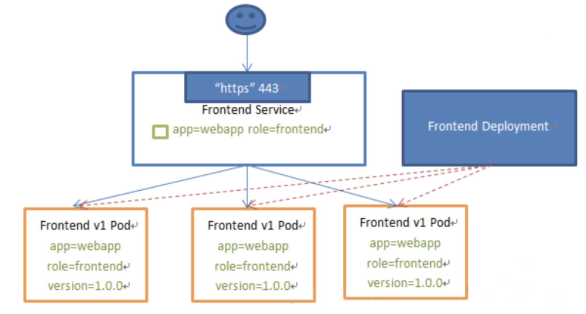
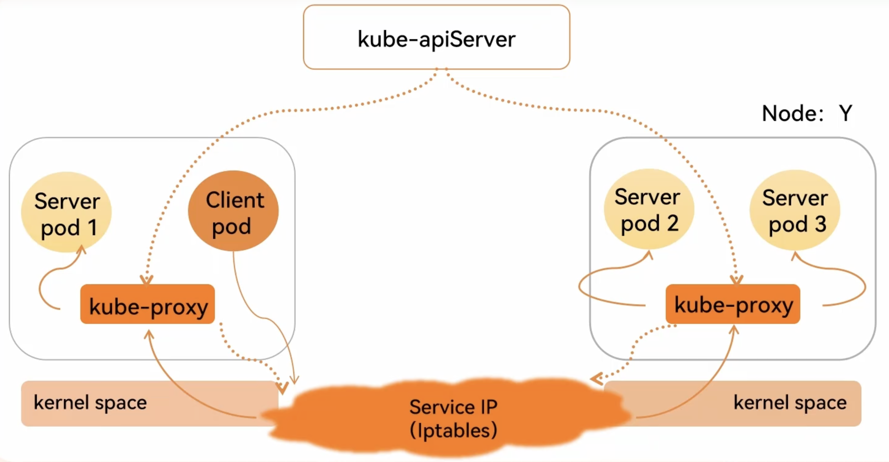
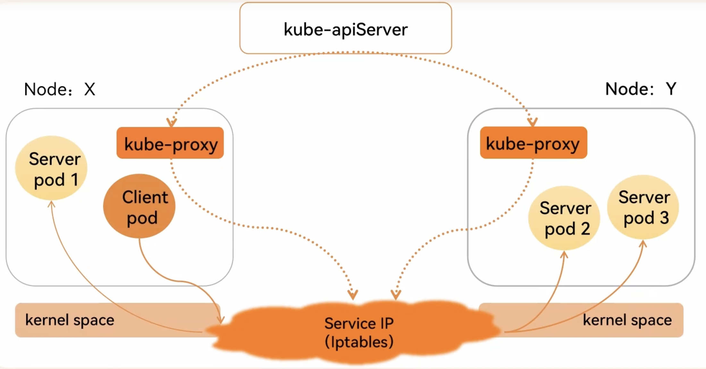
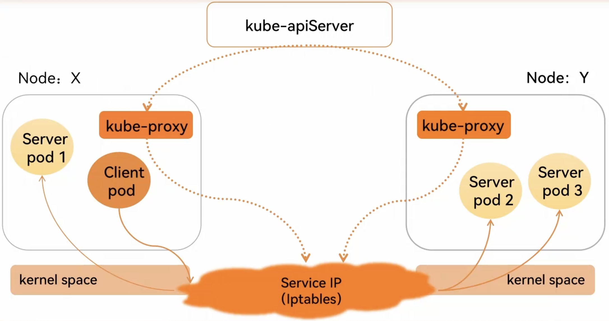
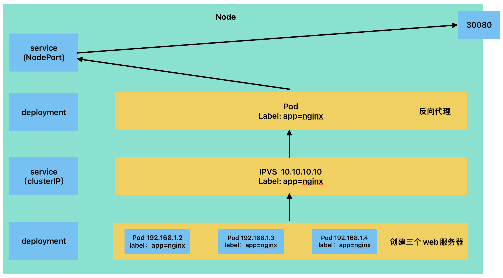
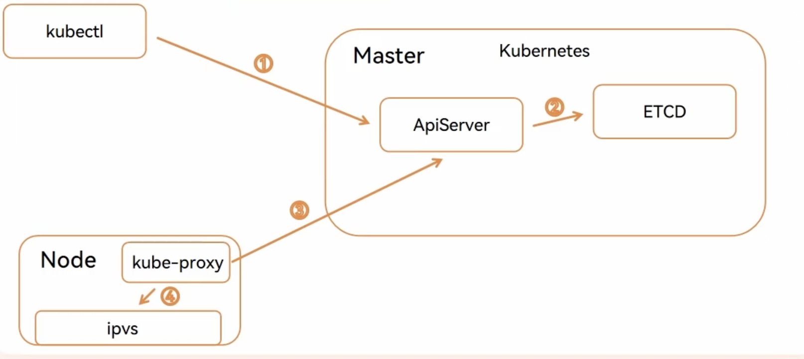
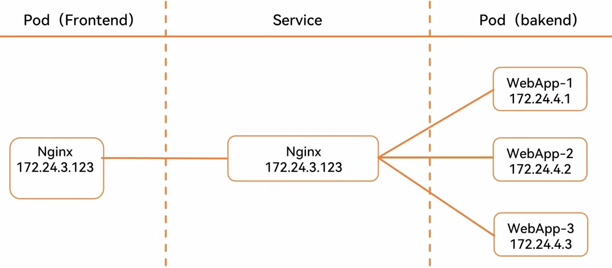
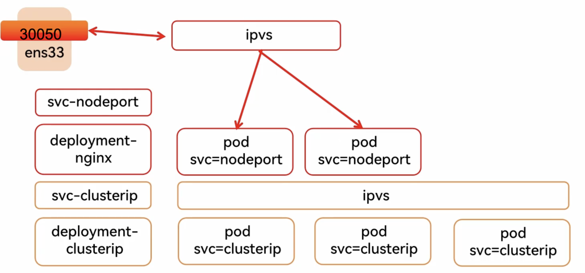

## 一、Service 概念

Kubernetes `Service`定义了这样一种抽象：逻辑上的一组 `Pod`，一种可以访问它们的策略 —— 通常被称为微服务。这一组 `Pod `能够被 `Service` 访问到，通常是通过 `selector`实现的。

举例：考虑一个图片处理 backend，它运行了 3 个副本。这些副本是可互换的 —— frontend 不需要关心它们调用了哪个 backend 副本。 然而组成这一组 backend 程序的 Pod 实际上可能会发生变化，frontend 客户端不应该也没必要知道，而且也不需要跟踪这一组 backend 的状态。Service 定义的抽象能够解耦这种关联。

Service 可以提供负载均衡的能力，但是使用上存在如下限制：

- 只能提供 4 层负载均衡能力，而没有 7 层功能。有时我们可能需要更多的匹配规则来转发请求，这点上 4 层负载均衡是不支持的、

如 web 访问的 service 服务示例图：



## 二、VIP 和 Service 代理

在 Kubernetes 集群中，每个 `Node` 运行一个 `kube-proxy` 进程。`kube-proxy`负责为 `Service` 实现了一种 VIP（虚拟 IP）的形式，而不是 ExternalName 的形式。

从 Kubernetes v1.0 开始，已经可以使用 userspace 代理模式。Kubernetes v1.1 添加了 iptables 代理模式，在 Kubernetes v1.2 中 kube-proxy 的 iptables 模式成为默认设置。Kubernetes v1.8 添加了 ipvs 代理模式。

**为什么不使用 DNS 轮询？**

原因如下：

- DNS 实现的历史由来已久，它不遵守记录 TTL，并且在名称查找到结果后会对其进行缓存。
- 有些应用程序仅执行一次 DNS 查找，并无限期地缓存结果。
- 即使应用和库进行了适当的重新解析，DNS 记录上的 TTL 值低或为零也可能会给 DNS 带来高负载，从而使管理变得困难。

总之就是因为有缓存，因此不合适。

### 1. Userspace 代理模式

这种模式，kube-proxy 会监视 Kubernetes master 对 Service 对象和 Endpoints 对象的添加和移除。 对每个 Service，它会在本地 Node 上打开一个端口（随机选择）。 任何连接到“代理端口”的请求，都会被代理到 Service 的 backend Pods 中的某个上面（如 Endpoints 所报告的一样）。 使用哪个 backend Pod，是 kube-proxy 基于 SessionAffinity 来确定的。

最后，它配置 iptables 规则，捕获到达该 Service 的 clusterIP（是虚拟 IP）和 Port 的请求，并重定向到代理端口，代理端口再代理请求到 backend Pod。

默认情况下，userspace 模式下的 kube-proxy 通过循环算法选择后端。

默认的策略是，通过 round-robin 算法来选择 backend Pod。



### 2. iptables 代理模式

这种模式，kube-proxy 会监视 Kubernetes 控制节点对 Service 对象和 Endpoints 对象的添加和移除。 对每个 Service，它会配置 iptables 规则，从而捕获到达该 Service 的 clusterIP 和端口的请求，进而将请求重定向到 Service 的一组 backend 中的某个上面。对于每个 Endpoints 对象，它也会配置 iptables 规则，这个规则会选择一个 backend 组合。

默认的策略是，kube-proxy 在 iptables 模式下随机选择一个 backend。

使用 iptables 处理流量具有较低的系统开销，因为流量由 Linux netfilter 处理，而无需在用户空间和内核空间之间切换。 这种方法也可能更可靠。

如果 kube-proxy 在 iptables 模式下运行，并且所选的第一个 Pod 没有响应，则连接失败。 这与 userspace 模式不同：在这种情况下，kube-proxy 将检测到与第一个 Pod 的连接已失败，并会自动使用其他后端 Pod 重试。

我们可以使用 Pod readiness 探测器 验证后端 Pod 是否可以正常工作，以便 iptables 模式下的 kube-proxy 仅看到测试正常的后端。这样做意味着可以避免将流量通过 kube-proxy 发送到已知已失败的 Pod。



### 3. ipvs 代理模式

在 ipvs 模式下，kube-proxy 监视 Kubernetes 服务(Service)和端点(Endpoints)，调用 netlink 接口相应地创建 IPVS 规则， 并定期将 IPVS 规则与 Kubernetes 服务(Service)和端点(Endpoints)同步。该控制循环可确保 IPVS 状态与所需状态匹配。访问服务(Service)时，IPVS 　将流量定向到后端 Pod 之一。

ipvs 和 iptables 都是基于 netfilter 的，那么 ipvs 模式有哪些更好的性能呢？

• ipvs 为大型集群提供了更好的可拓展性和性能

• ipvs 支持比 iptables 更复杂的负载均衡算法（包括：最小负载、最少连接、加权等）

• ipvs 支持服务噐健康检查和连接重试等功能

• 可以动态修改 ipset 的集合，即使 iptables 的规则正在使用这个集合

ipvs 依赖于 iptables。ipvs 会使用 iptables 进行包过滤、airpin-masquerade tricks（地址伪装）、SNAT 等功能，但是使用的是 iptables 的扩展 ipset，并不是直接调用 iptables 来生成规则链。通过 ipset 来存储需要 DROP 或 masquerade 的流量的源或目标地址，用于确保 iptables 规则的数量是恒定的，这样我们就不需要关心有多少 Service 或是 Pod 了。

使用 ipset 相较于 iptables 有什么优点呢？iptables 是线性的数据结构，而 ipset 引入了带索引的数据结构，当规则很多的时候，ipset 依然可以很高效的查找和匹配。我们可以将 ipset 简单理解为一个 IP（段）的集合，这个集合的内容可以是 IP 地址、IP 网段、端口等，iptables 可以直接添加规则对这个“可变的集合进行操作”，这样就可以大大减少 iptables 规则的数量，从而减少性能损耗。

举一个例子，如果我们要禁止成千上万个 IP 访问我们的服务器，如果使用 iptables 就需要—条一条的添加规则，这样会在 iptables 中生成大量的规则；如果用 ipset 就只需要将相关的 IP 地址（网段）加入到 ipset 集合中，然后只需要设置少量的 iptables 规则就可以实现这个目标。

IPVS 提供了更多选项来平衡后端 Pod 的流量。这些是：

- rr: round-robin
- lc: least connection (smallest number of open connections)
- dh: destination hashing
- sh: source hashing
- sed: shortest expected delay
- nq: never queue

注意：要在 IPVS 模式下运行 kube-proxy，必须在启动 kube-proxy 之前使 IPVS Linux 在节点上可用。 当 kube-proxy 以 IPVS 代理模式启动时，它将验证 IPVS 内核模块是否可用。 如果未检测到 IPVS 内核模块，则 kube-proxy 将退回到以 iptables 代理模式运行。



## 三、Service 类型

Kubernetes 中 Service 有以下 4 中类型：

- `ClusterIP`：默认类型，自动分配一个仅 Cluster 内部可以访问的虚拟 IP
- `NodePort`：通过每个 Node 上的 IP 和静态端口（NodePort）暴露服务。以 ClusterIP 为基础，NodePort 服务会路由到 ClusterIP 服务。通过请求 `<NodeIP>:<NodePort>`，可以从集群的外部访问一个集群内部的 NodePort 服务。
- `LoadBalancer`：使用云提供商的负载均衡器，可以向外部暴露服务。外部的负载均衡器可以路由到 NodePort 服务和 ClusterIP 服务。
- `ExternalName` ：通过返回 CNAME 和它的值，可以将服务映射到 externalName 字段的内容（例如，foo.bar.example.com）。没有任何类型代理被创建。

需要注意的是：Service 能够将一个接收 port 映射到任意的 targetPort。默认情况下，targetPort 将被设置为与 port 字段相同的值。

Service 域名格式：`$(service name).$(namespace).svc.cluster.local`，其中 cluster.local 为指定的集群的域名

### 

## 四、Service组件调用流程



## 五、Cluster

### 1.结构图



### 2.资源清单

```yanl
apiVersion: v1
kind: Service
metadata:
  name: nginx-nodeport
spec:
  type: clusterip
  selector:
    app: nginx
  ports:
  - protocol: TCP
    port: 80
    targetPort: 80
```

## 六、NodePort

### 1.结构 图



### 2.资源清单

```yaml
apiVersion: apps/v1
kind: Deployment
metadata:
  name: nginx-deploy
spec:
  replicas: 2
  selector:
    matchLabels:
      app: nginx
  template:
    metadata:
      labels:
        app: nginx
    spec:
      containers:
        - name: nginx
          image: nginx:1.22
          ports:
            - containerPort: 80
---
apiVersion: v1
kind: Service
metadata:
  name: nginx-nodeport
spec:
  type: NodePort
  selector:
    app: nginx
  ports:
    - protocol: TCP
      port: 80
      targetPort: 80
      nodePort: 30080 # 可以指定一个端口号，如果不指定，会自动分配一个
```
