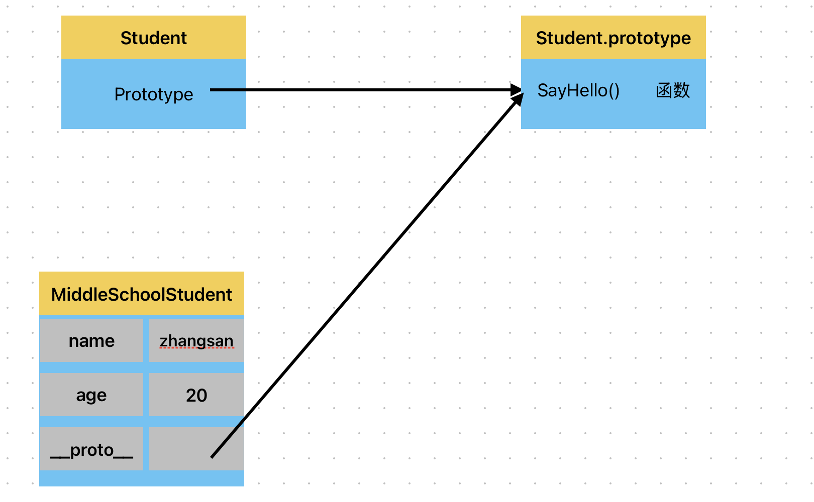
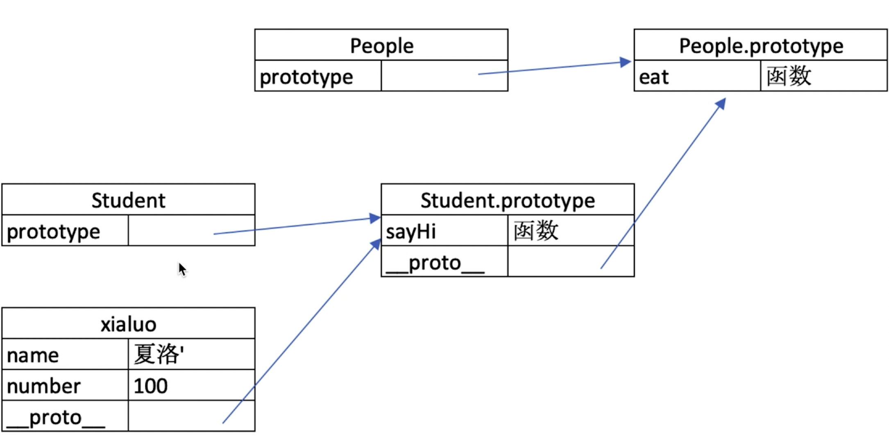
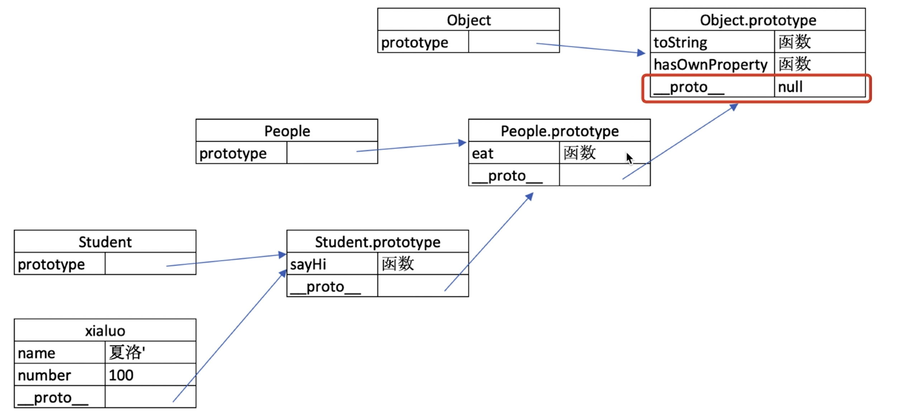

### 一、变量类型和计算

#### 1. typeof 能判断哪些类型

1). 作用

- 判断所有值类型

```javascript
// 判断所有值类型
let a;
typeof a; // 'undefined'
const str = "abc";
typeof str; // 'string'
const n = 100;
typeof n; // 'number’
const b = true;
typeof b; // 'boolean'
const s = Symbol("s");
typeof s; // 'symbol'
```

- 识别函数

```javascript
// 能判断函数
typeof console.log         // 'function'
typeof function () {}.     // 'function'
```

- 判断是否是引用类型

```javascript
// 能识别引用类型（不能再继续识别）
typeof null             // 'object'
typeof l'a', 'b']       // 'object'
typeof { x: 100 }       // 'object'
```

#### 2. 值类型和引用类型

1). 值类型

```javascript
let a = 50;
let b = a;
a = 100;
console.log(b); // 50
```

2). 引用类型

```javascript
let a = { name: "wg" };
let b = a;
b.name = "zhangsan";
onsole.log(a.name); // zhangsan
```

3). 分类

```javascript
// 值类型
	undefine  字符串   数值   布尔   Symol
// 引用类型
  obecjt{}  数组[]  null
```

#### 3. 深拷贝

```javascript
function deepCopy(obj) {
  // 如果传入的不是对象或者是 null，则直接返回
  if (typeof obj !== "object" || obj === null) {
    return obj;
  }

  let result;
  // 处理数组
  if (Array.isArray(obj)) {
    result = [];
    for (let i = 0; i < obj.length; i++) {
      result[i] = deepCopy(obj[i]);
    }
  } else {
    // 处理普通对象
    result = {};
    for (let key in obj) {
      if (obj.hasOwnProperty(key)) {
        result[key] = deepCopy(obj[key]);
      }
    }
  }

  return result;
}

// 示例使用
const original = {
  a: 1,
  b: [2, 3],
  c: { d: 4 },
};

const copied = deepCopy(original);
console.log(copied);
copied.b.push(5);
console.log(original.b); // 输出: [2, 3]
console.log(copied.b); // 输出: [2, 3, 5]
```

### 二、原型和原型链

#### 1. class 和继承

class 使用 constructor 构建，示例：

```javascript
class Student {
  constructor(name, age) {
    this.name = name;
    this.age = age;
  }
  SayHello() {
    console.log(`你好，我叫 ${this.name},今年${this.age}岁了`);
  }
}

let student = new Student("zhangsan", 18);
student.SayHello();
```

继承，使用 extends 关键字来完成继承，super 来执行父类的构造函数，示例：

```javascript
class Student {
  constructor(name, age) {
    this.name = name;
    this.age = age;
  }
  SayHello() {
    console.log(`你好，我叫 ${this.name},今年${this.age}岁了`);
  }
}

// 继承
class MiddleSchoolStudent extends Student {
  constructor(name, age, task) {
    super(name, age);
    this.task = task;
  }
  CompleteTask() {
    console.log(`${this.name}完成了${this.task}任务`);
  }
}

let middleSchoolStudent = new MiddleSchoolStudent("zhangsan", 20, "英语听力");
middleSchoolStudent.SayHello(); // 你好，我叫 zhangsan,今年20岁了
middleSchoolStudent.CompleteTask(); // zhangsan完成了英语听力任务
```

#### 2. 类型判断 instanceof

```javascript
MiddleSchoolStudent instanceof Student     // true
Student instanceof Object      						 // true

[] instanceof Array			// true
[] instanceof Object     // true

{} instanceof Object      // true
```

#### 3. 原型和原型链

1). 原型

```javascript
// class 实际上是函数，是个语法糖
typeof Student; // function
typeof MiddleSchoolStudent; // function

// 隐式原型__porto__和显式原型prototype
console.log(MiddleSchoolStudent.__proto__);
console.log(Student.prototype);
console.log(MiddleSchoolStudent.__proto__ === Student.prototype);
```



- 每个 class 都有显式原型`prototype`
- 每个实例都有隐式原型`__proto__`
- 实例的隐式原型 `__proto__`指向 class 的显式原型`prototype`

- MiddleSchoolStudent 获取属性 name 或执行 SayHello()方法时，现在自身属性和方法寻找，如果找不到就到`__proto__`中去查找



- MiddleSchoolStudent.hasOwnProperty('name') // true
- MiddleSchoolStudent.hasOwnProperty('SayHello') // false



- Instancesof 比如 MiddleSchoolStudent instanceof Student，会沿着上述链条寻找

### 三、作用域和闭包

#### 1. this 的不同应用场景，如何取值

> this 取什么值，是在函数执行时确定的，不是在函数定义的时候确定的

**1). 作为普通函数**

```javascript
function fn() {
  console.log(this);
}
fn(); // this 是 window
```

**2). 使用 call、apply、bind**

```javascript
// call 是函数对象的一个方法，其用途是改变函数内部 this 的指向，同时能在调用函数时传入参数
function fn() {
  console.log(this);
}
fn.call({ x: 100 });
// this 是 {x:100}

// bind() 是函数对象的一个方法，它主要用于创建一个新的函数，在调用时这个新函数的 this 值会被绑定到指定的对象上，并且可以预设一些参数

const fn1 = fn.bind({ x: 200 });
fn1();
// this 是 {x:200}
```

**3). 作为对象方法被调用**

```javascript
const zhangsan = {
  name: "张三",
  sayHello() {
    console.log(this); // 这里的this指向当前对象
  },
  wait() {
    setTimeout(function () {
      console.log(this); // this === window,这个this是被setTimeout触发执行，所以指向setTimeout，而不是wait触发
    });
  },
};
```

**4). 箭头函数**

```javascript
const zhangsan = {
  name: "张三",
  sayHello() {
    console.log(this); // 这里的this指向当前对象
  },
  wait() {
    setTimeout(() => {
      console.log(this); // this即当前对象，箭头函数被setTimeout触发，但是箭头函数的this取得是箭头函数的上级作用域的this,就是wait()
    });
  },
};
```

**5). 在 class 方法中被调用**

```javascript
class Student{
    constructor(name,age) {
        this.name = name;
        this.age = age;
    }
    SayHello(){
        console.log(this)
    }
}

const zhangsan = New Student("张三",18)
zhangsan.SayHello()       // this指向zhangsan对象
```

#### 2. 手写 bind 函数

```javascript
Function.prototype.myBind = function (thisArg, ...args) {
  const self = this;
  return function (...newArgs) {
    const allArgs = [...args, ...newArgs];
    return self.apply(thisArg, allArgs);
  };
};

// 测试代码
function greet(message) {
  console.log(`${message}, ${this.name}`);
}

const person = { name: "John" };
const boundGreet = greet.myBind(person, "Hello");
boundGreet();
```

#### 3. 实际开发中闭包的应用场景，举例说明

**第一种情况：**

函数作为返回值

```javascript
function create() {
  const a = 100;
  return function () {
    console.log(a);
  };
}

const fn = create();
const a = 200;
fn(); // 输出：100
```

console.log 中的 a 叫做自由变量，没有被赋值，它会在自己定义的位置向上级作用域查找，不是执行的地方，比如上述例子中，console.log

中的 a 定义在 create()函数中，它会向上查找，找到 `const a=100` 自己就赋值为 100

**第二种情况：**

函数作为参数

```javascript
function print(fn) {
  const a = 200;
  fn();
}

const a = 100;
function fn() {
  console.log(a);
}
print(fn); // 输出：100
```

console.log 中的 a 为自由变量，在自己定义的作用域中向上级作用域查找，不是执行的地方，最近的是 `const a =100` 所以输出 100
